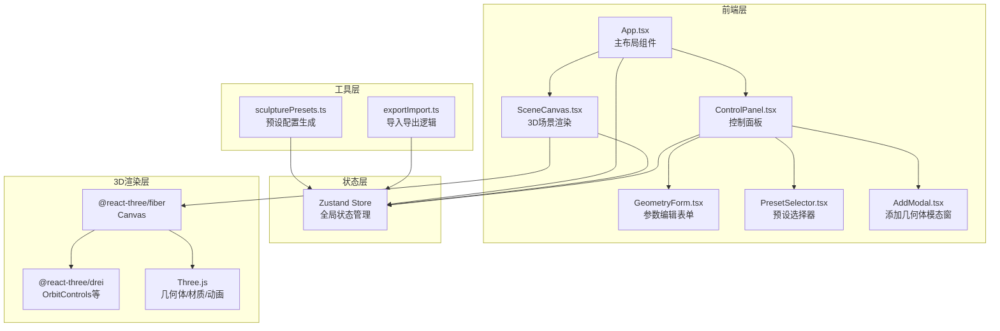

## 1. 架构设计



## 2. 技术说明

- **前端框架**：React 18 + TypeScript
- **构建工具**：Vite + @vitejs/plugin-react
- **3D渲染**：Three.js + @react-three/fiber + @react-three/drei
- **状态管理**：Zustand
- **样式方案**：CSS Modules + CSS自定义属性（深色主题变量）
- **唯一标识**：uuid
- **图标**：lucide-react
- **后端**：无
- **数据库**：无

## 3. 路由定义

| 路由 | 用途 |
|------|------|
| / | 单页应用，包含3D场景和控制面板 |

## 4. 数据模型

### 4.1 核心数据结构

```typescript
type GeometryType = 'cube' | 'sphere' | 'cylinder' | 'cone' | 'torus';

interface GeometryItem {
  id: string;
  type: GeometryType;
  name: string;
  position: { x: number; y: number; z: number };
  rotation: { x: number; y: number; z: number };
  scale: number;
  color: string;
}

interface PresetType {
  id: 'stack' | 'scatter' | 'ring';
  name: string;
  generate: (items: GeometryItem[]) => GeometryItem[];
}

interface SculptureState {
  geometries: GeometryItem[];
  selectedId: string | null;
  preset: PresetType['id'] | null;
  addGeometry: (type: GeometryType) => void;
  removeGeometry: (id: string) => void;
  updateGeometry: (id: string, updates: Partial<GeometryItem>) => void;
  selectGeometry: (id: string | null) => void;
  applyPreset: (preset: PresetType['id']) => void;
  importConfig: (config: GeometryItem[]) => void;
}
```

### 4.2 导出JSON格式

```json
{
  "version": "1.0",
  "preset": "stack",
  "geometries": [
    {
      "id": "uuid-string",
      "type": "cube",
      "name": "立方体-1",
      "position": { "x": 0, "y": 1, "z": 0 },
      "rotation": { "x": 0, "y": 45, "z": 0 },
      "scale": 1.0,
      "color": "#ff6b6b"
    }
  ]
}
```

## 5. 文件结构

```
├── package.json
├── index.html
├── vite.config.ts
├── tsconfig.json
├── src/
│   ├── main.tsx
│   ├── App.tsx
│   ├── App.css
│   ├── store/
│   │   └── useSculptureStore.ts
│   ├── components/
│   │   ├── SceneCanvas.tsx
│   │   ├── ControlPanel.tsx
│   │   ├── GeometryForm.tsx
│   │   ├── PresetSelector.tsx
│   │   ├── AddModal.tsx
│   │   └── GeometryObject.tsx
│   └── utils/
│       ├── sculpturePresets.ts
│       └── exportImport.ts
```

## 6. 动画实现策略

| 动画效果 | 实现方式 | 持续时间 |
|---------|---------|---------|
| 视角旋转缩放 | OrbitControls（enableDamping, dampingFactor=0.95） | 持续 |
| Y轴自转 | useFrame中更新rotation.y | 0.01弧度/秒 |
| 参数调整弹性过渡 | useSpring（@react-three/drei）或手动lerp | 0.2秒 |
| 新几何体淡入 | opacity从0到1的动画（useFrame） | 0.3秒 |
| 删除缩小消散 | scale从1到0的动画（useFrame） | 0.2秒 |
| 预设切换移动 | position lerp with easeInOut | 0.5秒 |
| 导入粒子消散重组 | 粒子系统动画 | 1秒 |
| 模态窗滑入 | CSS transform translateY + transition | 0.3秒 |
| 列表条目滑出 | CSS transform + opacity + transition | 0.2秒 |
| 下载进度条 | CSS width transition | 0.5秒 |

## 7. 性能指标

- 场景维持60FPS
- 控制面板参数调整后场景更新延迟低于50ms
- 导出/导入JSON时页面无卡顿
- 导出文件大小小于1MB
