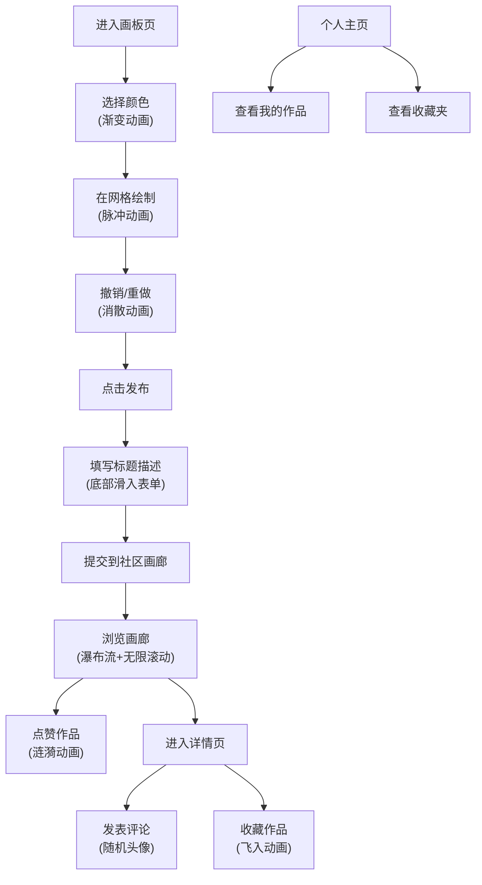

## 1. 产品概述

PixelArt 是一个在线复古像素艺术创作与社区展示平台，用户可以像使用像素画板一样绘制像素图，发布到社区画廊与他人分享，同时可以浏览、点赞、评论和收藏其他用户的作品。

- 主要目标：为像素艺术爱好者提供一个简洁、有趣的创作和交流平台
- 核心价值：通过复古像素风格的UI设计和流畅的交互动画，打造沉浸式的创作体验

## 2. 核心功能

### 2.1 用户角色

| 角色 | 注册方式 | 核心权限 |
|------|----------|----------|
| 普通用户 | 自动生成用户ID（本地存储） | 绘制创作、发布作品、浏览画廊、点赞评论、收藏作品 |

### 2.2 功能模块

1. **像素画板页**：16色调色板、32x32网格绘制、颜色渐变预览、缩放脉冲动画、撤销/重做（20步）、逐格消散动画、发布表单
2. **社区画廊页**：瀑布流布局、无限滚动加载、卡片悬停动画、心形点赞涟漪动画
3. **作品详情页**：全尺寸像素画展示、网格线辅助、评论列表、随机像素头像、左滑删除动画
4. **个人主页**：用户作品展示（响应式栅格）、按时间倒序排列
5. **收藏夹页**：收藏作品栅格展示、飞入收藏夹动画

### 2.3 页面详情

| 页面名称 | 模块名称 | 功能描述 |
|----------|----------|----------|
| 像素画板页 | 调色板 | 16色预设，颜色切换时圆点从旧色渐变到新色（0.3秒） |
| 像素画板页 | 网格绘制 | 32x32格子，点击/拖拽绘制，缩放脉冲动画（1.0→0.85→1.0，0.2秒） |
| 像素画板页 | 撤销/重做 | 最多20步，逐格消散动画（每格0.05秒间隔） |
| 像素画板页 | 发布表单 | 底部滑入，半透明模糊背景，标题≤30字，描述≤100字 |
| 社区画廊页 | 瀑布流卡片 | 圆角12px，悬停上浮8px加深阴影（0.2秒过渡） |
| 社区画廊页 | 无限滚动 | 初始20张，每次加载10张，脉冲占位动画（1秒） |
| 社区画廊页 | 点赞功能 | 心形图标，点击填充红色+涟漪扩散（0.4秒） |
| 作品详情页 | 像素画展示 | 1px网格线，放大时变粗 |
| 作品详情页 | 评论区 | 最多200字，时间倒序，随机像素头像（16种表情） |
| 作品详情页 | 删除评论 | 左滑出消失动画（0.3秒） |
| 个人主页 | 作品展示 | 每行4张，响应式布局，时间倒序 |
| 收藏夹页 | 收藏展示 | 点击收藏时卡片飞入缩小消失（0.5秒） |

## 3. 核心流程

## 4. 用户界面设计

### 4.1 设计风格

- **主色调**：暖色系（橙红 #E07A5F、米黄 #F2CC8F、深棕 #3D405B）
- **背景**：浅灰方格纹理（20x20px，透明度0.1）
- **边框**：2px实线 + 轻微阴影
- **字体**：像素风格字体搭配清晰易读的无衬线字体
- **动画风格**：像素化过渡动画，如弹窗边框逐像素扫描（0.3秒）
- **性能要求**：画板交互帧率60fps

### 4.2 页面设计概述

| 页面名称 | 模块名称 | UI元素 |
|----------|----------|--------|
| 像素画板页 | 调色板 | 16个色块按钮，当前色预览圆点，颜色名称和十六进制码显示 |
| 像素画板页 | 网格区域 | 32x32格子，悬停高亮，绘制脉冲效果 |
| 像素画板页 | 操作按钮 | 撤销/重做按钮，发布按钮，像素风格边框 |
| 社区画廊页 | 卡片列表 | 瀑布流布局，圆角卡片，悬停上浮效果 |
| 社区画廊页 | 加载状态 | 灰色脉冲占位卡片 |
| 作品详情页 | 像素画展示 | 带网格线的全尺寸展示，缩放控制 |
| 作品详情页 | 评论列表 | 左侧像素头像，右侧评论内容和时间 |
| 个人主页 | 作品栅格 | 响应式4列布局，悬停效果 |

### 4.3 响应式设计

- 桌面端优先设计，适配不同屏幕尺寸
- 个人主页作品栅格：大屏幕4列，中等屏幕3列，平板2列，手机1列
- 画板网格在小屏幕自适应缩放
- 触摸设备优化：增大点击区域，支持触摸绘制

### 4.4 交互动画细节

| 动画名称 | 触发时机 | 动画效果 | 持续时间 |
|----------|----------|----------|----------|
| 颜色渐变 | 切换调色板颜色 | 预览圆点从旧色渐变到新色 | 0.3秒 |
| 缩放脉冲 | 点击绘制格子 | 1.0→0.85→1.0缩放 | 0.2秒 |
| 逐格消散 | 撤销操作 | 已画格子逐格消失（每格间隔0.05秒） | - |
| 底部滑入 | 点击发布 | 表单从底部滑入，背景模糊 | 0.3秒 |
| 卡片上浮 | 鼠标悬停卡片 | 上浮8px，加深阴影 | 0.2秒 |
| 心形涟漪 | 点击点赞 | 心形变红，向外扩散涟漪 | 0.4秒 |
| 左滑消失 | 删除评论 | 向左滑出，淡出 | 0.3秒 |
| 飞入收藏 | 点击收藏 | 卡片飞入收藏图标，缩小消失 | 0.5秒 |
| 像素扫描 | 弹窗出现 | 边框逐像素扫描显示 | 0.3秒 |
| 脉冲加载 | 加载更多 | 占位卡片灰色脉冲闪烁 | 1秒 |
