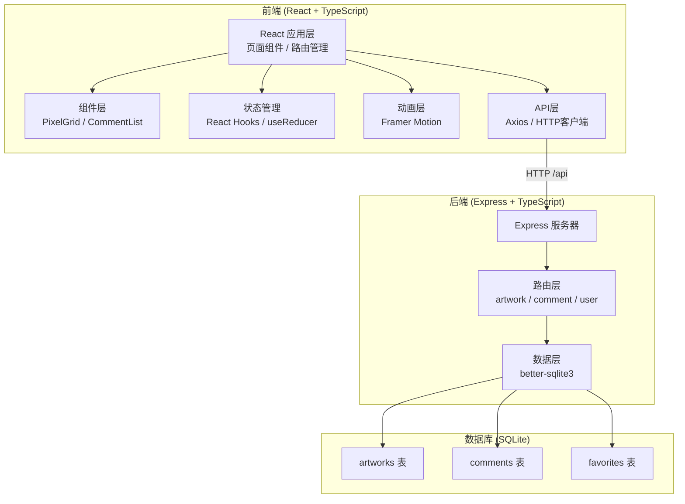

## 1. 架构设计



## 2. 技术描述

### 2.1 技术栈

| 层级 | 技术选型 | 版本 | 说明 |
|------|----------|------|------|
| 前端框架 | React | 18.x | 组件化UI框架 |
| 前端语言 | TypeScript | 5.x | 类型安全的JavaScript |
| 构建工具 | Vite | 5.x | 快速开发构建工具 |
| 路由 | react-router-dom | 6.x | 单页应用路由管理 |
| 动画 | framer-motion | 11.x | 流畅的React动画库 |
| HTTP客户端 | axios | 1.x | 基于Promise的HTTP客户端 |
| 后端框架 | Express | 4.x | 轻量级Node.js Web框架 |
| 数据库 | better-sqlite3 | 11.x | 高性能SQLite3驱动 |
| 跨域支持 | cors | 2.x | 跨域资源共享中间件 |
| 文件上传 | multer | 1.x | 文件上传处理中间件 |
| 唯一ID | uuid | 9.x | UUID生成器 |
| 启动工具 | concurrently | 9.x | 同时运行前后端开发服务器 |

### 2.2 项目结构

```
auto49/
├── package.json (根目录)
├── client/ (前端)
│   ├── index.html
│   ├── vite.config.ts
│   ├── tsconfig.json
│   └── src/
│       ├── main.tsx
│       ├── App.tsx
│       ├── pages/
│       │   ├── Canvas.tsx (像素画板页)
│       │   ├── Gallery.tsx (社区画廊页)
│       │   ├── Detail.tsx (作品详情页)
│       │   └── Profile.tsx (个人主页/收藏夹)
│       └── components/
│           ├── PixelGrid.tsx (像素网格组件)
│           └── CommentList.tsx (评论列表组件)
└── server/ (后端)
    └── src/
        ├── index.ts (Express服务器入口)
        ├── routes/
        │   ├── artwork.ts (作品CRUD接口)
        │   ├── comment.ts (评论接口)
        │   └── user.ts (用户相关接口)
        └── models/
            └── db.ts (数据库初始化)
```

### 2.3 端口配置

- 前端开发服务器：5173
- 后端API服务器：3001
- 前端代理：`/api` → `http://localhost:3001`

## 3. 路由定义

### 3.1 前端路由 (React Router)

| 路由路径 | 页面组件 | 功能说明 |
|----------|----------|----------|
| `/` | Canvas.tsx | 像素画板页 - 创作像素画 |
| `/gallery` | Gallery.tsx | 社区画廊 - 瀑布流展示作品 |
| `/artwork/:id` | Detail.tsx | 作品详情 - 展示像素画和评论 |
| `/profile` | Profile.tsx | 个人主页 - 展示用户作品 |
| `/favorites` | Profile.tsx | 收藏夹 - 展示收藏的作品 |

### 3.2 后端API路由

| 方法 | 路径 | 功能 |
|------|------|------|
| POST | `/api/artworks` | 创建新作品 |
| GET | `/api/artworks` | 获取作品列表（分页） |
| GET | `/api/artworks/:id` | 获取单个作品详情 |
| DELETE | `/api/artworks/:id` | 删除作品 |
| POST | `/api/comments` | 创建评论 |
| GET | `/api/comments/:artworkId` | 获取作品评论列表 |
| DELETE | `/api/comments/:id` | 删除评论 |
| GET | `/api/user/:id/artworks` | 获取用户的作品列表 |
| GET | `/api/user/:id/favorites` | 获取用户的收藏列表 |
| POST | `/api/favorites` | 添加收藏 |
| DELETE | `/api/favorites/:id` | 取消收藏 |

## 4. API 定义

### 4.1 数据类型定义

```typescript
// 作品类型
interface Artwork {
  id: string;
