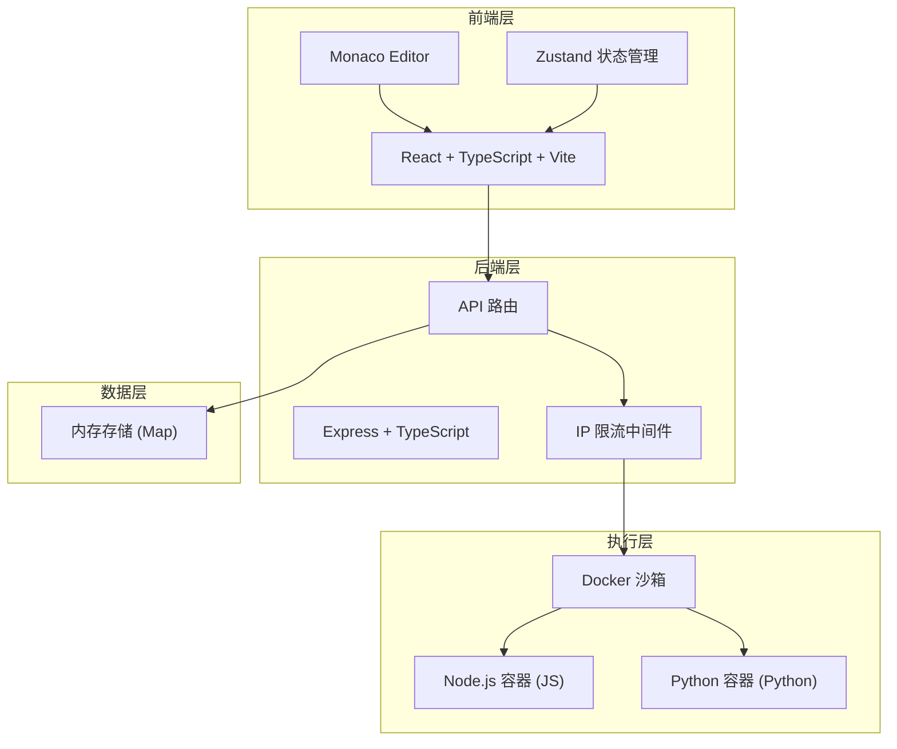
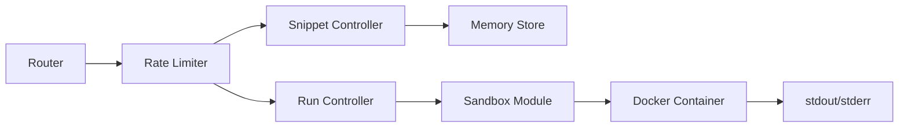
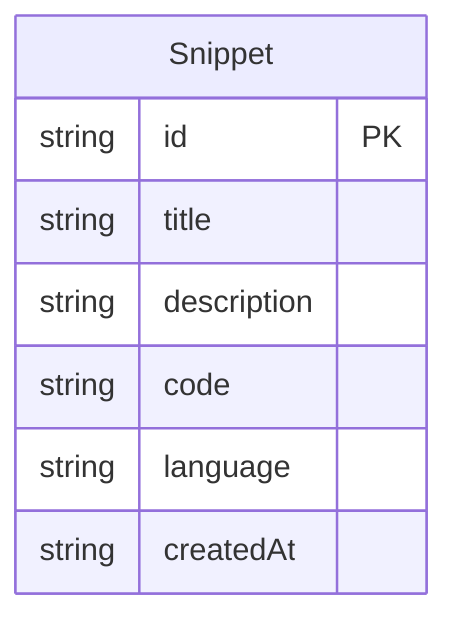

## 1. 架构设计



## 2. 技术说明

- 前端：React@18 + TypeScript + Vite + TailwindCSS@3 + Zustand
- 初始化工具：vite-init（react-express-ts 模板）
- 后端：Express@4 + TypeScript（ESM）
- 代码编辑器：@monaco-editor/react
- 数据存储：内存 Map（代码片段以 UUID 为 key）
- 沙箱执行：Docker 容器隔离执行

## 3. 路由定义

| 路由 | 用途 |
|------|------|
| / | 编辑器主页面，创建和运行代码 |
| /snippet/:id | 分享查看页面，只读查看代码片段 |

## 4. API 定义

```typescript
interface CreateSnippetRequest {
  title: string;
  description: string;
  code: string;
  language: "javascript" | "python";
}

interface CreateSnippetResponse {
  id: string;
  url: string;
}

interface RunCodeRequest {
  code: string;
  language: "javascript" | "python";
}

interface RunCodeResponse {
  output: string;
  error: string | null;
  timedOut: boolean;
}

interface Snippet {
  id: string;
  title: string;
  description: string;
  code: string;
  language: "javascript" | "python";
  createdAt: string;
}

// API 端点
// POST   /api/snippets      - 创建代码片段，返回短链接ID
// GET    /api/snippets/:id  - 获取代码片段详情
// POST   /api/run           - 运行代码，返回执行结果
```

## 5. 服务器架构图



## 6. 数据模型

### 6.1 数据模型定义



### 6.2 数据定义

- Snippet 存储在内存 Map 中，key 为 UUID
- IP 限流数据存储在内存 Map 中，key 为 IP 地址，value 为请求时间戳数组
- 服务重启后数据清除（MVP 阶段使用内存存储）
