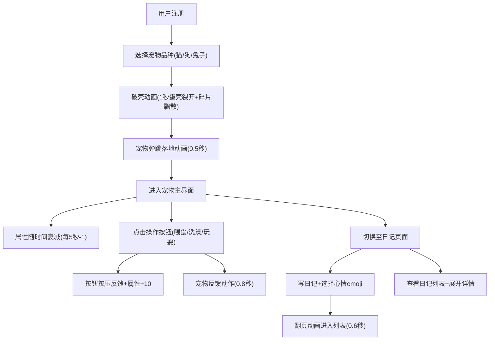

## 1. 产品概述

在线虚拟宠物养成与互动日记应用，用户可领养数字宠物（猫/狗/兔子），通过喂食、清洁、玩耍维持宠物状态，同时记录每日互动日记。
- 面向喜爱治愈系互动体验的用户，提供轻松的宠物养成和情感记录功能
- 核心价值：温暖治愈的互动体验 + 个性化日记记录，让用户在忙碌生活中拥有一个随时陪伴的数字伙伴

## 2. 核心功能

### 2.1 用户角色
| 角色 | 注册方式 | 核心权限 |
|------|----------|----------|
| 普通用户 | 用户名注册 | 领养宠物、互动操作、写日记 |

### 2.2 功能模块
1. **注册与领养页**：用户注册、选择宠物品种、破壳动画
2. **宠物主界面**：宠物展示、属性条、互动操作按钮
3. **互动日记页**：日记列表、新建日记、宠物心情剪影

### 2.3 页面详情
| 页面名称 | 模块名称 | 功能描述 |
|----------|----------|----------|
| 注册与领养页 | 注册表单 | 用户输入用户名完成注册 |
| 注册与领养页 | 品种选择 | 三选一（猫/狗/兔子），展示默认外观描述和缩略图 |
| 注册与领养页 | 破壳动画 | 蛋壳裂开动画1秒 + 碎片飘散 + 宠物弹跳落地0.5秒 |
| 宠物主界面 | 宠物视觉 | 左侧CSS绘制的宠物全身站立图，3:4宽高比 |
| 宠物主界面 | 属性面板 | 右侧四项属性条（饱食度/清洁度/心情值/健康值），渐变色进度条 |
| 宠物主界面 | 属性衰减 | 每5秒属性下降1点，进度条宽度实时过渡0.3秒 |
| 宠物主界面 | 操作按钮 | 喂食/洗澡/玩耍三个按钮，按压反馈0.9缩放弹回 |
| 宠物主界面 | 宠物反馈 | 喂食咀嚼/洗澡水花/玩耍蹦跳，持续0.8秒 |
| 互动日记页 | 日记列表 | 翻页卡片展示，日期倒序，圆角阴影卡片 |
| 互动日记页 | 新建日记 | 文本区域最多300字，选择心情emoji（开心/普通/生气/伤心） |
| 互动日记页 | 翻页动画 | 从右向左翻页0.6秒进入列表 |
| 互动日记页 | 宠物剪影 | Canvas绘制当日宠物彩色简化剪影 |
| 互动日记页 | 展开详情 | 点击卡片垂直展开，高度0到auto过渡0.3秒 |

## 3. 核心流程

用户注册后选择宠物品种，观看破壳动画后进入主界面。主界面中宠物属性随时间下降，用户通过操作按钮维护宠物状态，宠物做出对应反馈动作。用户可随时切换到日记页面记录互动点滴，日记以翻页卡片形式展示。

## 4. 用户界面设计

### 4.1 设计风格
- 主色：#F5E6D3（柔和暖米色），卡片背景：白色，标题文字：#5C4033（深棕色）
- 按钮：#8BC34A（清新绿）和 #FFB74D（暖橙色）互补色
- 属性条渐变：饱食度橙色、清洁度蓝色、心情值粉色、健康值绿色
- 像素风/扁平卡通风CSS绘制宠物
- 圆角卡片+阴影，翻页式日记
- 字体：标题使用圆润可爱风格，正文使用清晰易读字体
- 布局：Flex+Grid响应式，桌面端左右分栏，移动端上下堆叠

### 4.2 页面设计概览
| 页面名称 | 模块名称 | UI元素 |
|----------|----------|--------|
| 注册与领养页 | 注册表单 | 居中卡片，输入框+按钮，暖色背景 |
| 注册与领养页 | 品种选择 | 三个品种卡片横排，悬停放大，选中高亮边框 |
| 注册与领养页 | 破壳动画 | 全屏居中蛋壳+宠物，CSS关键帧动画 |
| 宠物主界面 | 宠物视觉区 | 左侧3:4比例容器，CSS绘制宠物+状态动画 |
| 宠物主界面 | 属性面板 | 右侧竖排四个渐变进度条+数值标签 |
| 宠物主界面 | 操作按钮 | 底部三个圆角按钮，图标+文字，按压动画 |
| 互动日记页 | 日记列表 | 卡片网格/列表，圆角阴影，翻页动画 |
| 互动日记页 | 新建表单 | 底部/顶部表单区，文本框+emoji选择+提交按钮 |
| 互动日记页 | 宠物剪影 | 卡片底部Canvas小型剪影图 |

### 4.3 响应式设计
- 桌面优先设计，移动端自适应
- 桌面端：宠物区与属性区左右分栏布局
- 移动端：上下堆叠，宠物区占满宽度，属性区和按钮区紧凑排列
- 日记页桌面端双列卡片，移动端单列
- 触摸优化：按钮最小44px点击区域

### 4.4 性能要求
- 属性更新每秒不超过60帧渲染
- 日记列表50条以内翻页无卡顿（帧率≥50fps）
- CSS动画使用transform/opacity触发GPU加速
- Canvas剪影绘制仅在日记提交时执行一次
