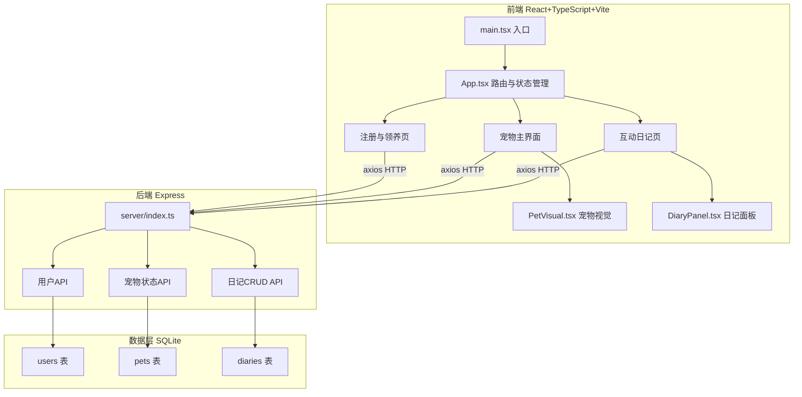
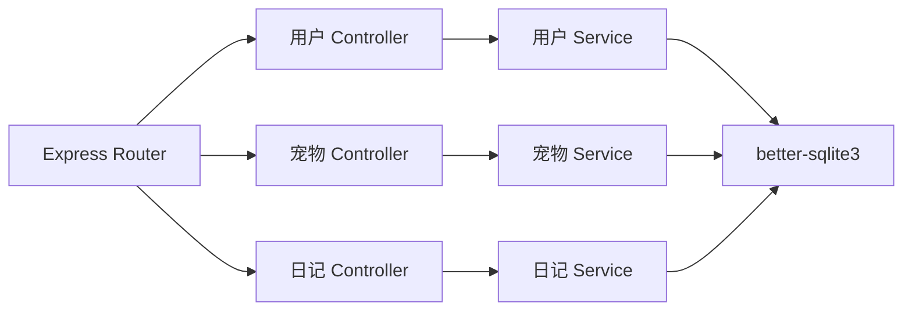
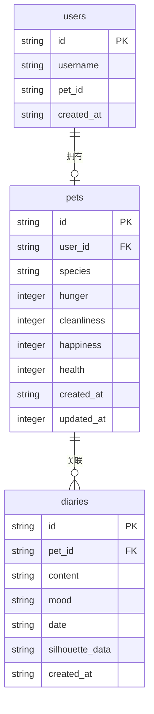

## 1. 架构设计



## 2. 技术说明
- 前端：React@18 + TypeScript + Vite + framer-motion + axios + react-router-dom
- 初始化工具：Vite
- 后端：Express@4 + cors + better-sqlite3 + uuid + body-parser
- 数据库：SQLite（better-sqlite3）
- 样式：CSS Modules / 内联样式，不使用Tailwind（保持CSS动画精细控制）
- 动画：framer-motion（翻页、展开）+ CSS keyframes（宠物动作、属性条过渡）

## 3. 路由定义
| 路由 | 用途 |
|------|------|
| / | 注册与领养页，新用户注册并选择宠物 |
| /pet | 宠物主界面，显示宠物、属性、操作按钮 |
| /diary | 互动日记页，日记列表与新建 |

## 4. API 定义

### 4.1 用户相关
```typescript
// POST /api/users/register
interface RegisterRequest {
  username: string;
}
interface RegisterResponse {
  userId: string;
  username: string;
}

// GET /api/users/:userId
interface UserResponse {
  userId: string;
  username: string;
  petId: string | null;
}
```

### 4.2 宠物相关
```typescript
// POST /api/pets/adopt
interface AdoptRequest {
  userId: string;
  species: 'cat' | 'dog' | 'rabbit';
}
interface AdoptResponse {
  petId: string;
  species: string;
  hunger: number;
  cleanliness: number;
  happiness: number;
  health: number;
}

// GET /api/pets/:petId
interface PetResponse {
  petId: string;
  species: string;
  hunger: number;
  cleanliness: number;
  happiness: number;
  health: number;
  createdAt: string;
}

// POST /api/pets/:petId/action
interface ActionRequest {
  action: 'feed' | 'bath' | 'play';
}
interface ActionResponse {
  hunger: number;
  cleanliness: number;
  happiness: number;
  health: number;
}
```

### 4.3 日记相关
```typescript
// POST /api/diaries
interface CreateDiaryRequest {
  petId: string;
  content: string;
  mood: 'happy' | 'normal' | 'angry' | 'sad';
}
interface DiaryResponse {
  diaryId: string;
  petId: string;
  content: string;
  mood: string;
  date: string;
  silhouetteData: string;
}

// GET /api/diaries?petId=xxx
interface DiaryListResponse {
  diaries: DiaryResponse[];
}

// GET /api/diaries/:diaryId
interface DiaryDetailResponse extends DiaryResponse {}
```

## 5. 服务端架构图



## 6. 数据模型

### 6.1 数据模型定义



### 6.2 数据定义语言

```sql
CREATE TABLE users (
  id TEXT PRIMARY KEY,
  username TEXT NOT NULL UNIQUE,
  pet_id TEXT,
  created_at TEXT DEFAULT (datetime('now'))
);

CREATE TABLE pets (
  id TEXT PRIMARY KEY,
  user_id TEXT NOT NULL,
  species TEXT NOT NULL CHECK(species IN ('cat', 'dog', 'rabbit')),
  hunger INTEGER DEFAULT 80 CHECK(hunger >= 0 AND hunger <= 100),
  cleanliness INTEGER DEFAULT 80 CHECK(cleanliness >= 0 AND cleanliness <= 100),
  happiness INTEGER DEFAULT 80 CHECK(happiness >= 0 AND happiness <= 100),
  health INTEGER DEFAULT 80 CHECK(health >= 0 AND health <= 100),
  created_at TEXT DEFAULT (datetime('now')),
  updated_at TEXT DEFAULT (datetime('now')),
  FOREIGN KEY (user_id) REFERENCES users(id)
);

CREATE TABLE diaries (
  id TEXT PRIMARY KEY,
  pet_id TEXT NOT NULL,
  content TEXT NOT NULL CHECK(length(content) <= 300),
  mood TEXT NOT NULL CHECK(mood IN ('happy', 'normal', 'angry', 'sad')),
  date TEXT NOT NULL,
  silhouette_data TEXT,
  created_at TEXT DEFAULT (datetime('now')),
  FOREIGN KEY (pet_id) REFERENCES pets(id)
);

CREATE INDEX idx_pets_user_id ON pets(user_id);
CREATE INDEX idx_diaries_pet_id ON diaries(pet_id);
CREATE INDEX idx_diaries_date ON diaries(date DESC);
```
