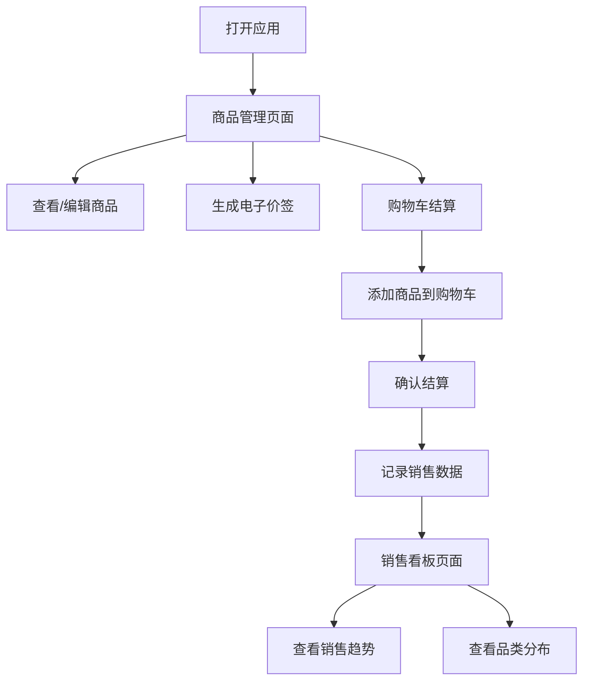

## 1. 产品概述

创意市集摊位管理与销售数据看板应用，为创意市集摊主提供数字化摊位管理工具，解决手工登记商品、计算总价和记录顾客偏好的繁琐问题，提升摆摊效率。

- 核心价值：商品管理数字化、价签生成自动化、销售结算便捷化、数据分析可视化
- 目标用户：创意市集摊主、手工艺品创作者、小型零售从业者

## 2. 核心功能

### 2.1 用户角色

| 角色 | 注册方式 | 核心权限 |
|------|----------|----------|
| 摊主用户 | 无需注册，本地使用 | 商品管理、价签生成、购物结算、销售数据查看 |

### 2.2 功能模块

1. **商品管理模块**：商品列表展示、添加商品、编辑商品、删除商品、品类主题色标识
2. **电子价签生成模块**：价签预览、品类色价格展示、打印功能
3. **购物车结算模块**：商品添加、数量调整、总价计算、结算记录、成功提示
4. **销售数据看板模块**：今日销售额、订单数、热门品类、销售趋势图、品类分布图

### 2.3 页面详情

| 页面名称 | 模块名称 | 功能描述 |
|----------|----------|----------|
| 商品管理页 | 商品列表 | 卡片网格展示商品，支持增删改操作，带动画效果 |
| 商品管理页 | 价签生成 | 点击生成价签按钮，弹出模态框预览A7尺寸价签，支持打印 |
| 商品管理页 | 购物车工具栏 | 底部固定购物车，折叠/展开动画，商品管理和总价计算 |
| 销售看板页 | 数据卡片 | 展示今日总销售额、订单数、热门品类三大指标 |
| 销售看板页 | 销售趋势图 | 折线图展示当天每小时销售额，支持品类筛选 |
| 销售看板页 | 品类分布图 | 环形图展示各品类销售占比，交互联动折线图 |

## 3. 核心流程

### 主要用户流程
1. 摊主打开应用，进入商品管理页面
2. 查看/添加/编辑/删除商品信息
3. 为商品生成电子价签并打印
4. 顾客选购商品，摊主使用购物车添加商品
5. 确认购物车内容，一键结算
6. 查看销售看板，了解当日销售趋势和热门品类

## 4. 用户界面设计

### 4.1 设计风格
- **主色调**：暖色系，米白色背景（#F5F0EB），深木色导航栏（#6B4226），橙色主按钮（#FF8C00）
- **品类主题色**：首饰#FFB5B5、陶艺#B5D8A3、布艺#B5C8FF、木工#D8B5A3、插画#E5B5FF
- **按钮样式**：胶囊形状（border-radius: 20px），主按钮橙色背景白色文字，悬停背景加深10%
- **卡片样式**：白色背景（#FFFFFF），浅浅阴影（0 2px 8px rgba(0,0,0,0.08)），圆角12px
- **字体**：系统默认无衬线字体
- **布局**：顶部导航栏 + 内容区居中（最大宽度1200px）

### 4.2 页面设计概览

| 页面名称 | 模块名称 | UI元素 |
|----------|----------|--------|
| 商品管理页 | 导航栏 | 深木色背景，手绘小房子LOGO，Tab切换（商品管理/销售看板），橙色下划线指示 |
| 商品管理页 | 商品卡片 | 左侧品类色条，商品名称、价格、库存，生成价签按钮，编辑/删除操作，入场/退场动画 |
| 商品管理页 | 价签模态框 | 半透明模糊背景，居中放大动画，A7价签预览，价格闪烁动画，打印按钮 |
| 商品管理页 | 购物车 | 底部渐变色长条（折叠态），上滑展开面板，商品列表，总价显示，结算按钮弹性动画 |
| 销售看板页 | 数据卡片 | 三张卡片依次弹入，大号数字（销售额绿色#2E8B57、订单蓝色#4169E1、热门品类橙色#FF8C00） |
| 销售看板页 | 折线图 | 480px高，平滑曲线，渐变填充，整点数据点，工具提示 |
| 销售看板页 | 环形图 | 300px直径居中，品类主题色扇区，中心"品类分布"文字，悬停放大交互 |

### 4.3 响应式
- 桌面优先，移动端适配
- 屏幕宽度 < 768px 时：
  - 商品列表从4列网格变为2列
  - 购物车变为固定全宽底部横条（50px高），点击上滑显示完整购物车
  - 销售看板图表垂直排列（折线图400px高，环形图200px直径）
- 所有尺寸变化带0.3秒过渡动画

### 4.4 动效设计
- 商品卡片：添加时底部弹入淡化（0.3s），编辑时翻转动画（0.4s），删除时缩小透明消失（0.25s）后其余卡片平滑上移（0.3s）
- 价签模态框：中心由小变大动画，背景半透明模糊
- 价格数字：闪烁强调动画（闪烁2次，每次0.2s）
- 购物车：底部向上滑入展开（0.3s）
- 结算按钮：总价数字弹性动画（放大再缩小，0.5s）
- 成功提示：绿色吐司从顶部滑入，2秒后自动消失
- 数据卡片：从左到右依次0.1秒延迟渐入（上方下落回弹，0.4s）
- 看板刷新：淡入动画（0.3s）
- 使用framer-motion标准缓动函数
