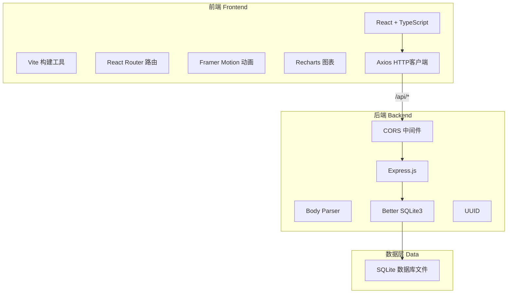
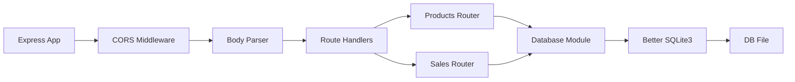
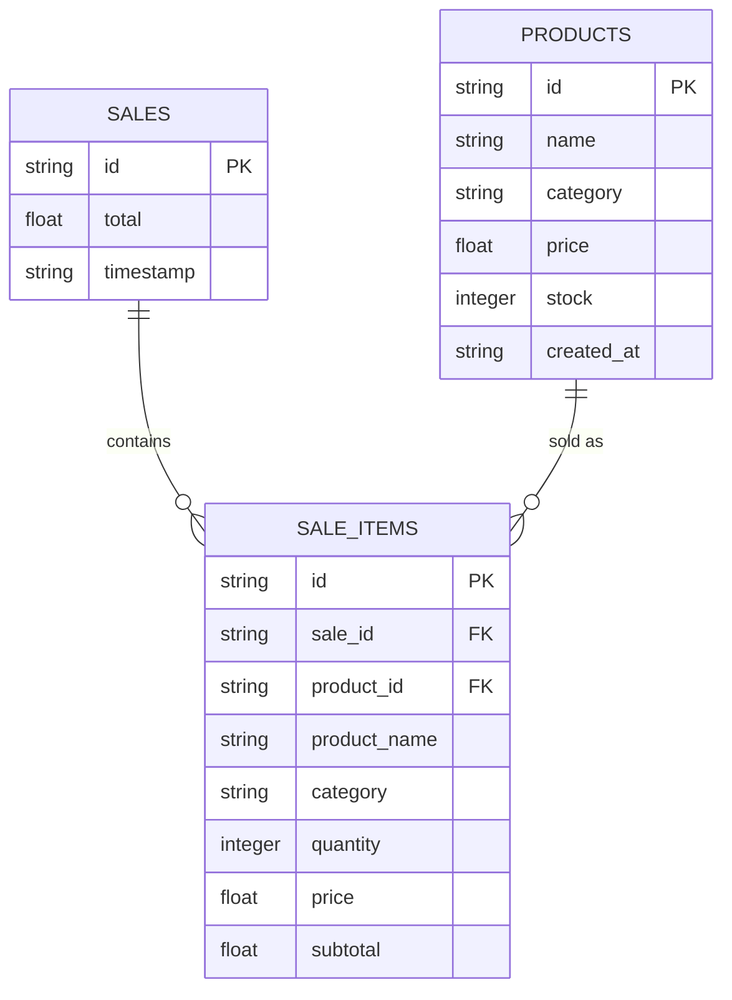

## 1. 架构设计



## 2. 技术栈说明

- **前端框架**：React@18 + TypeScript
- **构建工具**：Vite@5（含React插件和代理配置）
- **路由管理**：react-router-dom@6
- **HTTP客户端**：axios@1
- **图表库**：recharts@2
- **动画库**：framer-motion@11
- **后端框架**：Express@4
- **数据库**：better-sqlite3（本地文件数据库）
- **跨域处理**：cors
- **请求体解析**：body-parser
- **唯一ID生成**：uuid

## 3. 路由定义

| 路由路径 | 页面组件 | 用途 |
|----------|----------|------|
| / | ShopItemList | 重定向到商品管理页 |
| /products | ShopItemList | 商品管理页面（商品列表+购物车+价签生成） |
| /dashboard | SalesDashboard | 销售数据看板页面 |

## 4. API 定义

### 4.1 商品接口

#### 获取所有商品
- **GET** `/api/products`
- 响应：`Product[]`

#### 新增商品
- **POST** `/api/products`
- 请求体：`{ name: string, category: string, price: number, stock: number }`
- 响应：`Product`

#### 更新商品
- **PUT** `/api/products/:id`
- 请求体：`{ name?: string, category?: string, price?: number, stock?: number }`
- 响应：`Product`

#### 删除商品
- **DELETE** `/api/products/:id`
- 响应：`{ success: boolean }`

### 4.2 销售记录接口

#### 创建销售记录
- **POST** `/api/sales`
- 请求体：`{ items: { productId: string, quantity: number, price: number }[], total: number, timestamp: string }`
- 响应：`SaleRecord`

#### 获取今日销售统计
- **GET** `/api/sales/today`
- 响应：`{ totalSales: number, orderCount: number, topCategory: string, hourlySales: { hour: number, amount: number }[], categorySales: { category: string, amount: number }[] }`

### 4.3 TypeScript 类型定义

```typescript
interface Product {
  id: string;
  name: string;
  category: '首饰' | '陶艺' | '布艺' | '木工' | '插画';
  price: number;
  stock: number;
  createdAt: string;
}

interface SaleRecord {
  id: string;
  items: SaleItem[];
  total: number;
  timestamp: string;
}

interface SaleItem {
  productId: string;
  productName: string;
  category: string;
  quantity: number;
  price: number;
  subtotal: number;
}

interface CartItem {
  product: Product;
  quantity: number;
}
```

## 5. 服务器架构图



## 6. 数据模型

### 6.1 数据模型定义



### 6.2 数据定义语言

```sql
-- 商品表
CREATE TABLE IF NOT EXISTS products (
  id TEXT PRIMARY KEY,
  name TEXT NOT NULL,
  category TEXT NOT NULL,
  price REAL NOT NULL,
  stock INTEGER NOT NULL,
  created_at TEXT NOT NULL
);

-- 销售记录表
CREATE TABLE IF NOT EXISTS sales (
  id TEXT PRIMARY KEY,
  total REAL NOT NULL,
  timestamp TEXT NOT NULL
);

-- 销售明细表
CREATE TABLE IF NOT EXISTS sale_items (
  id TEXT PRIMARY KEY,
  sale_id TEXT NOT NULL,
  product_id TEXT NOT NULL,
  product_name TEXT NOT NULL,
  category TEXT NOT NULL,
  quantity INTEGER NOT NULL,
  price REAL NOT NULL,
  subtotal REAL NOT NULL,
  FOREIGN KEY (sale_id) REFERENCES sales(id)
);

-- 索引
CREATE INDEX IF NOT EXISTS idx_sales_timestamp ON sales(timestamp);
CREATE INDEX IF NOT EXISTS idx_sale_items_sale_id ON sale_items(sale_id);
CREATE INDEX IF NOT EXISTS idx_products_category ON products(category);
```

### 6.3 模拟数据初始化

- 首次运行自动插入10个商品（分布在5个品类中）
- 生成过去24小时内50条随机销售记录
- 每条销售记录包含商品ID、数量、总价和时间戳
