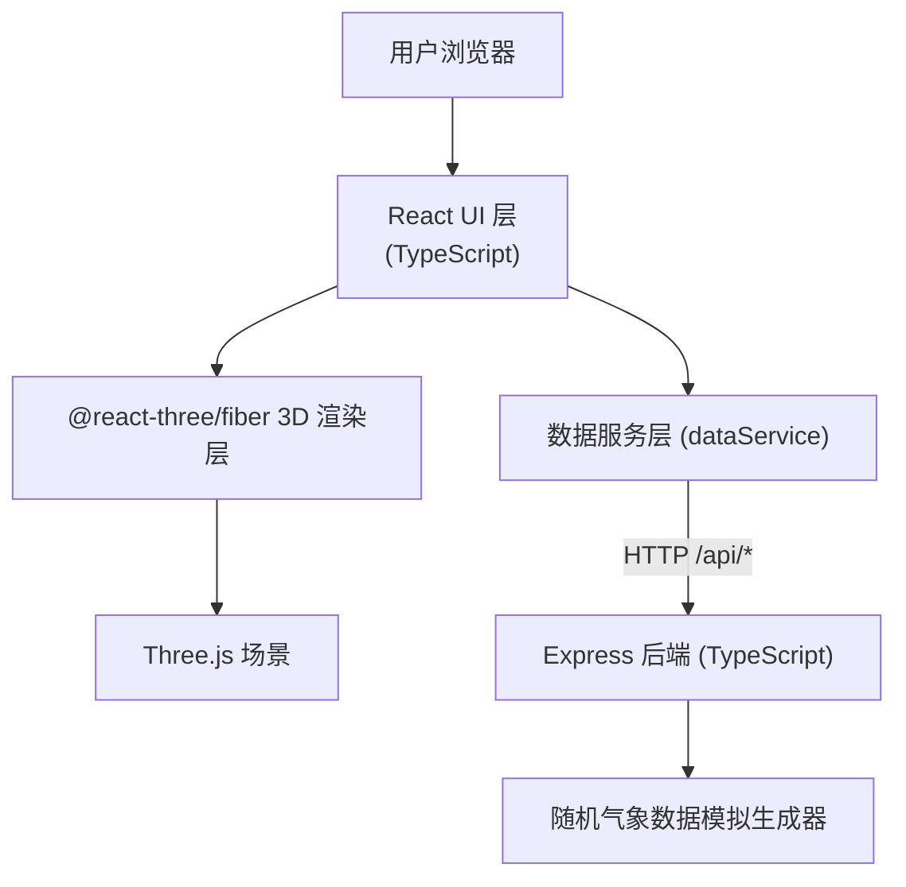
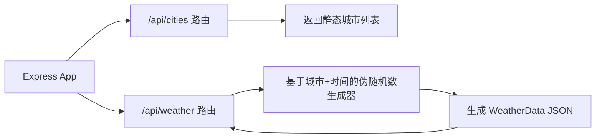

## 1. 架构设计



## 2. 技术描述

- **前端框架**：React 18 + TypeScript（严格模式，目标 ES2020）
- **构建工具**：Vite，开发代理后端到 3001 端口
- **3D 渲染**：Three.js + @react-three/fiber + @react-three/drei
- **UI 组件**：原生 React 组件，CSS 自定义样式（毛玻璃、渐变）
- **图表**：recharts（预留扩展，当前项目用于色阶可视化参考）
- **路由**：react-router-dom（单页应用，预留多页面扩展）
- **后端**：Express 4 + TypeScript（ts-node 运行）
- **并发开发**：concurrently 同时运行前端 Vite 和后端 Express

## 3. 路由定义

| 路由 | 用途 |
|-------|---------|
| / | 主页面，展示 3D 气象沙盘 |

## 4. API 定义

### 4.1 类型定义

```typescript
// 城市信息
interface City {
  id: string;
  name: string;
  lat: number;
  lon: number;
  elevation: number;
}

// 单个气象格点数据
interface WeatherPoint {
  x: number;        // 相对地形坐标 X
  y: number;        // 相对地形坐标 Y
  temperature: number;  // 温度 -10 ~ 45°C
  windSpeed: number;    // 风速 0 ~ 30 m/s
  windDirection: number; // 风向 0 ~ 360°（度）
  precipitation: number; // 降水量 0 ~ 100 mm/h
}

// 某时间点的全市气象数据
interface WeatherData {
  cityId: string;
  time: string;  // ISO 格式时间
  points: WeatherPoint[];
}
```

### 4.2 接口定义

| 方法 | 路径 | 参数 | 返回值 | 说明 |
|------|------|------|--------|------|
| GET | /api/cities | 无 | City[] | 获取所有城市列表 |
| GET | /api/weather | city: string, time: string | WeatherData | 获取指定城市指定时间的气象数据 |

## 5. 服务器架构



后端使用纯内存模拟，无需数据库，基于城市 ID 和时间字符串生成稳定的随机气象数据。

## 6. 项目文件结构

```
auto55/
├── package.json              # 根配置，含前后端依赖与脚本
├── index.html                # Vite 入口页面
├── vite.config.ts            # Vite 配置（代理到 :3001）
├── tsconfig.json             # TypeScript 严格模式配置
├── server/
│   └── index.ts              # Express 后端，提供气象 API
└── src/
    ├── main.tsx              # React 入口
    ├── App.tsx               # 主布局 + 全局状态管理
    ├── services/
    │   └── dataService.ts    # API 封装与类型定义
    └── components/
        ├── ScenarioScene.tsx # Three.js 场景（地形+气象+动画）
        ├── ControlPanel.tsx  # 底部时间轴控制条
        └── LegendPanel.tsx   # 右侧可折叠图例面板
```

## 7. 核心实现要点

### 7.1 地形渲染
- 使用 PlaneGeometry(200, 200, 50, 50)，顶点高度用多层 Perlin 噪声模拟
- 自定义 ShaderMaterial，顶点颜色根据高度从绿→黄绿→棕→白渐变
- 分块加载动画：按距中心距离排序，每 0.05s 显现一块，每块 0.5s 升起动画

### 7.2 气象元素
- **温度球**：InstancedMesh 管理 200~500 个球体，shader 内根据温度映射颜色和大小
- **风速流线**：使用 FlowField 算法生成流线，LineSegments + shader 实现箭头流动
- **降水粒子**：Points 材质，粒子位置和速度在 GPU 侧更新

### 7.3 数据更新
- 后端每 3 秒返回一批数据，前端在数据点之间做线性插值
- 所有可视化属性（颜色、大小、方向、密度）均使用 0.5s 平滑过渡

### 7.4 时间轴
- 范围 2024-01-01 到 2024-12-31，按月分 12 个刻度带吸磁
- 播放速度 1x/2x/4x/8x，对应每天/半天/6 小时/3 小时每秒

### 7.5 性能优化
- InstancedMesh 减少 draw call
- ShaderMaterial 减少 JS 侧数据更新
- 数据插值在 requestAnimationFrame 中增量更新，避免卡顿
