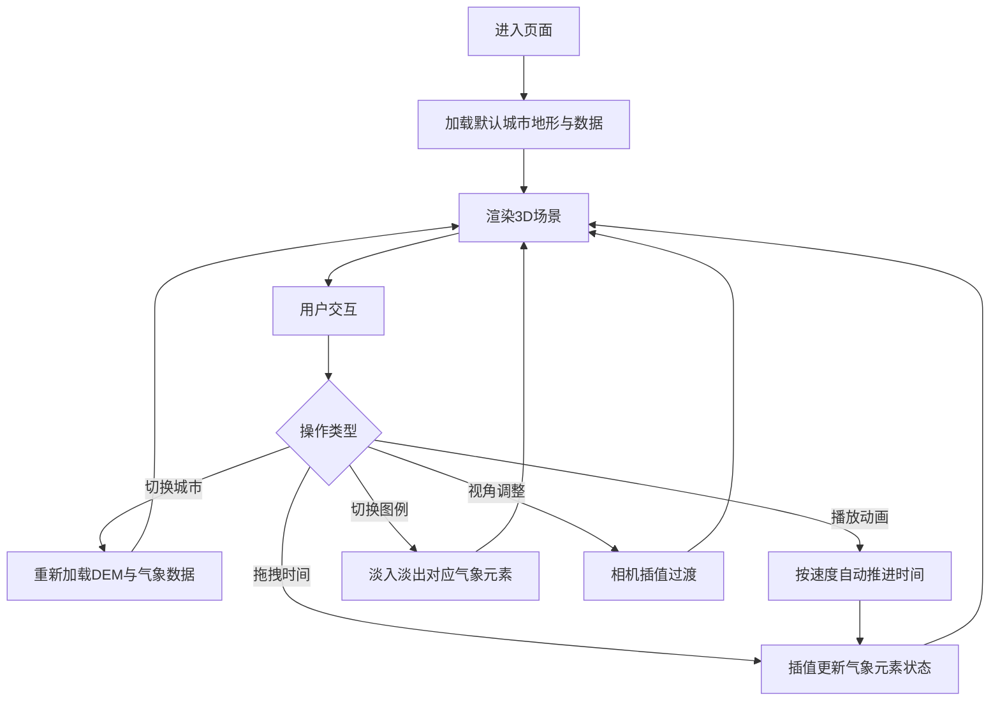

## 1. 产品概述

3D气象数据可视化沙盘是一个基于Web的交互式气象数据展示平台，通过三维地形与动态气象元素的结合，让用户直观地观察城市气象指标的时空变化。面向气象研究人员、教育工作者和数据可视化爱好者。

- 核心价值：将抽象的气象数据转化为直观、沉浸式的三维可视化体验
- 核心功能：城市切换、地形生成、气象动态展示、时间轴播放、图例交互

## 2. 核心功能

### 2.1 功能模块

1. **主场景页面**：三维地形展示、气象元素渲染、视角控制
2. **时间轴控制条**：城市选择、时间滑块、播放控制、速度调节
3. **图例面板**：温度色阶、风速示例、降水图例、元素显示切换

### 2.2 页面详情

| 页面名称 | 模块名称 | 功能描述 |
|-----------|-------------|---------------------|
| 主场景 | 三维地形 | DEM地形网格生成，按海拔着色，加载动画（从中心向外逐块显现，带上升动画） |
| 主场景 | 气象点阵 | 温度彩色小球（-10°C~45°C色阶）、风速流线（箭头+流动动画）、降水粒子 |
| 主场景 | 视角交互 | 鼠标拖拽旋转（阻尼0.92）、滚轮缩放（1x~10x）、视角变化0.4秒插值过渡 |
| 时间轴控制条 | 城市选择 | 下拉选择目标城市，触发地形和数据重新加载 |
| 时间轴控制条 | 播放控制 | 播放/暂停按钮、速度调节（1x/2x/4x/8x）、时间滑块拖拽（吸磁效果） |
| 时间轴控制条 | 时间显示 | 显示当前时间点和总时间范围，每月刻度标记，发光圆点跟随滑块 |
| 图例面板 | 温度图例 | 横向色阶条，带流动动画，点击切换显示 |
| 图例面板 | 风速图例 | 箭头示例动画，点击切换显示 |
| 图例面板 | 降水图例 | 粒子密度对应表，点击切换显示 |
| 图例面板 | 面板交互 | 可折叠收起，折叠后右侧显示半透明窄条按钮 |

## 3. 核心流程

用户进入页面后，默认加载第一个城市的地形和气象数据。用户可以通过下拉切换城市，拖拽时间滑块或点击播放按钮观察气象演变，通过右侧图例控制各气象元素的显示，通过鼠标交互调整观察视角。

## 4. 用户界面设计

### 4.1 设计风格

- **主色调**：深蓝(#0a1628)到灰黑(#1a1f2e)的渐变背景，模拟夜空效果
- **辅助色**：温度色阶（蓝→青→绿→黄→橙→红），风速用白色半透明，降水用蓝色粒子
- **按钮/控件**：统一圆角(8px)，毛玻璃质感(backdrop-filter: blur(10px))，半透明白色背景
- **字体**：无衬线字体，层次清晰（标题16px semibold，正文14px regular，说明12px light）
- **交互反馈**：按钮悬停亮度+15%并上移2px，点击缩放0.95后弹回1.0，过渡时长0.2s

### 4.2 页面设计概述

| 页面名称 | 模块名称 | UI元素 |
|-----------|-------------|-------------|
| 主场景 | 三维视口 | 全屏Canvas，居中占满背景，上层叠放时间轴和图例 |
| 主场景 | 背景装饰 | 夜空渐变 + 微弱星点，营造深度感 |
| 时间轴控制条 | 底部条 | 固定在底部，高度64px，横向布局：城市选择→速度选择→时间刻度→播放控制→时间文本 |
| 图例面板 | 右侧抽屉 | 默认展开，宽度320px，横向卡片排列，每张卡片含动画示例+说明+开关 |
| 图例面板 | 折叠按钮 | 折叠后右侧显示24px宽半透明条，带箭头指示 |

### 4.3 响应式设计

- **1280px以上**：完整布局，右侧图例展开，底部时间轴全功能
- **1024px~1280px**：右侧图例转为底部滑动抽屉，点击展开
- **768px以下**：时间轴缩小，仅保留播放/暂停按钮和当前时间文本

### 4.4 3D场景指导

- **环境**：深色渐变背景，模拟夜空，辅以环境光和半球光
- **光照**：AmbientLight(0.3) + DirectionalLight(0.8, 方向从上方偏前) + HemisphereLight(天地色)
- **相机**：PerspectiveCamera，初始位置(0, 80, 120)，看向原点，fov 50°
- **地形**：PlaneGeometry分段后随机生成高度，顶点着色器按海拔着色，从中心向外逐步显现(scale从0到1，y从-5到目标高度)
- **气象元素**：
  - 温度球：InstancedMesh管理大量小球，颜色和大小通过材质uniform插值
  - 风速流线：BufferGeometry + ShaderMaterial实现动态线条流动
  - 降水粒子：Points + ShaderMaterial实现粒子下落动画
- **后期**：轻微Bloom效果，提升发光圆点和高亮气象元素的视觉层次
- **性能**：目标帧率30fps+，播放时24fps+，单帧更新<200ms，使用InstancedMesh和ShaderMaterial优化大量元素渲染
