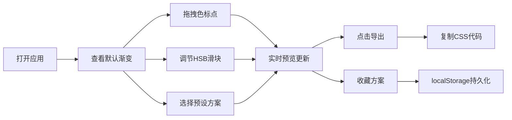

# Gradient Studio 产品需求文档

## 1. 产品概述

Gradient Studio 是一款在线CSS渐变色预览与微调工具，面向设计师和前端开发者，提供直观的交互式预览和参数调节能力，解决在挑选渐变配色时需要反复在代码和浏览器之间切换的效率问题。

- 核心价值：可视化渐变配色调试，实时预览，一键导出CSS代码
- 目标用户：UI设计师、前端开发者、创意工作者
- 产品定位：专业级渐变配色工具，深色主题，精致动效

## 2. 核心功能

### 2.1 用户角色

| 角色 | 注册方式 | 核心权限 |
|------|----------|----------|
| 访客用户 | 无需注册 | 使用全部渐变编辑、预览、导出、收藏功能 |

### 2.2 功能模块

1. **渐变预览区**：大型渐变色条展示，色标点拖拽，导出按钮
2. **控制面板**：渐变类型切换、色标参数编辑、预设方案、收藏管理
3. **导出功能**：CSS代码生成、复制、浮层展示
4. **收藏系统**：本地存储收藏方案，命名与删除

### 2.3 页面详情

| 页面名称 | 模块名称 | 功能描述 |
|---------|----------|----------|
| 主页面 | 渐变预览区 | 80px高渐变色条，可拖拽色标点，实时预览，导出按钮 |
| 主页面 | 控制面板 | 渐变类型切换、HSB颜色调节、十六进制输入、角度/形状调节 |
| 主页面 | 预设方案 | 10+种知名渐变预设，点击平滑过渡 |
| 主页面 | 收藏管理 | 2列网格收藏列表，命名输入，删除按钮，localStorage持久化 |
| 主页面 | 导出浮层 | 底部滑入动画，等宽字体代码展示，行号，复制按钮 |

## 3. 核心流程

用户打开应用 → 查看默认渐变 → 拖拽色标点/调节滑块/选择预设 → 预览实时更新 → 点击导出 → 复制CSS代码 → 收藏满意方案

## 4. 用户界面设计

### 4.1 设计风格

- **主背景色**：#1a1a2e（深紫蓝）
- **卡片背景**：#16213e（深蓝）
- **文字颜色**：#e0e0e0（浅灰）
- **强调色**：#e94560（玫红）
- **按钮风格**：圆角，hover半透明背景，点击向内缩放反馈
- **字体**：现代无衬线字体 + 等宽字体（代码展示）
- **布局风格**：左右分栏布局，可拖拽垂直分隔线
- **图标风格**：线性简约图标

### 4.2 页面设计概览

| 页面名称 | 模块名称 | UI元素 |
|---------|----------|--------|
| 主页面 | 渐变预览区 | 大号渐变色条（圆角12px，高80px）、彩色可拖拽圆点、导出按钮 |
| 主页面 | 控制面板 | 折叠式分段布局、箭头旋转动画、高度过渡动画 |
| 主页面 | 预设卡片 | 渐变缩略图、卡片hover效果、点击0.4s平滑过渡 |
| 主页面 | 收藏卡片 | 2列网格、缩略图、命名输入框、删除按钮 |
| 主页面 | 导出浮层 | 底部滑入、半透明背景、圆角16px、代码块带行号、复制按钮带对勾 |

### 4.3 响应式设计

- **桌面端**（≥768px）：左右分栏布局，预览区60%（最小480px），控制区40%（最小320px）
- **平板/移动端**（＜768px）：上下布局，预览区在上，控制区在下
- **预设卡片**：桌面端3列，移动端2列
- **触摸优化**：色标点触摸区域扩大，滑块高度增加

### 4.4 动画与动效

- 颜色切换过渡：0.2秒平滑过渡
- 预设切换过渡：0.4秒渐变过渡
- 折叠面板展开收起：max-height过渡 + 箭头旋转0.2秒
- 导出浮层：底部滑入动画
- 按钮hover：背景色从透明到半透明（0.2秒）
- 按钮点击：向内缩放（1.0 → 0.95 → 1.0，0.15秒）
- 复制反馈：文字变为"已复制"+绿色对勾，1.5秒后恢复
- 分隔线拖拽：高亮色#e94560

### 4.5 性能要求

- 色标点拖拽帧率 ≥ 30fps
- 滑块调节无明显卡顿或闪烁
- 使用requestAnimationFrame或防抖优化频繁重绘
