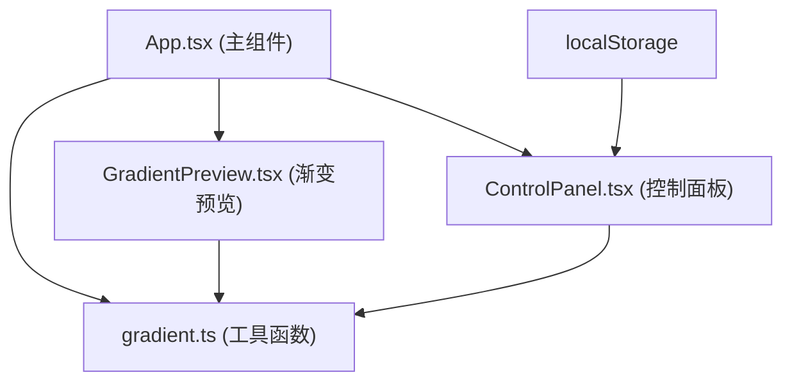

# Gradient Studio 技术架构文档

## 1. 架构设计



## 2. 技术说明

- **前端框架**：React 18 + TypeScript
- **构建工具**：Vite
- **样式方案**：原生CSS（CSS Modules风格的scoped样式，使用styled-components或内联样式处理动态渐变）
- **状态管理**：React useState/useReducer（组件内状态）
- **数据持久化**：localStorage
- **图标库**：lucide-react

## 3. 文件结构

```
├── package.json
├── index.html
├── vite.config.ts
├── tsconfig.json
└── src/
    ├── App.tsx              # 主组件，管理渐变状态、布局、分隔线拖拽
    ├── main.tsx             # 入口文件
    ├── index.css            # 全局样式
    ├── components/
    │   ├── GradientPreview.tsx  # 渐变预览组件（色条、色标点拖拽、导出按钮）
    │   └── ControlPanel.tsx     # 控制面板组件（色标编辑、预设、收藏）
    └── utils/
        └── gradient.ts       # 渐变工具函数（生成CSS、颜色校验、导出代码）
```

## 4. 核心类型定义

### 4.1 色标类型

```typescript
interface ColorStop {
  id: string;
  color: string;     // hex颜色
  position: number;  // 0-100 百分比
}
```

### 4.2 渐变类型

```typescript
type GradientType = 'linear' | 'radial';

interface GradientConfig {
  type: GradientType;
  stops: ColorStop[];
  angle: number;      // 线性渐变角度 (0-360)
  shape: 'circle' | 'ellipse';  // 径向渐变形状
}
```

### 4.3 预设方案类型

```typescript
interface PresetGradient {
  id: string;
  name: string;
  type: GradientType;
  stops: ColorStop[];
  angle?: number;
  shape?: 'circle' | 'ellipse';
}
```

### 4.4 收藏类型

```typescript
interface FavoriteGradient {
  id: string;
  name: string;
  type: GradientType;
  stops: ColorStop[];
  angle: number;
  shape: 'circle' | 'ellipse';
  createdAt: number;
}
```

## 5. 核心功能实现方案

### 5.1 色标点拖拽

- 使用mousedown/mousemove/mouseup事件监听
- 拖拽时通过requestAnimationFrame优化性能
- 计算鼠标在渐变色条上的相对位置，更新色标position
- 限制色标位置在0-100%范围内

### 5.2 预设平滑过渡

- 点击预设时，保存当前渐变状态为起始状态
- 使用requestAnimationFrame在0.4秒内插值过渡
- 颜色插值：RGB颜色空间线性插值
- 位置/角度插值：数值线性插值

### 5.3 颜色调节（HSB）

- 色相滑块：0-360度
- 饱和度滑块：0-100%
- 明度滑块：0-100%
- 十六进制输入框：支持#RRGGBB格式
- HSB与Hex互转工具函数

### 5.4 导出功能

- 生成标准CSS渐变代码
- 浮层从底部滑入（CSS transform + transition）
- 代码展示：等宽字体 + 行号
- 复制功能：navigator.clipboard.writeText
- 复制反馈：setTimeout 1.5秒恢复

### 5.5 收藏系统

- localStorage存储，key: 'gradient_favorites'
- 初始化时从localStorage读取
- 增删操作后同步保存
- 命名输入框双向绑定

### 5.6 可拖拽分隔线

- mousedown记录起始位置和起始宽度
- mousemove时计算宽度变化，更新左右面板宽度
- 最小宽度限制：预览区480px，控制区320px
- 拖拽时分隔线高亮为#e94560

### 5.7 折叠面板

- 使用max-height过渡实现展开收起动画
- 箭头图标旋转0.2秒过渡
- 每个分段独立管理展开状态

### 5.8 性能优化

- 色标位置更新使用requestAnimationFrame批量处理
- 滑块调节使用requestAnimationFrame
- 避免不必要的重渲染（React.memo优化子组件）

## 6. 预设方案列表

1. 日出 (Sunrise)
2. 海洋 (Ocean)
3. 极光 (Aurora)
4. 霓虹 (Neon)
5. 复古 (Vintage)
6. 日落 (Sunset)
7. 森林 (Forest)
8. 星空 (Starry Night)
9. 火焰 (Flame)
10. 薰衣草 (Lavender)
11. 薄荷 (Mint)
12. 黄金 (Golden Hour)
