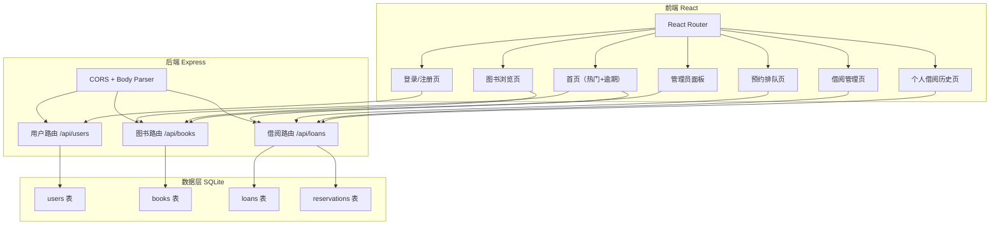
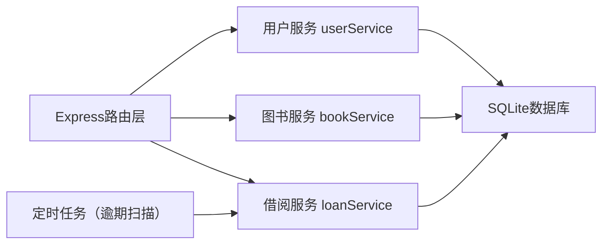
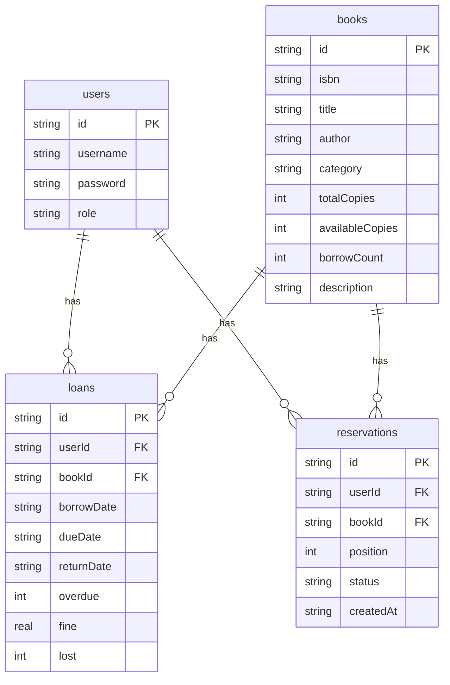

## 1. 架构设计



## 2. 技术说明

- 前端：React@18 + TypeScript + TailwindCSS + Vite
- 状态管理：Zustand
- 路由：react-router-dom
- 动画：framer-motion
- 图表：recharts
- HTTP客户端：axios
- 图标：lucide-react
- 初始化工具：vite-init（react-express-ts模板）
- 后端：Express@4 + TypeScript（ESM格式）
- 数据库：SQLite（better-sqlite3）
- 其他后端依赖：cors, uuid, body-parser

## 3. 路由定义

| 路由 | 目的 |
|------|------|
| /login | 登录/注册页面 |
| / | 首页（热门图书推荐+逾期提醒） |
| /books | 图书浏览与搜索页 |
| /my-loans | 个人借阅历史与统计页 |
| /admin | 管理员借阅管理+图书管理面板 |

## 4. API定义

### 4.1 用户模块 /api/users

| 方法 | 路径 | 请求体 | 响应 |
|------|------|--------|------|
| POST | /api/users/register | `{ username, password, role }` | `{ id, username, role }` |
| POST | /api/users/login | `{ username, password }` | `{ user: { id, username, role }, token }` |
| GET | /api/users/:id | - | `{ id, username, role }` |

### 4.2 图书模块 /api/books

| 方法 | 路径 | 请求体 | 响应 |
|------|------|--------|------|
| GET | /api/books | query: `?search=&category=` | `Book[]` |
| GET | /api/books/popular | - | `Book[]`（前6本热门） |
| GET | /api/books/:id | - | `Book` |
| POST | /api/books | `{ isbn, title, author, category, totalCopies }` | `Book` |
| PUT | /api/books/:id | `{ isbn?, title?, author?, category?, totalCopies? }` | `Book` |
| DELETE | /api/books/:id | - | `{ success: true }` |

### 4.3 借阅模块 /api/loans

| 方法 | 路径 | 请求体 | 响应 |
|------|------|--------|------|
| POST | /api/loans/borrow | `{ userId, bookId }` | `Loan` |
| POST | /api/loans/return/:id | - | `Loan` |
| GET | /api/loans/user/:userId | query: `?year=&category=` | `Loan[]` |
| GET | /api/loans/overdue | - | `Loan[]` |
| GET | /api/loans/stats/:userId | - | `{ byYear: [...], byCategory: [...] }` |
| POST | /api/loans/reserve | `{ userId, bookId }` | `{ reservationId, position }` |
| GET | /api/loans/reservations/:userId | - | `Reservation[]` |
| GET | /api/loans | query: `?userName=&bookTitle=&dateFrom=&dateTo=` | `Loan[]` |

### 4.4 TypeScript类型定义

```typescript
interface Book {
  id: string;
  isbn: string;
  title: string;
  author: string;
  category: string;
  totalCopies: number;
  availableCopies: number;
  borrowCount: number;
  description: string;
}

interface User {
  id: string;
  username: string;
  password: string;
  role: 'reader' | 'admin';
}

interface Loan {
  id: string;
  userId: string;
  bookId: string;
  borrowDate: string;
  dueDate: string;
  returnDate: string | null;
  overdue: boolean;
  fine: number;
  lost: boolean;
  userName?: string;
  bookTitle?: string;
}

interface Reservation {
  id: string;
  userId: string;
  bookId: string;
  position: number;
  status: 'active' | 'fulfilled' | 'cancelled';
  createdAt: string;
  bookTitle?: string;
}
```

## 5. 服务器架构图



## 6. 数据模型

### 6.1 数据模型定义



### 6.2 数据定义语言

```sql
CREATE TABLE IF NOT EXISTS users (
  id TEXT PRIMARY KEY,
  username TEXT UNIQUE NOT NULL,
  password TEXT NOT NULL,
  role TEXT NOT NULL DEFAULT 'reader'
);

CREATE TABLE IF NOT EXISTS books (
  id TEXT PRIMARY KEY,
  isbn TEXT UNIQUE NOT NULL,
  title TEXT NOT NULL,
  author TEXT NOT NULL,
  category TEXT NOT NULL,
  totalCopies INTEGER NOT NULL DEFAULT 1,
  availableCopies INTEGER NOT NULL DEFAULT 1,
  borrowCount INTEGER NOT NULL DEFAULT 0,
  description TEXT DEFAULT ''
);

CREATE TABLE IF NOT EXISTS loans (
  id TEXT PRIMARY KEY,
  userId TEXT NOT NULL,
  bookId TEXT NOT NULL,
  borrowDate TEXT NOT NULL,
  dueDate TEXT NOT NULL,
  returnDate TEXT,
  overdue INTEGER NOT NULL DEFAULT 0,
  fine REAL NOT NULL DEFAULT 0,
  lost INTEGER NOT NULL DEFAULT 0,
  FOREIGN KEY (userId) REFERENCES users(id),
  FOREIGN KEY (bookId) REFERENCES books(id)
);

CREATE TABLE IF NOT EXISTS reservations (
  id TEXT PRIMARY KEY,
  userId TEXT NOT NULL,
  bookId TEXT NOT NULL,
  position INTEGER NOT NULL,
  status TEXT NOT NULL DEFAULT 'active',
  createdAt TEXT NOT NULL,
  FOREIGN KEY (userId) REFERENCES users(id),
  FOREIGN KEY (bookId) REFERENCES books(id)
);

CREATE INDEX IF NOT EXISTS idx_loans_user ON loans(userId);
CREATE INDEX IF NOT EXISTS idx_loans_book ON loans(bookId);
CREATE INDEX IF NOT EXISTS idx_loans_overdue ON loans(overdue);
CREATE INDEX IF NOT EXISTS idx_reservations_book ON reservations(bookId);
CREATE INDEX IF NOT EXISTS idx_reservations_user ON reservations(userId);
CREATE INDEX IF NOT EXISTS idx_books_category ON books(category);
CREATE INDEX IF NOT EXISTS idx_books_isbn ON books(isbn);
```
