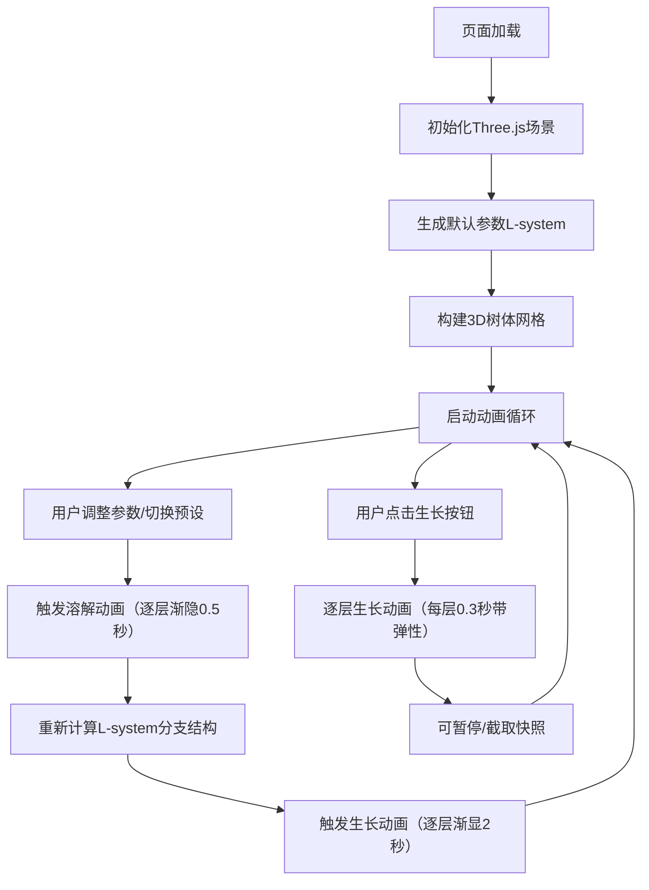

## 1. 产品概述

3D分形植物生长模拟工具，基于L-system算法实现可交互的植物分形结构可视化。面向生物模拟爱好者和设计师，解决难以直观调整L-system参数并实时观察分形结构变化的问题。

## 2. 核心功能

### 2.1 功能模块
1. **主场景**：3D分形树渲染、鼠标交互视角控制、微风摇摆动画
2. **参数控制面板**：迭代次数、主干长度、分支角度、衰减系数、叶密度滑块控制
3. **生长回放**：逐层生长动画、暂停控制、快照保存
4. **预设模板**：6种分形规则模板切换，粒子动画过渡
5. **状态栏**：实时帧率、迭代次数、分支数、叶数统计

### 2.2 页面详情
| 页面名称 | 模块名称 | 功能描述 |
|-----------|-------------|---------------------|
| 主页 | 3D场景 | Three.js渲染3D分形树，支持鼠标拖拽旋转、滚轮缩放、视角平滑插值 |
| 主页 | 控制面板 | 左侧半透明毛玻璃面板，滑块实时调节参数，数值显示在控件下方 |
| 主页 | 生长控制 | 生长/暂停按钮，快照截取保存为带时间戳的图片 |
| 主页 | 预设切换 | 6种预设模板（毕达哥拉斯树、龙形曲线、科赫雪花、蕨类、灌木、仙人掌）选择 |
| 主页 | 状态栏 | 底部半透明状态栏，显示FPS、迭代数、分支数、叶数 |

## 3. 核心流程

## 4. 用户界面设计

### 4.1 设计风格
- **主题配色**：赛博朋克深色科技感，背景渐变#1a1a2e到#16213e
- **主色**：霓虹绿#00ff88，辅色：霓虹蓝#0088ff
- **字体**：参数数值使用monospace等宽字体
- **毛玻璃效果**：控制面板使用rgba(255,255,255,0.08)背景配合10px模糊
- **动画过渡**：所有按钮和滑块悬停有0.2秒颜色渐变

### 4.2 页面设计概述
| 页面名称 | 模块名称 | UI元素 |
|-----------|-------------|-------------|
| 主页 | 3D场景 | 深灰渐变背景，棕色圆柱体树干，绿色球体树叶，整体摇摆动画 |
| 主页 | 控制面板 | 左侧280px宽半透明面板，滑块+数值显示，生长/暂停/快照按钮，预设选择器 |
| 主页 | 状态栏 | 底部半透明条，绿色FPS数值 + 迭代/分支/叶数统计 |
| 主页 | 移动端 | 窗口<768px时控制面板折叠为悬浮图标，点击展开覆盖层 |

### 4.3 响应式
桌面优先，移动端自适应。窗口宽度小于768px时控制面板折叠为右下角悬浮按钮，点击展开为全屏覆盖层。

### 4.4 3D场景指导
- **光照**：环境光 + 方向光模拟自然光照
- **相机**：PerspectiveCamera，初始位置可观察整棵树
- **控制**：OrbitControls实现拖拽旋转、阻尼系数0.9、平滑插值0.3秒
- **材质**：树干使用MeshStandardMaterial棕色，树叶使用绿色半透明
- **性能**：合并几何体减少draw call，帧率监控降级处理
