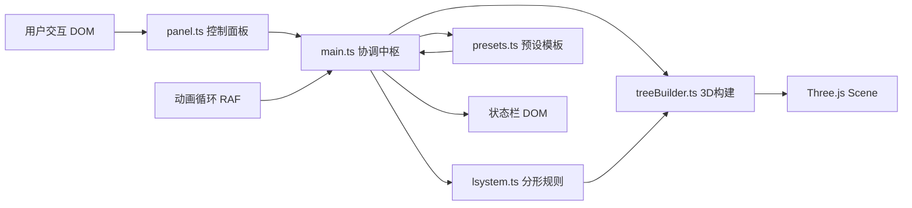

## 1. 架构设计



## 2. 技术描述
- **前端框架**：原生 TypeScript + Three.js（CDN引入）
- **构建工具**：Vite 5.x
- **类型系统**：TypeScript 严格模式
- **数据流向**：panel → main → lsystem/treeBuilder/presets → main → scene/DOM

## 3. 文件结构

| 文件 | 职责 |
|------|------|
| `index.html` | 入口页面，引入Three.js CDN，挂载容器 |
| `package.json` | 依赖three, @types/three, vite, typescript |
| `vite.config.js` | 基础Vite配置 |
| `tsconfig.json` | TypeScript严格模式配置 |
| `src/main.ts` | 场景初始化、相机、渲染器、动画循环、模块协调 |
| `src/lsystem.ts` | L-system字符串生成、分支规则解析、边界检查 |
| `src/treeBuilder.ts` | 构建3D网格、生长/消散/粒子动画、弹性效果 |
| `src/panel.ts` | DOM控制面板生成、滑块事件、响应式折叠 |
| `src/presets.ts` | 6种预设参数配置、切换函数 |

## 4. 核心类型定义

```typescript
interface LSystemParams {
  iterations: number;      // 3-8
  trunkLength: number;     // 10-30
  branchAngle: number;     // 10-60 degrees
  lengthDecay: number;     // 0.6-0.9
  leafDensity: number;     // 0-1
  axiom?: string;
  rules?: Record<string, string>;
}

interface BranchSegment {
  start: THREE.Vector3;
  end: THREE.Vector3;
  depth: number;
  hasLeaf: boolean;
}

interface TreeBuildResult {
  group: THREE.Group;
  segments: BranchSegment[];
  branchCount: number;
  leafCount: number;
  maxDepth: number;
}
```

## 5. 动画系统

| 动画类型 | 实现方式 | 时长 |
|----------|----------|------|
| 参数调整溶解 | 每层分支opacity从1→0，间隔0.05s | 0.5s |
| 参数重建生长 | 每层分支opacity从0→1+scale，间隔0.05s | 2.0s |
| 生长回放 | 每层从末端延展，弹性easeOutElastic | 0.3s/层 |
| 预设切换消散 | 粒子从网格位置向四周飞散+渐隐 | 1.0s |
| 预设切换汇聚 | 粒子从四周飞向中心凝聚成形 | 1.2s |
| 微风摇摆 | 正弦波驱动Group.rotation.z，幅度5度周期2s | 持续 |

## 6. 性能优化策略
- 合并同类型几何体减少draw call
- 材质共享、实例化渲染树叶
- 帧率监控：FPS<30时自动减少树叶密度/降低迭代
- 对象池复用粒子系统
- requestAnimationFrame与dt绑定，高帧率设备不浪费算力
