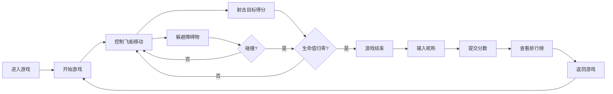

## 1. 产品概述

节奏空间是一款基于节奏感的空间射击挑战游戏，玩家驾驶飞船在动态生成的障碍网格中躲避并射击目标，通过精准的时机把控获取高分并挑战排行榜。

- 核心玩法：结合音乐节奏与射击躲避，提供沉浸式的太空游戏体验
- 目标用户：休闲游戏爱好者，追求高分挑战的玩家
- 市场价值：结合节奏感与射击元素的创新玩法，具备高度重玩价值

## 2. 核心特性

### 2.1 用户角色

| 角色 | 注册方式 | 核心权限 |
|------|---------|---------|
| 普通玩家 | 无需注册，游戏结束后输入昵称提交分数 | 进行游戏、提交分数、查看排行榜 |

### 2.2 功能模块

1. **游戏主页**：Canvas游戏画布、得分显示、生命值显示、节奏指示条、操作提示
2. **游戏核心逻辑**：飞船控制、障碍物生成、目标生成、子弹射击、碰撞检测、粒子效果
3. **排行榜页面**：TOP20分数展示、新分数高亮动画、返回游戏按钮

### 2.3 页面详情

| 页面名称 | 模块名称 | 功能描述 |
|---------|---------|----------|
| 游戏主页 | 游戏画布 | 800x600 Canvas渲染，深空背景星星闪烁 |
| 游戏主页 | 飞船控制 | 方向键控制三角形飞船移动，边界限制 |
| 游戏主页 | 障碍系统 | 节奏生成障碍物，速度随分数提升 |
| 游戏主页 | 射击系统 | 空格键发射子弹，命中目标得分 |
| 游戏主页 | HUD界面 | 得分、生命值、节奏条实时显示 |
| 游戏主页 | 结束界面 | 最终得分展示、昵称输入、重新开始按钮 |
| 排行榜 | 榜单展示 | TOP20分数列表，降序排列 |
| 排行榜 | 动效展示 | 新条目滑入动画、金色高亮 |

## 3. 核心流程

## 4. 界面设计

### 4.1 设计风格

- **主色调**：深空蓝黑色 #0a0a2e
- **面板背景**：渐变紫蓝色 #3b2066 到 #1a1a4e
- **强调色**：白色文字、金色 #ffd700 高亮
- **按钮风格**：圆角矩形，深蓝到亮蓝渐变，悬停平滑过渡
- **字体**：采用现代科幻风格字体，数字使用等宽字体
- **布局**：游戏画布居中，周围环绕控制面板和排行榜入口
- **动画风格**：粒子效果、弹性动画、平滑过渡

### 4.2 页面设计概览

| 页面名称 | 模块名称 | UI元素 |
|---------|---------|--------|
| 游戏主页 | 游戏画布 | 深空背景、星星闪烁、飞船、障碍物、目标、子弹、粒子效果 |
| 游戏主页 | HUD | 左上角得分(白色粗体发光)、右上角心形生命值、底部节奏条 |
| 游戏主页 | 结束面板 | 半透明背景、最终得分、昵称输入框、提交按钮、重新开始 |
| 排行榜 | 标题区 | 金色标题、返回按钮 |
| 排行榜 | 列表区 | 隔行透明度区分、排名、昵称、分数、新条目高亮动画 |

### 4.3 响应式设计

- **桌面端**：游戏画布800x600居中，操作面板两侧分布
- **移动端**（宽度<768px）：
  - 游戏画布按比例缩放至屏幕宽度
  - 操作提示和排行榜布局垂直堆叠
  - 确保单手可操作的触控区域

### 4.4 性能要求

- 游戏渲染帧率稳定60FPS
- 游戏对象总数不超过50个，超出时自动回收复用
- Canvas 2D绘制无明显卡顿闪烁
- 后端API响应时间<200ms
