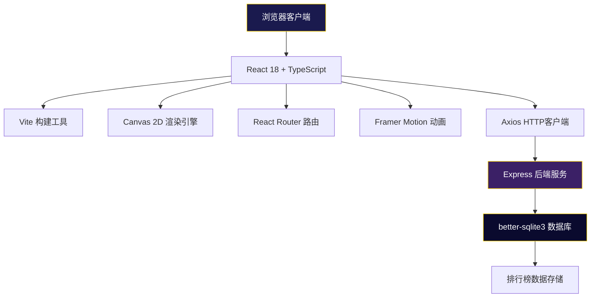
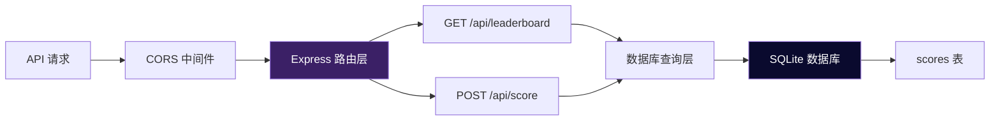
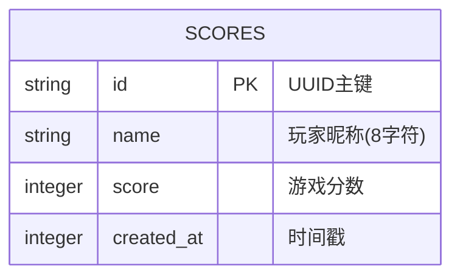

## 1. 架构设计



## 2. 技术描述

- **前端框架**：React 18 + TypeScript
- **构建工具**：Vite
- **渲染引擎**：Canvas 2D API
- **路由管理**：react-router-dom v6
- **动画库**：framer-motion
- **HTTP客户端**：axios
- **后端框架**：Express 4
- **数据库**：better-sqlite3
- **唯一ID**：uuid
- **跨域处理**：cors
- **并发启动**：concurrently

## 3. 路由定义

| 路由 | 页面 | 描述 |
|-----|------|------|
| / | 游戏主页 | 游戏主界面，包含Canvas画布和HUD |
| /leaderboard | 排行榜 | TOP20分数展示页面 |

## 4. API 定义

### 类型定义

```typescript
interface ScoreEntry {
  id: string;
  name: string;
  score: number;
  created_at: number;
}

interface LeaderboardResponse {
  data: ScoreEntry[];
  count: number;
}

interface SubmitScoreRequest {
  name: string;
  score: number;
}

interface SubmitScoreResponse {
  success: boolean;
  message: string;
  entry: ScoreEntry;
}
```

### API 端点

#### GET /api/leaderboard
- **描述**：获取TOP20排行榜数据
- **响应**：`LeaderboardResponse`
- **响应示例**：
```json
{
  "data": [
    {
      "id": "uuid-1",
      "name": "Player1",
      "score": 250,
      "created_at": 1234567890
    }
  ],
  "count": 1
}
```

#### POST /api/score
- **描述**：提交玩家分数
- **请求体**：`SubmitScoreRequest`
- **响应**：`SubmitScoreResponse`
- **请求限制**：name最长8字符，score非负整数

## 5. 服务器架构



## 6. 数据模型

### 6.1 数据模型定义



### 6.2 DDL 语句

```sql
CREATE TABLE IF NOT EXISTS scores (
  id TEXT PRIMARY KEY,
  name TEXT NOT NULL CHECK(LENGTH(name) <= 8),
  score INTEGER NOT NULL CHECK(score >= 0),
  created_at INTEGER NOT NULL
);

CREATE INDEX IF NOT EXISTS idx_scores_score ON scores(score DESC);
CREATE INDEX IF NOT EXISTS idx_scores_created ON scores(created_at DESC);
```

## 7. 项目文件结构

```
├── package.json
├── vite.config.js
├── tsconfig.json
├── index.html
├── server.js
├── data/
│   └── leaderboard.db
└── src/
    ├── main.tsx
    ├── Game.tsx
    ├── types/
    │   └── game.ts
    ├── game/
    │   ├── Engine.ts
    │   ├── Ship.ts
    │   ├── Obstacle.ts
    │   ├── Target.ts
    │   ├── Bullet.ts
    │   ├── Particle.ts
    │   └── ObjectPool.ts
    ├── hooks/
    │   └── useGameLoop.ts
    └── ui/
        └── Leaderboard.tsx
```

## 8. 核心模块说明

### 游戏引擎 (Engine.ts)
- 管理Canvas渲染循环
- 处理键盘输入
- 协调游戏对象更新和碰撞检测
- 对象池管理

### 对象池 (ObjectPool.ts)
- 复用游戏对象减少GC
- 控制最大对象数量(≤50)
- 提供acquire/release接口

### 碰撞检测
- AABB碰撞检测算法
- 圆形碰撞检测(目标、子弹)
- 边界检测

### 动画系统
- 粒子系统：尾焰、爆炸效果
- 脉动动画：障碍物、目标
- CSS/Framer Motion：UI元素动画
