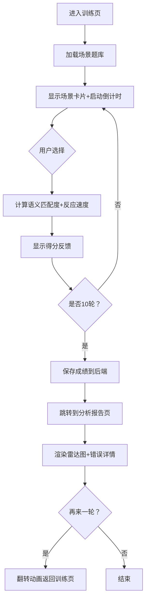

## 1. 产品概述
即兴台词训练与反应力挑战平台，通过模拟真实社交场景帮助用户提升临场应变能力和语言表达能力。目标用户包括即兴表演爱好者、职场人士、学生群体等需要提升沟通技巧的人群。通过游戏化的训练方式，让用户在趣味中获得真实的能力提升。

## 2. 核心功能

### 2.1 用户角色
| 角色 | 注册方式 | 核心权限 |
|------|----------|----------|
| 普通用户 | 自动生成匿名ID | 使用训练功能、查看个人成绩报告 |

### 2.2 功能模块
1. **训练会话页面**：场景卡片展示、5秒倒计时、选项选择、实时反馈、连击特效、错误冷却
2. **分析报告页面**：雷达图可视化、错误详情列表、历史成绩查询、再来一轮功能

### 2.3 页面详情
| 页面名称 | 模块名称 | 功能描述 |
|-----------|-------------|---------------------|
| 训练会话页 | 场景引擎 | 随机场景生成、倒计时控制、选项渲染与点击判定 |
| 训练会话页 | 计分系统 | 语义匹配百分比计算、反应速度得分、连击状态管理 |
| 训练会话页 | 动画系统 | 卡片缩放动画、环形进度条、数字滚动动画、粒子特效 |
| 分析报告页 | 雷达图模块 | Chart.js绘制五维能力图、数据点摆动动画 |
| 分析报告页 | 错误详情 | 最近5条错误记录、展开对比正确项与错误项 |
| 分析报告页 | 导航模块 | 翻转卡片动画返回训练页 |

## 3. 核心流程
用户进入训练页面 → 系统加载场景题库 → 显示场景卡片并启动5秒倒计时 → 用户在限定时间内选择回复选项 → 系统计算得分并展示反馈 → 累计10轮后跳转到分析报告页 → 查看雷达图和错误详情 → 可选择再来一轮。

## 4. 用户界面设计

### 4.1 设计风格
- 主色调：渐变紫色到蓝色作为背景，毛玻璃卡片效果
- 辅助色：绿色（正确）、红色（错误/倒计时警告）、金色（连击特效）
- 按钮风格：圆角8px，高度48px，淡紫到蓝色渐变过渡
- 字体：采用现代无衬线字体，标题加粗，正文清晰易读
- 布局：居中卡片式布局，大量留白突出核心内容
- 动画风格：流畅的缓动曲线，弹性反馈，微交互丰富

### 4.2 页面设计概述
| 页面名称 | 模块名称 | UI元素 |
|-----------|-------------|----------|
| 训练会话页 | 场景卡片 | 圆角16px毛玻璃效果、中心缩放展开动画0.4s ease-out、径向渐变背景 |
| 训练会话页 | 环形进度条 | 绿到红渐变色、每秒更新12次、快结束时脉冲光晕 |
| 训练会话页 | 选项按钮 | 圆角8px高48px、点击缩放0.95弹回、淡紫到蓝色渐变、0.1s偏移过渡 |
| 训练会话页 | 反馈动画 | 绿色对勾缩放0.3s、数字滚动0.5s（间隔0.03s）、金色粒子爆射0.6s |
| 分析报告页 | 雷达图 | 透明背景浅灰网格、五维标注、数据点摆动动画（间隔0.1s） |
| 分析报告页 | 错误列表 | 红色圆点标记、点击展开对比、时间倒序排列 |
| 分析报告页 | 再来一轮 | 翻转卡片动画0.5s |

### 4.3 响应式
桌面端优先设计，移动端自适应布局，卡片最大宽度限制，触摸设备优化按钮点击区域。

### 4.4 性能要求
- 动画帧率稳定在55帧以上
- 选择判定到反馈渲染总延迟不超过100ms
- 使用requestAnimationFrame实现流畅动画
