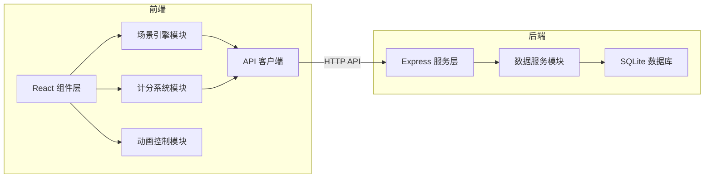
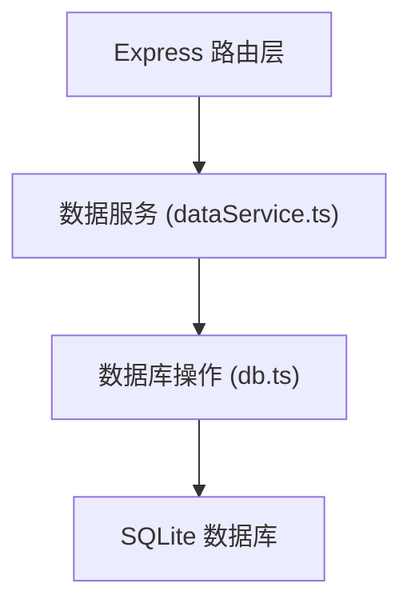
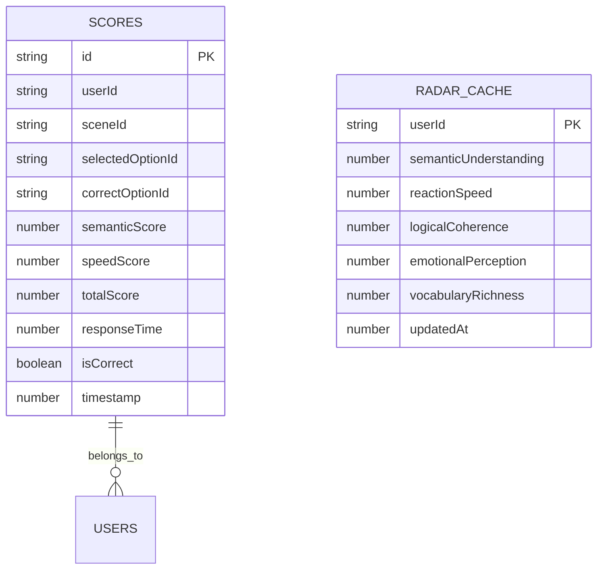

## 1. 架构设计


## 2. 技术描述
- 前端：React@18 + TypeScript + Vite + framer-motion + Chart.js + react-chartjs-2 + axios + react-router-dom
- 后端：Express@4 + better-sqlite3 + cors + uuid
- 构建工具：Vite
- 数据库：SQLite（better-sqlite3驱动）
- 状态管理：React Hooks (useState, useEffect, useRef)
- 动画库：framer-motion
- 图表库：Chart.js + react-chartjs-2

## 3. 路由定义
| 路由 | 页面 | 目的 |
|-------|------|---------|
| / | 训练会话页 | 进行即兴台词训练 |
| /analysis | 分析报告页 | 查看训练结果和能力雷达图 |

## 4. API 定义

### 类型定义
```typescript
interface Scene {
  id: string;
  description: string;
  options: { id: string; text: string; isCorrect: boolean; matchScore: number }[];
  category: string;
}

interface ScoreRecord {
  id: string;
  userId: string;
  sceneId: string;
  selectedOptionId: string;
  correctOptionId: string;
  semanticScore: number;
  speedScore: number;
  totalScore: number;
  responseTime: number;
  isCorrect: boolean;
  timestamp: number;
}

interface RadarData {
  semanticUnderstanding: number;
  reactionSpeed: number;
  logicalCoherence: number;
  emotionalPerception: number;
  vocabularyRichness: number;
}

interface ErrorDetail {
  id: string;
  sceneDescription: string;
  selectedOption: string;
  correctOption: string;
  semanticScore: number;
  timestamp: number;
}
```

### API 接口
| 方法 | 路径 | 描述 | 请求 | 响应 |
|------|------|------|------|------|
| GET | /api/scenes | 获取场景题库 | - | Scene[] |
| POST | /api/scores | 保存成绩记录 | ScoreRecord | { success: boolean } |
| GET | /api/radar/:userId | 获取雷达图数据 | - | { radar: RadarData; recentErrors: ErrorDetail[] } |

## 5. 服务器架构图


## 6. 数据模型

### 6.1 数据模型定义


### 6.2 数据定义语言
```sql
CREATE TABLE IF NOT EXISTS scores (
  id TEXT PRIMARY KEY,
  userId TEXT NOT NULL,
  sceneId TEXT NOT NULL,
  selectedOptionId TEXT NOT NULL,
  correctOptionId TEXT NOT NULL,
  semanticScore REAL NOT NULL,
  speedScore REAL NOT NULL,
  totalScore REAL NOT NULL,
  responseTime REAL NOT NULL,
  isCorrect INTEGER NOT NULL,
  timestamp INTEGER NOT NULL
);

CREATE INDEX IF NOT EXISTS idx_scores_userId ON scores(userId);
CREATE INDEX IF NOT EXISTS idx_scores_timestamp ON scores(timestamp);

CREATE TABLE IF NOT EXISTS radar_cache (
  userId TEXT PRIMARY KEY,
  semanticUnderstanding REAL NOT NULL DEFAULT 0,
  reactionSpeed REAL NOT NULL DEFAULT 0,
  logicalCoherence REAL NOT NULL DEFAULT 0,
  emotionalPerception REAL NOT NULL DEFAULT 0,
  vocabularyRichness REAL NOT NULL DEFAULT 0,
  updatedAt INTEGER NOT NULL
);
```

## 7. 文件结构
```
.
├── package.json
├── vite.config.js
├── tsconfig.json
├── index.html
├── src/
│   ├── scenes/
│   │   ├── SceneEngine.tsx
│   │   └── ScoringSystem.ts
│   ├── pages/
│   │   ├── TrainingSession.tsx
│   │   └── AnalysisReport.tsx
│   └── main.tsx
└── server/
    ├── dataService.ts
    └── db.ts
```

## 8. 性能优化策略
1. 使用 `requestAnimationFrame` 实现高频倒计时更新（每秒12次）
2. 动画使用 `transform` 和 `opacity` 避免重排重绘
3. 预加载场景数据，避免训练过程中网络请求
4. 使用 `useMemo` 和 `useCallback` 优化重渲染
5. 数字滚动动画采用分片更新策略，每0.03秒更新一次
6. 粒子特效使用CSS动画而非Canvas，降低CPU开销
