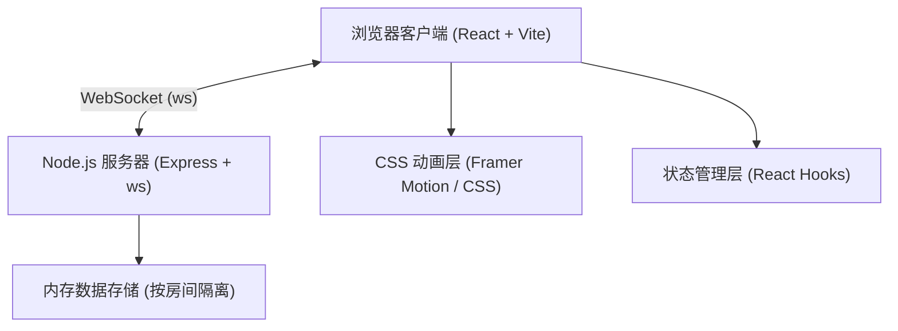
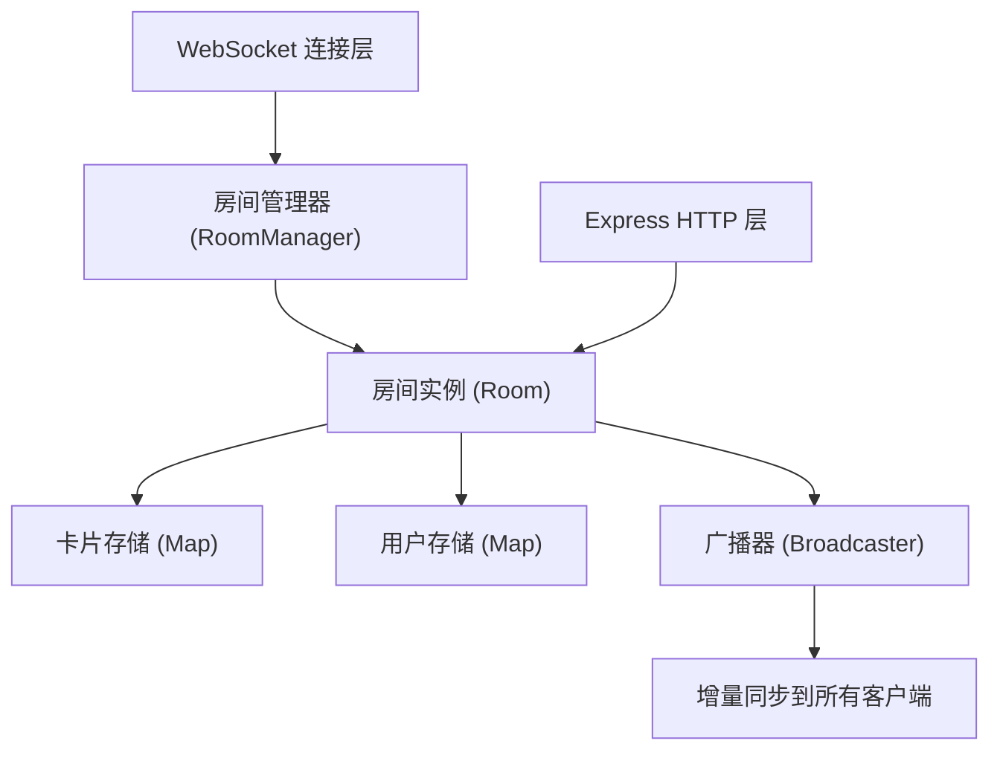

## 1. 架构设计



## 2. 技术描述

- **前端**：React 18 + TypeScript + Vite
- **后端**：Node.js + Express 4 + ws (WebSocket库)
- **数据存储**：内存存储（无数据库），按房间隔离卡片数据
- **构建工具**：Vite 5
- **包管理**：npm
- **代码组织**：前后端分离结构，client/ 和 server/ 目录
- **启动方式**：concurrently 同时启动前后端开发服务器

## 3. 路由定义

| 路由/端点 | 类型 | 用途 |
|-------|------|---------|
| `GET /api/rooms/:roomId/cards` | HTTP | 获取指定房间的所有卡片 |
| `ws://host/:roomId` | WebSocket | 加入房间并接收实时同步 |

## 4. API 与消息定义

### HTTP API
```typescript
// GET /api/rooms/:roomId/cards
interface CardsResponse {
  cards: Card[];
  users: OnlineUser[];
}
```

### WebSocket 消息协议
```typescript
// 客户端发送消息
type ClientMessage =
  | { type: 'join'; userId: string; userName: string; avatarColor: string }
  | { type: 'card:create'; card: Card }
  | { type: 'card:update'; cardId: string; changes: Partial<Card> }
  | { type: 'card:delete'; cardId: string }
  | { type: 'card:vote'; cardId: string; vote: 'up' | 'down' | null }
  | { type: 'cursor:move'; x: number; y: number }
  | { type: 'card:editing'; cardId: string | null }
  | { type: 'ping' };

// 服务端广播消息
type ServerMessage =
  | { type: 'init'; cards: Card[]; users: OnlineUser[] }
  | { type: 'user:join'; user: OnlineUser }
  | { type: 'user:leave'; userId: string }
  | { type: 'card:created'; card: Card }
  | { type: 'card:updated'; cardId: string; changes: Partial<Card> }
  | { type: 'card:deleted'; cardId: string }
  | { type: 'card:voted'; cardId: string; votes: CardVotes }
  | { type: 'cursor:moved'; userId: string; x: number; y: number }
  | { type: 'card:editing'; userId: string; cardId: string | null }
  | { type: 'pong' };
```

### 数据类型定义
```typescript
type CardColor = 'red' | 'orange' | 'yellow' | 'green' | 'blue' | 'purple';

interface CardVotes {
  up: string[];
  down: string[];
}

interface Card {
  id: string;
  title: string;
  description: string;
  color: CardColor;
  x: number;
  y: number;
  votes: CardVotes;
  createdAt: number;
  updatedAt: number;
  createdBy: string;
}

interface OnlineUser {
  id: string;
  name: string;
  avatarColor: string;
  cursor?: { x: number; y: number };
  editingCardId?: string | null;
}

type SortMode = 'color' | 'heat' | 'time';
```

## 5. 服务器架构图



## 6. 项目文件结构

```
auto7/
├── package.json              # 根配置，使用 concurrently 启动前后端
├── server/
│   └── index.ts              # WebSocket + Express 服务器
└── client/
    ├── index.html            # React 入口 HTML
    ├── tsconfig.json         # TypeScript 配置（严格模式）
    ├── vite.config.ts        # Vite 配置（代理 /api 到后端）
    └── src/
        ├── App.tsx           # 主应用组件
        ├── components/
        │   └── Card.tsx      # 单张卡片组件
        └── utils/
            └── wsClient.ts   # WebSocket 客户端封装
```
