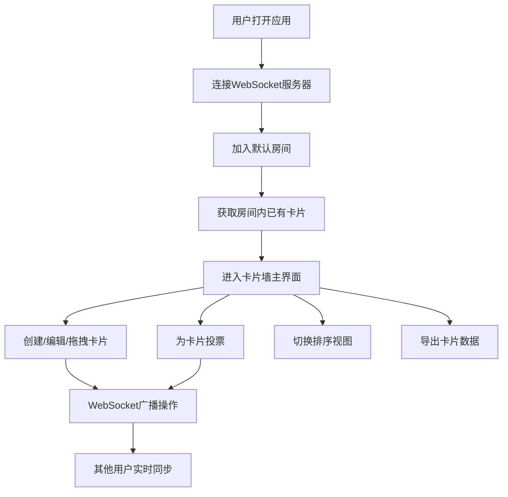

## 1. 产品概述

团队头脑风暴卡片墙应用，解决远程团队在创意发散阶段缺乏实时协作工具、点子容易被遗忘或淹没的问题。
- 面向分布式远程团队，提供多人实时协作的虚拟卡片墙
- 通过可视化创意卡片 + 投票机制，帮助团队高效收集、评估和筛选想法

## 2. 核心功能

### 2.1 功能模块
1. **卡片墙主页**：卡片画布、顶部工具栏、实时协作状态指示
2. **卡片管理**：创建/编辑/删除卡片、拖拽定位、网格吸附、颜色标签
3. **实时协作**：WebSocket多人同步、他人光标追踪、编辑状态呼吸光晕
4. **创意投票**：赞成/反对投票、实时票数柱状图展示、投票动效
5. **智能分类**：按颜色/热度/时间三种排序切换、波浪式重排动画
6. **数据导出**：一键导出所有卡片为JSON格式

### 2.2 页面详情
| 页面名称 | 模块名称 | 功能描述 |
|-----------|-------------|---------------------|
| 卡片墙主页 | 顶部工具栏 | 创建卡片按钮、连接状态指示灯、排序下拉菜单、导出按钮 |
| 卡片墙主页 | 卡片画布 | 瀑布流布局卡片展示、拖拽定位、网格吸附 |
| 卡片墙主页 | 单张卡片 | 标题/描述编辑、颜色标签选择、投票按钮、票数柱状图 |
| 卡片墙主页 | 协作指示 | 他人光标浮动头像、编辑中卡片呼吸光晕 |

## 3. 核心流程

用户打开应用后自动加入默认房间，可创建卡片拖拽到墙面任意位置，所有操作通过WebSocket实时同步给其他在线用户。用户可为卡片投票，系统实时更新票数统计。可切换排序视图查看不同维度的创意排列，最终一键导出所有卡片数据。

## 4. 用户界面设计

### 4.1 设计风格
- **主色调**：渐变灰蓝到浅紫的径向渐变背景，毛玻璃质感卡片（半透明磨砂白 + 微弱边框光影）
- **强调色**：红/橙/黄/绿/蓝/紫六色标签体系，绿色（赞成）+ 红色（反对）投票色
- **按钮样式**：圆角按压式，下沉动画，hover时背景微亮
- **字体**：现代无衬线字体，标题清晰有力，正文舒适可读
- **布局**：瀑布流卡片布局，固定顶部工具栏，响应式适配（320px - 1200px）
- **动效**：卡片创建缩放淡入、拖拽阴影动态增强、排序波浪式重排、投票弹簧回弹+发光涟漪

### 4.2 页面设计概述
| 页面名称 | 模块名称 | UI元素 |
|-----------|-------------|-------------|
| 卡片墙主页 | 顶部工具栏 | 毛玻璃背景、连接状态脉冲圆点、按钮按压下沉、下拉平滑过渡 |
| 卡片墙主页 | 卡片画布 | 径向渐变背景、瀑布流网格、拖拽阴影层级 |
| 卡片墙主页 | 单张卡片 | 毛玻璃卡片、颜色标签条、投票按钮弹性动画、票数红绿柱状图 |
| 卡片墙主页 | 协作指示 | 浮动圆形头像、编辑光晕呼吸动画 |

### 4.3 响应式
桌面优先设计，适配最小宽度320px，最大宽度1200px。卡片最小宽度220px，瀑布流自动调整列数。移动端支持触摸拖拽操作。
