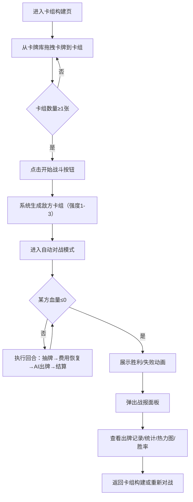

## 1. 产品概述

卡牌构筑与自动战斗模拟应用，为卡牌游戏玩家提供快速测试卡组构思和平衡性验证的工具。玩家可以从预设卡牌库中构建卡组，并通过自动对战模拟验证卡组强度与策略效果。

- **核心目标**：解决卡牌游戏玩家在构思新卡组时缺乏快速测试和平衡性验证工具的痛点
- **目标用户**：卡牌游戏爱好者、卡组构筑研究者、竞技玩家
- **产品价值**：提供即时可视化的卡组测试体验，加速卡组迭代与策略优化

## 2. 核心功能

### 2.1 用户角色

| 角色 | 注册方式 | 核心权限 |
|------|---------|---------|
| 普通玩家 | 无需注册（本地使用） | 浏览卡牌库、构建卡组、启动战斗、查看战报 |

### 2.2 功能模块

1. **卡组构建页面**：卡牌库展示、拖拽添加、卡组管理、稀有度显示、类型筛选
2. **战斗模拟页面**：自动回合制对战、Canvas动画渲染、实时血条更新、战斗结果展示
3. **战报分析页面**：回合出牌记录、数据统计、使用频率热力图、胜率预测

### 2.3 页面详情

| 页面名称 | 模块名称 | 功能描述 |
|---------|---------|---------|
| 卡组构建页 | 卡牌库面板 | 展示30+张卡牌，按类型（攻击/防御/法术/召唤）分类，显示费用、名称、效果图标、稀有度边框 |
| 卡组构建页 | 拖拽交互 | 卡牌跟随鼠标半透明拖拽，目标区域高亮呼吸动画，放入滑入动画，满员抖动弹回 |
| 卡组构建页 | 卡组区域 | 显示当前卡组（上限15张），支持移除卡牌，显示卡组总费用曲线 |
| 卡组构建页 | 开始战斗 | 卡组验证通过后生成敌方卡组（随机强度1-3）进入对战 |
| 战斗模拟页 | 对战区域 | 双方英雄血条、手牌区、战场区、回合信息显示 |
| 战斗模拟页 | 战斗动画 | 卡牌抛物线飞行、冲击波落地效果、受击闪红抖动、血量数字动画、胜利/失败特效 |
| 战斗模拟页 | 自动对战逻辑 | 回合制自动出牌，费用每回合+1（上限10），每回合抽1张牌 |
| 战报面板 | 回合记录 | 双方各回合出牌记录，时间线展示 |
| 战报面板 | 数据统计 | 总伤害量、治疗量、卡牌使用次数统计 |
| 战报面板 | 热力图 | 卡牌使用频率以颜色深浅表示（红色越深使用越多） |
| 战报面板 | 胜率预测 | 基于历史同类对战数据的胜率修正值展示 |

## 3. 核心流程

玩家从卡牌库拖拽卡牌构建15张卡组 → 点击开始战斗 → 系统生成随机敌方卡组 → 自动回合制对战（双方轮流出牌）→ 战斗结束展示胜负动画 → 弹出详细战报面板（包含出牌记录、统计数据、热力图、胜率预测）。

## 4. 用户界面设计

### 4.1 设计风格

- **主题色调**：暗色主题，背景深灰 `#1a1a2e`，毛玻璃效果卡牌区域（backdrop-blur: 10px，半透明）
- **稀有度配色**：常见 `#888888`（灰）、稀有 `#4a9eff`（蓝）、史诗 `#c77dff`（紫）、传说金色渐变 `linear-gradient(135deg, #ffd700, #ffae00, #ff8c00)`
- **按钮样式**：圆角 8px，悬停放大 1.05 倍加亮，点击 0.1s 缩放反馈
- **字体**：标题使用 Cinzel（衬线装饰字体，游戏感），正文使用 JetBrains Mono（等宽字体，清晰可读）
- **布局风格**：三栏布局（左卡牌库、中战斗区、右卡组区），卡牌化展示
- **动效风格**：卡牌飞行抛物线、冲击波扩散、受击抖动闪红、血条数字颜色渐变动画、页面加载底部滑入淡入

### 4.2 页面设计概览

| 页面名称 | 模块名称 | UI元素 |
|---------|---------|-------|
| 卡组构建页 | 顶部导航 | 游戏Logo、页面标题、模式切换按钮 |
| 卡组构建页 | 左侧卡牌库 | 类型筛选标签、卡牌网格列表、每张卡牌含：费用（左上圆标）、名称、效果图标、稀有度边框 |
| 卡组构建页 | 中间战斗预览 | 英雄占位图、血条示意、"战斗区域"文字提示 |
| 卡组构建页 | 右侧卡组区 | 卡组槽位（15格虚线框）、卡牌缩略列表、卡组费用曲线柱状图、开始战斗按钮 |
| 战斗模拟页 | 顶部状态栏 | 回合数、当前费用/最大费用、暂停/加速按钮 |
| 战斗模拟页 | 敌方区域 | 敌方英雄头像+血条+手牌背面、战场卡牌 |
| 战斗模拟页 | Canvas层 | 卡牌飞行轨迹、冲击波、受击特效、胜负文字动画 |
| 战斗模拟页 | 我方区域 | 我方英雄头像+血条+手牌、战场卡牌 |
| 战斗模拟页 | 战场光晕 | 底部向上渐变光晕，透明度0.2，模拟战场氛围 |
| 战报面板 | 覆盖层 | 半透明遮罩、中央弹出面板、关闭按钮 |
| 战报面板 | 回合记录 | 时间线布局，双方回合交替显示出牌信息 |
| 战报面板 | 数据统计 | 伤害/治疗/抽牌数据以大号数字+单位展示 |
| 战报面板 | 热力图 | 卡牌网格，背景色根据使用次数渐变红色 |
| 战报面板 | 胜率预测 | 进度条+百分比+修正值说明文字 |

### 4.3 响应式设计

- **≥1280px**：标准三栏布局（左25% + 中50% + 右25%）
- **768px - 1280px**：右侧卡组构建区折叠为可滑出侧边栏（抽屉式），左中两栏显示
- **<768px**：卡牌库和卡组区上下堆叠，战斗区居中，支持垂直滚动

### 4.4 Canvas 2D 战斗动画场景

- **环境**：暗色渐变背景，底部向上战场光晕（透明度0.2，呼吸动画）
- **动画元素**：
  - 卡牌飞行：从手牌位置抛物线运动到战场目标点，持续 0.5s
  - 冲击波：落地处圆形从0扩至80px半径渐隐，持续0.3s
  - 受击反馈：目标闪红0.2s + 5px幅度抖动
  - 胜负文字：金色大字从中心缩放飞出，ease-out，持续0.6s
- **性能要求**：拖拽响应<100ms，AI决策<200ms，首屏加载<3s
