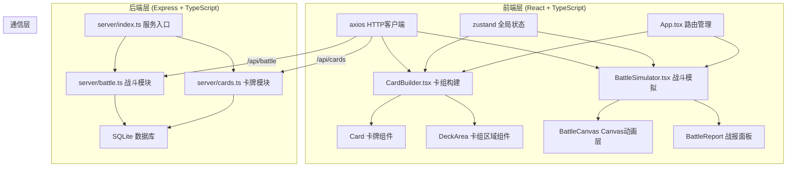
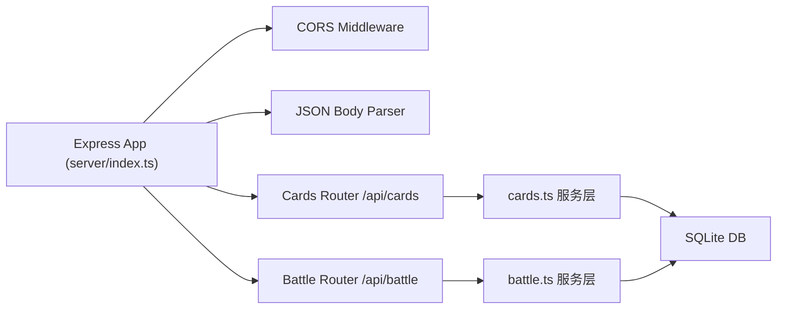
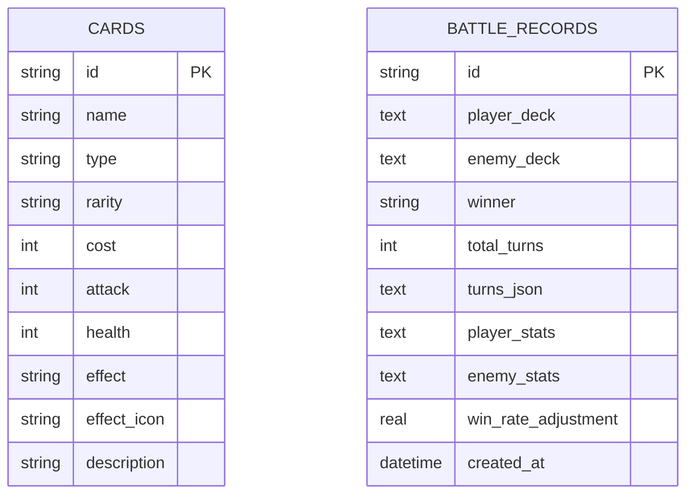

## 1. 架构设计



## 2. 技术选型说明

* **前端框架**：React 18 + TypeScript（严格模式）+ Vite 构建

* **状态管理**：zustand（轻量级状态管理）

* **UI动画**：framer-motion（组件动画）+ Canvas 2D（战斗特效）

* **HTTP通信**：axios

* **路由**：react-router-dom

* **后端**：Express 4 + TypeScript

* **数据库**：better-sqlite3（同步SQLite，高性能）

* **ID生成**：uuid

* **跨域**：cors 中间件

* **包管理**：npm（用户明确指定）

* **启动方式**：concurrently 同时启动 Vite 前端和 Express 后端

## 3. 路由定义

| 路由        | 页面/用途                   |
| --------- | ----------------------- |
| `/`       | 卡组构建页面（CardBuilder）     |
| `/battle` | 战斗模拟页面（BattleSimulator） |

## 4. API 定义

### 4.1 卡牌相关 API

```typescript
// 卡牌类型定义
type CardType = 'attack' | 'defense' | 'spell' | 'summon';
type CardRarity = 'common' | 'rare' | 'epic' | 'legendary';

interface Card {
  id: string;
  name: string;
  type: CardType;
  rarity: CardRarity;
  cost: number;
  attack?: number;
  health?: number;
  effect: string;
  effectIcon: string;
  description: string;
}

// GET /api/cards
// 获取所有卡牌列表（可按类型过滤）
// Query参数: type?: CardType
// Response: Card[]

// GET /api/cards/:id
// 获取单张卡牌详情
// Response: Card
```

### 4.2 战斗相关 API

```typescript
interface BattleCard extends Card {
  instanceId: string;
  currentHealth?: number;
  currentAttack?: number;
}

interface BattlePlayer {
  health: number;
  maxHealth: number;
  mana: number;
  maxMana: number;
  deck: BattleCard[];
  hand: BattleCard[];
  battlefield: BattleCard[];
}

interface BattleTurnRecord {
  turn: number;
  side: 'player' | 'enemy';
  cardsPlayed: { cardId: string; cardName: string; target?: string }[];
  damageDealt: number;
  healingDone: number;
}

interface BattleRequest {
  playerDeck: Card[];
  enemyLevel?: 1 | 2 | 3;
}

interface BattleResponse {
  battleId: string;
  winner: 'player' | 'enemy';
  turns: BattleTurnRecord[];
  playerStats: { totalDamage: number; totalHealing: number; cardsUsed: Record<string, number> };
  enemyStats: { totalDamage: number; totalHealing: number; cardsUsed: Record<string, number> };
  winRateAdjustment: number;
}

// POST /api/battle
// 提交卡组执行自动对战，返回完整战报
// Request Body: BattleRequest
// Response: BattleResponse

// GET /api/battle/:id
// 查询历史战斗记录
// Response: BattleResponse
```

## 5. 后端服务架构



* **Controller层**：路由定义 + 请求参数校验

* **Service层**：业务逻辑（卡牌查询、战斗模拟AI）

* **Repository层**：SQLite 数据读写（通过 better-sqlite3）

* **数据初始化**：服务启动时自动建表并插入 30+ 张预设卡牌数据

## 6. 数据模型

### 6.1 ER 图



### 6.2 DDL 与初始化数据

```sql
-- 卡牌表
CREATE TABLE IF NOT EXISTS cards (
  id TEXT PRIMARY KEY,
  name TEXT NOT NULL,
  type TEXT NOT NULL CHECK(type IN ('attack','defense','spell','summon')),
  rarity TEXT NOT NULL CHECK(rarity IN ('common','rare','epic','legendary')),
  cost INTEGER NOT NULL DEFAULT 0,
  attack INTEGER DEFAULT 0,
  health INTEGER DEFAULT 0,
  effect TEXT NOT NULL DEFAULT 'none',
  effect_icon TEXT NOT NULL DEFAULT '✨',
  description TEXT NOT NULL DEFAULT ''
);

-- 战斗记录表
CREATE TABLE IF NOT EXISTS battle_records (
  id TEXT PRIMARY KEY,
  player_deck TEXT NOT NULL,
  enemy_deck TEXT NOT NULL,
  winner TEXT NOT NULL CHECK(winner IN ('player','enemy')),
  total_turns INTEGER NOT NULL DEFAULT 0,
  turns_json TEXT NOT NULL,
  player_stats TEXT NOT NULL,
  enemy_stats TEXT NOT NULL,
  win_rate_adjustment REAL NOT NULL DEFAULT 0,
  created_at DATETIME DEFAULT CURRENT_TIMESTAMP
);

-- 索引
CREATE INDEX IF NOT EXISTS idx_cards_type ON cards(type);
CREATE INDEX IF NOT EXISTS idx_cards_rarity ON cards(rarity);
CREATE INDEX IF NOT EXISTS idx_battles_created ON battle_records(created_at DESC);
```

初始化时插入 30+ 张卡牌（攻击/
