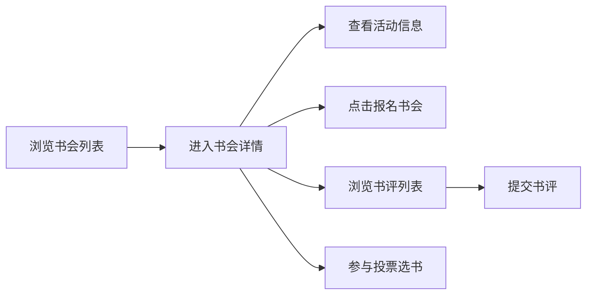

## 1. 产品概述

书会圈子是一个面向小型独立书店的在线书会管理与读者互动平台，支持书会发布、读者报名、书评提交和投票选书功能，旨在连接书店与读者，营造活跃的读书社区氛围。

- 核心目标：为独立书店提供线上书会运营工具，提升读者参与度和粘性
- 目标用户：独立书店运营者、读书会爱好者
- 产品价值：轻量化、社区化的读书互动体验

## 2. 核心功能

### 2.1 用户角色
| 角色 | 注册方式 | 核心权限 |
|------|----------|----------|
| 读者用户 | 默认识别 | 浏览书会、报名参加、提交书评、投票选书 |

### 2.2 功能模块
1. **书会列表页**：展示所有书会卡片，支持卡片悬停动效，点击进入详情
2. **书会详情页**：活动介绍、报名读者头像、评论区、投票功能
3. **书评系统**：星级评分、文本评论、时间倒序展示
4. **投票系统**：候选书目展示、单选投票、票数动画

### 2.3 页面详情
| 页面名称 | 模块名称 | 功能描述 |
|---------|----------|----------|
| 书会列表页 | 书会卡片 | 展示书会名称、时间、报名人数、封面，悬停上浮效果 |
| 书会详情页 | 活动介绍 | 书会主题、时间、详细介绍 |
| 书会详情页 | 报名读者 | 头像列表，最多8个，超出显示+N |
| 书会详情页 | 评论区 | 星级评分、用户名、评论内容、相对时间、分页加载 |
| 书会详情页 | 报名按钮 | 点击报名，按钮状态切换，人数+1动画 |
| 投票弹窗 | 候选书目 | 3本候选图书，单选投票，票数滚动动画 |
| 书评表单 | 评分输入 | 5星选择，星星弹跳动画 |
| 书评表单 | 文本输入 | 聚焦边框变色过渡 |

## 3. 核心流程

用户打开首页浏览书会列表 → 点击感兴趣的书会进入详情页 → 查看活动介绍和已报名读者 → 点击报名按钮参加书会 → 浏览其他读者的书评 → 提交自己的书评和评分 → 参与下月共读书目投票

## 4. 用户界面设计

### 4.1 设计风格
- 主色调：奶油白 #FFF8E7（背景）、深咖啡色 #4A3728（文字）、紫罗兰 #8B5CF6（主题色）
- 按钮风格：圆角设计，主题色背景，悬停过渡效果
- 卡片风格：圆角 12px，浅阴影，悬停上浮加深阴影
- 字体：使用优雅的衬线与无衬线字体搭配
- 图标风格：简洁线性图标

### 4.2 页面设计概览
| 页面名称 | 模块名称 | UI 元素 |
|---------|----------|---------|
| 书会列表页 | 导航栏 | 固定顶部，深咖啡底色，白色文字，用户头像 |
| 书会列表页 | 卡片网格 | 响应式布局，卡片悬停上浮动画 |
| 书会详情页 | 头部区域 | 封面图、书会标题、时间地点、报名按钮 |
| 书会详情页 | 读者头像 | 圆形头像，彩色边框，最多8个+N |
| 书会详情页 | 评论区 | 星级展示、用户信息、相对时间、滑入动画 |
| 投票弹窗 | 候选图书 | 封面、书名、作者、选中效果 |
| 书评表单 | 星星评分 | 点击选中，弹跳缩放动画 |

### 4.3 响应式
- 桌面端（>768px）：卡片多列布局，导航栏完整展示
- 移动端（<768px）：卡片单列布局，汉堡菜单，评论区全宽适配

### 4.4 动效设计
- 卡片悬停：上浮 4px，阴影加深，0.2s 过渡
- 星星选中：弹跳缩放动画，0.2s
- 评论新增：淡入+底部滑入，0.3s
- 投票数字：滚动变化，0.4s
- 报名成功：打勾图标动画，数字缩放，0.3s
- 输入框聚焦：边框颜色渐变，0.3s
