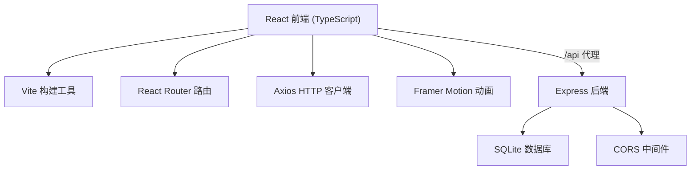
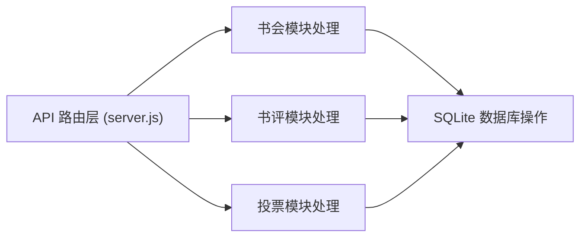
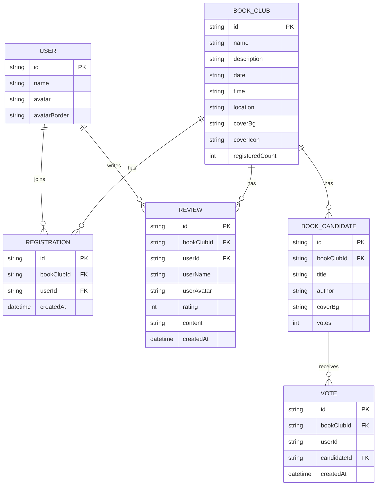

## 1. 架构设计



## 2. 技术说明

- 前端：React 18 + TypeScript + Vite
- 状态管理：React Hooks (useState, useEffect)
- 路由：React Router DOM
- HTTP 客户端：Axios
- 动画库：Framer Motion
- 后端：Express 4 + Node.js
- 数据库：SQLite (better-sqlite3)
- 唯一标识：uuid
- 代理配置：Vite dev server proxy (/api → 后端 3001 端口)

## 3. 路由定义

| 路由 | 用途 |
|------|------|
| / | 书会列表首页 |
| /bookclub/:id | 书会详情页 |

## 4. API 定义

### 4.1 书会模块
- `GET /api/bookclubs` - 获取所有书会列表
- `GET /api/bookclubs/:id` - 获取单个书会详情
- `POST /api/bookclubs/:id/register` - 报名参加书会

### 4.2 书评模块
- `GET /api/bookclubs/:id/reviews?page=1&limit=10` - 分页获取书评列表
- `POST /api/bookclubs/:id/reviews` - 提交书评

### 4.3 投票模块
- `GET /api/bookclubs/:id/candidates` - 获取候选书目
- `POST /api/bookclubs/:id/vote` - 投票

### 类型定义
```typescript
interface BookClub {
  id: string;
  name: string;
  description: string;
  date: string;
  time: string;
  location: string;
  coverBg: string;
  coverIcon: string;
  registeredCount: number;
  registeredUsers: User[];
}

interface User {
  id: string;
  name: string;
  avatar: string;
  avatarBorder: string;
}

interface Review {
  id: string;
  userId: string;
  userName: string;
  userAvatar: string;
  rating: number;
  content: string;
  createdAt: string;
}

interface BookCandidate {
  id: string;
  title: string;
  author: string;
  coverBg: string;
  votes: number;
}
```

## 5. 服务器架构图



## 6. 数据模型

### 6.1 数据模型定义



### 6.2 数据库初始化
- 使用 better-sqlite3 同步创建表结构
- 初始化示例数据用于演示
- 表包含：book_clubs, users, registrations, reviews, book_candidates, votes
