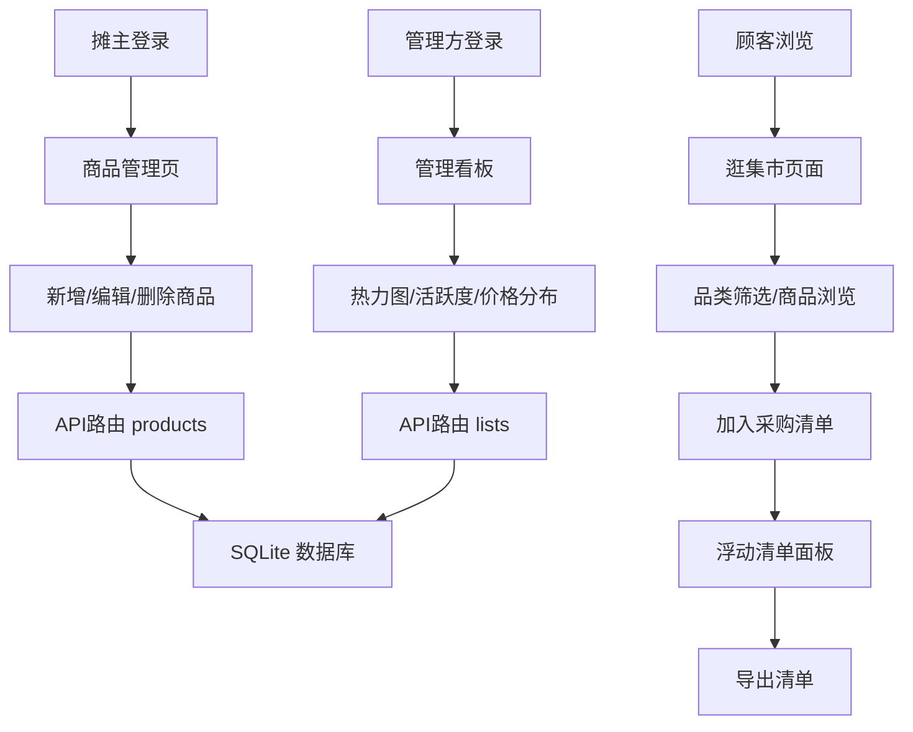

## 1. 产品概述

在线农贸集市商品信息发布与采购清单应用，为地方农贸市场联盟打造三位一体的线上平台——摊主管理商品、顾客比价采购、管理方监控供需热度。解决传统农贸市场信息不对称、采购效率低、市场监管难的痛点，构建"产地直连、透明比价、数据驱动"的智慧农贸生态。

## 2. 核心功能

### 2.1 用户角色

| 角色 | 注册/登录方式 | 核心权限 |
|------|--------------|----------|
| 摊主 | 账号登录 | 发布/编辑/删除商品、查看自己的商品列表、管理库存与价格 |
| 顾客 | 无需登录 | 按品类浏览商品、比价、加入采购清单、导出清单 |
| 管理方 | 账号登录 | 查看品类热力图、摊主活跃度、价格分布、整体供需分析 |

### 2.2 功能模块

1. **摊主商品管理页（MarketPage）**：商品列表展示、新增商品弹窗、编辑/删除商品、库存与价格管理
2. **顾客比价与清单页（BrowsePage）**：品类标签筛选、商品网格展示、浮动采购清单、清单导出
3. **管理仪表盘页（DashboardPage）**：品类商品数量柱状图、摊主活跃度折线图、价格分布箱线图

### 2.3 页面详情

| 页面名称 | 模块名称 | 功能描述 |
|---------|---------|----------|
| MarketPage | 商品列表 | 以卡片列表展示摊主自己的商品，支持从右滑入/向左滑出动画 |
| MarketPage | 新增商品弹窗 | 中心展开动画，表单字段聚焦时下边框平滑过渡为主题绿色 |
| MarketPage | 商品操作 | 编辑商品信息、删除商品、库存调整 |
| BrowsePage | 品类筛选标签 | 彩色胶囊标签，底部活动指示条平滑滑动切换 |
| BrowsePage | 商品网格 | 2列网格布局，卡片悬停上浮效果，加入清单按钮缩放反馈 |
| BrowsePage | 浮动清单面板 | 右侧滑入，毛玻璃效果，数量加减微缩放动画，合计总价，导出清单 |
| DashboardPage | 品类柱状图 | 各品类商品数量统计，从底部升起动画 |
| DashboardPage | 活跃度折线图 | 按天展示新增商品数量，从左到右绘制动画 |
| DashboardPage | 价格箱线图 | 按品类价格分布展示，箱体从中心淡入动画 |
| 全局 | 顶部导航栏 | 固定60px高度，主绿色背景，下划线滑动过渡，移动端汉堡菜单 |
| 全局 | 骨架屏/错误提示 | 加载时脉冲骨架屏，错误时带重试按钮的提示条 |
| 全局 | 空状态 | 插画 + 提示文字的空列表展示 |

## 3. 核心流程

### 3.1 摊主商品管理流程
摊主登录 → 进入商品管理页 → 查看/搜索商品列表 → 点击新增 → 弹出商品表单 → 填写商品信息 → 提交 → 新商品滑入列表顶部 → 可编辑/删除商品

### 3.2 顾客采购流程
顾客进入逛集市页面 → 选择品类标签（指示条滑动） → 浏览商品网格 → 点击加入清单（按钮缩放反馈） → 打开浮动清单面板 → 调整数量（微缩放动画） → 查看合计 → 导出采购清单

### 3.3 管理方数据监控流程
管理方登录 → 进入管理看板 → 品类柱状图升起动画 → 活跃度折线图绘制动画 → 价格箱线图淡入 → 查看各维度数据 → 工具提示显示精确数值

## 4. 用户界面设计

### 4.1 设计风格

- **主色调**：橄榄绿 `#5B8C5A`，象征新鲜农产品与自然
- **辅助色**：米色 `#F5F0E1` 作为背景基底，深褐色 `#3D2B1F` 作为文字主色
- **品类色**：蔬菜绿、水果橙、肉类红、水产蓝、干货棕
- **按钮风格**：圆角6px，悬停深一个色号，点击0.1秒缩放反馈
- **卡片风格**：统一圆角12px，白底，悬停上浮2px+增强阴影
- **字体**：标题使用有衬线感的粗体，正文清晰易读的现代字体
- **背景纹理**：细腻亚麻纹理（CSS repeat小点图案）

### 4.2 页面设计概述

| 页面名称 | 模块名称 | UI 元素 |
|---------|---------|---------|
| MarketPage | 商品列表 | 卡片列表、从右滑入动画、删除左滑出、空状态插画 |
| MarketPage | 新增弹窗 | 中心展开0.3s、米色边框、表单聚焦下边框绿变 |
| BrowsePage | 品类标签 | 圆角20px彩色胶囊、底部指示条0.2s滑动 |
| BrowsePage | 商品网格 | 2列布局、悬停上浮、加入按钮缩放反馈 |
| BrowsePage | 清单面板 | 右侧滑入320px、毛玻璃、数量微缩放动画 |
| DashboardPage | 柱状图 | 从底部升起0.5s、品类色填充、工具提示 |
| DashboardPage | 折线图 | 从左到右绘制1s、数据点高亮 |
| DashboardPage | 箱线图 | 箱体淡入0.3s、按品类分布 |
| 全局 | 导航栏 | 固定60px、橄榄绿背景、下划线滑动、移动端汉堡 |

### 4.3 响应式

- 桌面端（≥768px）：商品2列网格，清单面板320px宽
- 移动端（<768px）：商品单列布局，导航栏变汉堡菜单，清单面板全屏
- 触摸优化：按钮最小44px触控区域，手势滑动支持

### 4.4 动效设计

- 列表项添加：从右滑入0.3秒
- 列表项删除：向左滑出0.2秒
- 弹窗出现：从中心展开0.3秒
- 标签切换：指示条平滑滑动0.2秒
- 按钮点击：缩放至0.9再弹回0.15秒
- 图表加载：柱状图升起、折线图绘制、箱线图淡入
- 骨架屏：浅灰色脉冲动画
- 表单聚焦：下边框颜色过渡0.2秒
