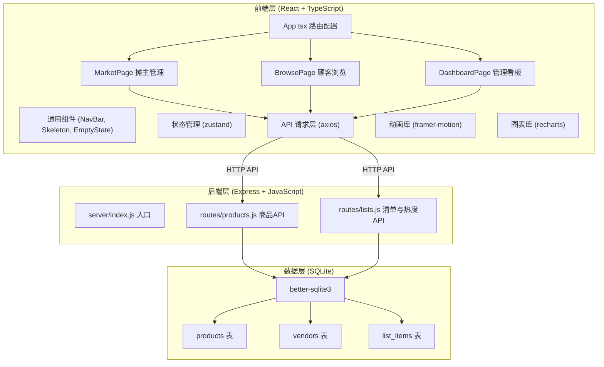
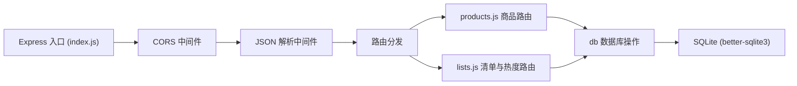
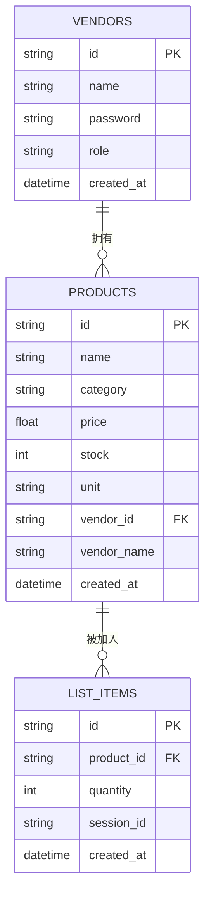

## 1. 架构设计



## 2. 技术选型说明

| 层级 | 技术栈 | 版本说明 |
|------|--------|---------|
| 前端框架 | React 18 + TypeScript | 函数式组件 + Hooks |
| 构建工具 | Vite | 快速热更新，代理后端请求 |
| 路由 | react-router-dom v6 | 客户端路由 |
| 状态管理 | zustand | 轻量级状态管理 |
| HTTP客户端 | axios | 请求拦截、统一错误处理 |
| 动画 | framer-motion | 声明式动画、列表动画 |
| 图表 | recharts | React图表库 |
| 样式 | TailwindCSS 3 + 自定义CSS | 实用优先 + 纹理/动画 |
| 图标 | lucide-react | 轻量SVG图标 |
| 后端框架 | Express 4 | RESTful API |
| 数据库 | SQLite (better-sqlite3) | 同步API、零配置 |
| 跨域 | cors | 开发环境跨域 |
| ID生成 | uuid | 唯一标识符生成 |

## 3. 路由定义

| 路由路径 | 页面组件 | 用途 |
|---------|---------|------|
| `/` | BrowsePage | 顾客逛集市首页 |
| `/market` | MarketPage | 摊主商品管理页 |
| `/dashboard` | DashboardPage | 管理仪表盘页 |

## 4. API 定义

### 4.1 商品管理 API（/api/products）

| 方法 | 路径 | 用途 | 请求体 | 响应体 |
|------|------|------|--------|--------|
| GET | `/api/products` | 获取所有商品（支持品类筛选） | query: category? | Product[] |
| GET | `/api/products/vendor/:vendorId` | 获取指定摊主的商品 | - | Product[] |
| GET | `/api/products/:id` | 获取单个商品详情 | - | Product |
| POST | `/api/products` | 新增商品 | { name, category, price, stock, unit, vendorId, vendorName } | Product |
| PUT | `/api/products/:id` | 更新商品 | { name?, category?, price?, stock?, unit? } | Product |
| DELETE | `/api/products/:id` | 删除商品 | - | { success: true } |

### 4.2 清单与热度 API（/api/lists）

| 方法 | 路径 | 用途 | 请求体 | 响应体 |
|------|------|------|--------|--------|
| GET | `/api/lists/stats/category-count` | 各品类商品数量统计 | - | CategoryCount[] |
| GET | `/api/lists/stats/vendor-activity` | 摊主活跃度（按天） | query: days? | VendorActivity[] |
| GET | `/api/lists/stats/price-distribution` | 价格分布数据 | - | PriceDistribution[] |

### 4.3 TypeScript 类型定义

```typescript
interface Product {
  id: string;
  name: string;
  category: 'vegetable' | 'fruit' | 'meat' | 'seafood' | 'drygoods';
  price: number;
  stock: number;
  unit: '斤' | '个' | '把';
  vendorId: string;
  vendorName: string;
  createdAt: string;
}

interface ListItem {
  productId: string;
  product: Product;
  quantity: number;
}

interface CategoryCount {
  category: string;
  count: number;
}

interface VendorActivity {
  date: string;
  vendorId: string;
  vendorName: string;
  count: number;
}

interface PriceDistribution {
  category: string;
  min: number;
  q1: number;
  median: number;
  q3: number;
  max: number;
}
```

## 5. 后端架构图



## 6. 数据模型

### 6.1 数据模型 ER 图



### 6.2 DDL 语句

```sql
-- 摊主表
CREATE TABLE IF NOT EXISTS vendors (
  id TEXT PRIMARY KEY,
  name TEXT NOT NULL UNIQUE,
  password TEXT NOT NULL,
  role TEXT NOT NULL DEFAULT 'vendor',
  created_at TEXT NOT NULL DEFAULT (datetime('now'))
);

-- 商品表
CREATE TABLE IF NOT EXISTS products (
  id TEXT PRIMARY KEY,
  name TEXT NOT NULL,
  category TEXT NOT NULL,
  price REAL NOT NULL,
  stock INTEGER NOT NULL DEFAULT 0,
  unit TEXT NOT NULL DEFAULT '斤',
  vendor_id TEXT NOT NULL,
  vendor_name TEXT NOT NULL,
  created_at TEXT NOT NULL DEFAULT (datetime('now')),
  FOREIGN KEY (vendor_id) REFERENCES vendors(id)
);

-- 清单项目表（用于统计热度）
CREATE TABLE IF NOT EXISTS list_items (
  id TEXT PRIMARY KEY,
  product_id TEXT NOT NULL,
  quantity INTEGER NOT NULL DEFAULT 1,
  session_id TEXT NOT NULL,
  created_at TEXT NOT NULL DEFAULT (datetime('now')),
  FOREIGN KEY (product_id) REFERENCES products(id)
);

-- 索引
CREATE INDEX IF NOT EXISTS idx_products_category ON products(category);
CREATE INDEX IF NOT EXISTS idx_products_vendor_id ON products(vendor_id);
CREATE INDEX IF NOT EXISTS idx_products_created_at ON products(created_at);
```

### 6.3 初始数据

- 3 个示例摊主账号（蔬菜摊主、水果摊主、水产摊主）
- 每个摊主 5-8 个示例商品
- 覆盖 5 个品类：蔬菜、水果、肉类、水产、干货
- 管理方账号 1 个
