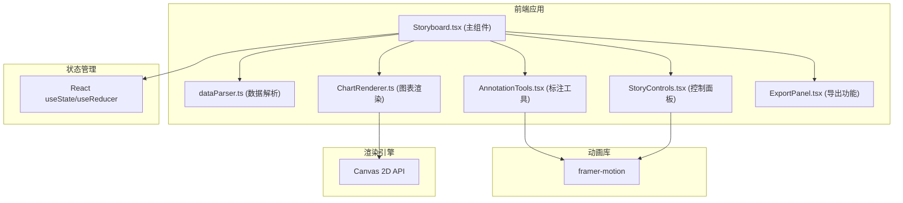

## 1. 架构设计



## 2. 技术描述

- **前端框架**：React 18 + TypeScript
- **构建工具**：Vite
- **动画库**：framer-motion
- **图表渲染**：Canvas 2D API（原生实现，无第三方图表库）
- **状态管理**：React useState/useReducer（轻量级，无需额外状态库）
- **样式方案**：内联样式 + CSS变量 + framer-motion动画
- **图标**：Lucide React

## 3. 目录结构

```
src/
├── dataParser.ts          # JSON数据解析与验证
├── ChartRenderer.ts       # Canvas图表渲染器（柱状图、折线图、时间线）
├── Storyboard.tsx         # 主组件，全局状态管理
├── AnnotationTools.tsx    # 标注编辑工具组件
├── StoryControls.tsx      # 故事控制面板组件
├── ChartCard.tsx          # 图表卡片组件
├── AnnotationCard.tsx     # 标注卡片组件
├── PlaybackView.tsx       # 播放视图组件
├── ExportButton.tsx       # 导出按钮组件
├── types.ts               # TypeScript类型定义
└── utils/
    ├── colorUtils.ts      # 颜色工具函数
    └── animationUtils.ts  # 动画工具函数
```

## 4. 核心数据结构

### 4.1 数据项类型
```typescript
interface DataPoint {
  date: string;
  value: number;
  category: string;
}
```

### 4.2 图表类型
```typescript
type ChartType = 'timeline' | 'bar' | 'line';

interface ChartItem {
  id: string;
  type: ChartType;
  title: string;
  data: DataPoint[];
}
```

### 4.3 标注类型
```typescript
interface AnnotationItem {
  id: string;
  type: 'annotation';
  chartId: string;
  text: string;
  fontSize: number;
  color: string;
  align: 'left' | 'center' | 'right';
}
```

### 4.4 故事板项
```typescript
type StoryboardItem = 
  | { id: string; type: 'chart'; chartId: string }
  | { id: string; type: 'annotation'; annotationId: string };
```

## 5. 关键技术方案

### 5.1 Canvas图表渲染
- 使用 requestAnimationFrame 实现平滑动画
- 柱状图：HSL色相循环分配颜色，生长动画用高度插值
- 折线图：路径逐步描绘，通过 clip 或 lineDash 实现
- 时间线：节点位置按索引分布，连接线动画

### 5.2 动画方案
- framer-motion 处理组件进入退出动画
- Canvas 内部动画用 requestAnimationFrame + 插值
- 图表类型切换：淡入淡出 + 高度弹性过渡

### 5.3 拖拽排序
- HTML5 Drag and Drop API 实现
- 拖拽时半透明效果，目标位置虚线占位
- 使用 CSS Grid 布局自动调整位置

### 5.4 导出功能
- 遍历所有图表和标注，生成静态HTML字符串
- Canvas 图表转 base64 图片嵌入
- 触发浏览器下载

### 5.5 性能优化
- Canvas 离屏渲染缓存
- 组件 memo 优化避免不必要重渲染
- requestAnimationFrame 节流动画更新
- 虚拟滚动（如需大量卡片）
