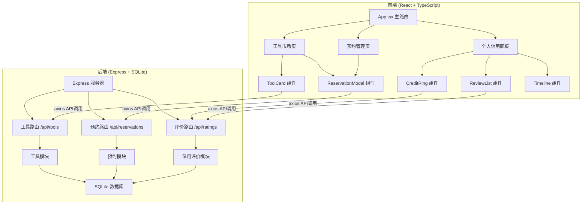
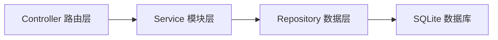
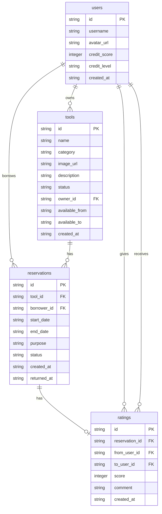

## 1. 架构设计



## 2. 技术说明

- **前端**：React@18 + TypeScript + Tailwind CSS@3 + Vite
- **状态管理**：Zustand
- **路由**：react-router-dom
- **动画**：framer-motion
- **图表**：recharts（圆环进度图）
- **HTTP客户端**：axios
- **初始化工具**：vite-init (react-express-ts 模板)
- **后端**：Express@4 + better-sqlite3 + cors + uuid
- **数据库**：SQLite（文件型数据库，无需外部服务）
- **并发运行**：concurrently

## 3. 路由定义

| 路由 | 用途 |
|------|------|
| `/` | 工具市场页，展示工具卡片网格、搜索筛选 |
| `/profile/:userId` | 个人信用面板，展示信用分、评价列表、历史时间线 |

## 4. API 定义

### 4.1 工具管理 API

| 方法 | 路径 | 描述 | 请求体 | 响应 |
|------|------|------|--------|------|
| GET | `/api/tools` | 获取所有工具列表 | - | `{ tools: Tool[] }` |
| GET | `/api/tools/:id` | 获取单个工具详情 | - | `{ tool: Tool }` |
| POST | `/api/tools` | 发布新工具 | `{ name, category, imageUrl, description, availableFrom, availableTo }` | `{ tool: Tool }` |
| PATCH | `/api/tools/:id` | 更新工具状态 | `{ status }` | `{ tool: Tool }` |

### 4.2 预约管理 API

| 方法 | 路径 | 描述 | 请求体 | 响应 |
|------|------|------|--------|------|
| GET | `/api/reservations` | 获取预约列表 | `?toolId=&userId=` | `{ reservations: Reservation[] }` |
| POST | `/api/reservations` | 创建预约 | `{ toolId, borrowerId, startDate, endDate, purpose }` | `{ reservation: Reservation }` |
| PATCH | `/api/reservations/:id/return` | 确认归还 | - | `{ reservation: Reservation }` |

### 4.3 信用评价 API

| 方法 | 路径 | 描述 | 请求体 | 响应 |
|------|------|------|--------|------|
| GET | `/api/ratings/:userId` | 获取用户信用信息 | - | `{ creditScore, ratings: Rating[] }` |
| POST | `/api/ratings` | 提交评价 | `{ reservationId, fromUserId, toUserId, score, comment }` | `{ rating: Rating, newCreditScore: number }` |

### 4.4 TypeScript 类型定义

```typescript
interface Tool {
  id: string;
  name: string;
  category: "园艺" | "维修" | "清洁" | "户外";
  imageUrl: string;
  description: string;
  status: "可用" | "已借出" | "维修中";
  ownerId: string;
  availableFrom: string;
  availableTo: string;
  createdAt: string;
}

interface Reservation {
  id: string;
  toolId: string;
  borrowerId: string;
  startDate: string;
  endDate: string;
  purpose: string;
  status: "待确认" | "进行中" | "已归还" | "已逾期";
  createdAt: string;
  returnedAt: string | null;
}

interface Rating {
  id: string;
  reservationId: string;
  fromUserId: string;
  toUserId: string;
  score: number;
  comment: string;
  createdAt: string;
}

interface UserCredit {
  userId: string;
  username: string;
  avatarUrl: string;
  creditScore: number;
  creditLevel: "优秀" | "良好" | "一般" | "较差";
}
```

## 5. 服务器架构图



- **路由层**：接收HTTP请求，参数校验，调用对应模块
- **模块层**：业务逻辑处理，预约状态验证，信用分计算
- **数据层**：数据库读写操作，SQL查询封装

## 6. 数据模型

### 6.1 数据模型定义



### 6.2 数据定义语言

```sql
CREATE TABLE IF NOT EXISTS users (
  id TEXT PRIMARY KEY,
  username TEXT NOT NULL,
  avatar_url TEXT DEFAULT '',
  credit_score INTEGER DEFAULT 70,
  credit_level TEXT DEFAULT '良好',
  created_at TEXT DEFAULT (datetime('now'))
);

CREATE TABLE IF NOT EXISTS tools (
  id TEXT PRIMARY KEY,
  name TEXT NOT NULL,
  category TEXT NOT NULL CHECK(category IN ('园艺', '维修', '清洁', '户外')),
  image_url TEXT DEFAULT '',
  description TEXT DEFAULT '',
  status TEXT DEFAULT '可用' CHECK(status IN ('可用', '已借出', '维修中')),
  owner_id TEXT NOT NULL REFERENCES users(id),
  available_from TEXT NOT NULL,
  available_to TEXT NOT NULL,
  created_at TEXT DEFAULT (datetime('now'))
);

CREATE TABLE IF NOT EXISTS reservations (
  id TEXT PRIMARY KEY,
  tool_id TEXT NOT NULL REFERENCES tools(id),
  borrower_id TEXT NOT NULL REFERENCES users(id),
  start_date TEXT NOT NULL,
  end_date TEXT NOT NULL,
  purpose TEXT DEFAULT '',
  status TEXT DEFAULT '待确认' CHECK(status IN ('待确认', '进行中', '已归还', '已逾期')),
  created_at TEXT DEFAULT (datetime('now')),
  returned_at TEXT
);

CREATE TABLE IF NOT EXISTS ratings (
  id TEXT PRIMARY KEY,
  reservation_id TEXT NOT NULL REFERENCES reservations(id),
  from_user_id TEXT NOT NULL REFERENCES users(id),
  to_user_id TEXT NOT NULL REFERENCES users(id),
  score INTEGER NOT NULL CHECK(score BETWEEN 1 AND 5),
  comment TEXT DEFAULT '',
  created_at TEXT DEFAULT (datetime('now'))
);

CREATE INDEX IF NOT EXISTS idx_tools_category ON tools(category);
CREATE INDEX IF NOT EXISTS idx_tools_status ON tools(status);
CREATE INDEX IF NOT EXISTS idx_tools_owner ON tools(owner_id);
CREATE INDEX IF NOT EXISTS idx_reservations_tool ON reservations(tool_id);
CREATE INDEX IF NOT EXISTS idx_reservations_borrower ON reservations(borrower_id);
CREATE INDEX IF NOT EXISTS idx_reservations_status ON reservations(status);
CREATE INDEX IF NOT EXISTS idx_ratings_to_user ON ratings(to_user_id);
CREATE INDEX IF NOT EXISTS idx_ratings_from_user ON ratings(from_user_id);
```
