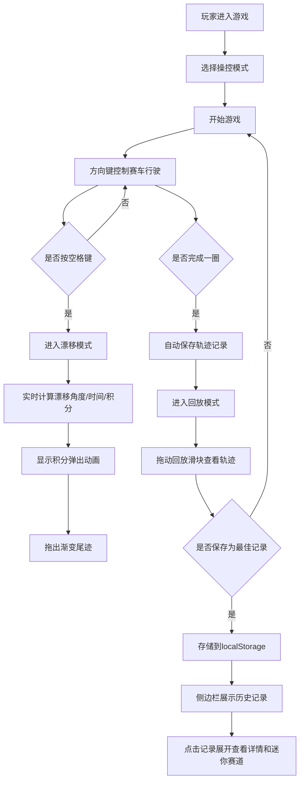

## 1. 产品概述
漂移追踪器是一款专为赛车游戏玩家设计的在线实时赛车漂移计分与轨迹回放浏览器游戏，解决玩家在练习漂移技巧时缺乏量化反馈和事后复盘工具的核心痛点。玩家通过键盘操控赛车在环形赛道上漂移，系统实时计算漂移角度、持续时间与积分，每圈结束后提供完整的轨迹回放功能，并支持保存历史最佳圈速记录。

## 2. 核心功能

### 2.1 功能模块
1. **游戏主界面**：Canvas赛道渲染、赛车操控、实时计分显示
2. **漂移计分系统**：实时计算漂移角度、持续时间、累积积分，积分弹出动画
3. **操控模式切换**：新手/进阶/高手三种模式，带平滑动画和赛车颜色变化
4. **轨迹回放系统**：每圈自动录制，支持进度条拖动、暂停、数据查看
5. **历史记录管理**：本地存储最多5条最佳记录，侧边面板展示与展开预览

### 2.2 页面详情
| 页面名称 | 模块名称 | 功能描述 |
|-----------|-------------|---------------------|
| 游戏主页面 | 赛道渲染模块 | 使用Canvas 2D绘制贝塞尔曲线环形赛道，包含内外曲线、白色虚线中线、红色路肩 |
| 游戏主页面 | 赛车物理引擎 | 模拟赛车行驶物理，支持方向键控制、空格键漂移、三种操控模式 |
| 游戏主页面 | 实时计分面板 | 屏幕上方显示漂移角度、持续时间、累积积分，等宽字体，动画效果 |
| 游戏主页面 | 模式切换面板 | 顶部半透明毛玻璃面板，三个选项横向排列，活动指示条平滑滑动 |
| 游戏主页面 | 回放控制条 | 屏幕底部48px高度的半透明控制条，带滑块拖动、播放暂停 |
| 游戏主页面 | 历史记录侧边栏 | 右侧280px宽度滑入面板，展示历史最佳圈速记录列表 |

## 3. 核心流程

## 4. 用户界面设计

### 4.1 设计风格
- **主题**：深色科技风，主背景#1a1a2e，辅背景#16213e，强调色#e94560
- **字体**：等宽字体Courier New用于数据读数，确保数字对齐
- **按钮**：圆角8px，高度40px，点击缩放至0.95再弹回的微动画
- **毛玻璃效果**：模式切换面板和侧边面板使用backdrop-filter: blur(12px)
- **圆角风格**：所有UI控件统一使用圆角，滑块为圆形，进度条圆角6px

### 4.2 页面设计概述
| 页面名称 | 模块名称 | UI元素 |
|-----------|-------------|-------------|
| 游戏主页面 | 赛道区域 | Canvas居中渲染，深灰色路面，白色虚线中线，两侧红色路肩 |
| 游戏主页面 | 赛车图形 | 俯视几何图形，车身宽0.8长1.2单位，半透明穹顶驾驶舱 |
| 游戏主页面 | 漂移尾迹 | 亮红到半透明橙色渐变，宽度从0.3渐变到0 |
| 游戏主页面 | 计分显示 | 屏幕顶部，等宽字体，数字变化时有放大闪烁动画 |
| 游戏主页面 | 积分弹出 | +xx从车尾向上飘散，0.8秒淡出 |
| 游戏主页面 | 模式面板 | 圆角12px毛玻璃，活动指示条0.3秒平滑滑动 |
| 游戏主页面 | 回放控制 | 底部48px高度，深灰半透明，进度条高度6px圆角6px |
| 游戏主页面 | 历史侧边栏 | 右侧滑入280px，毛玻璃背景，记录点击垂直展开0.3秒 |

### 4.3 响应式设计
- 桌面优先设计，横向屏幕适配（宽度≥1024px）
- 赛道和UI元素按屏幕宽度比例缩放
- 保持Canvas渲染区域的正确宽高比

### 4.4 动画设计
- 积分数字变化：放大至1.2倍再恢复，0.15秒
- 模式切换指示条：0.3秒平滑滑动
- 侧边面板滑入/滑出：右侧280px
- 历史记录展开/收起：0.3秒垂直展开
- 按钮点击：缩放至0.95再弹回
- 积分弹出：向上飘散，0.8秒淡出
