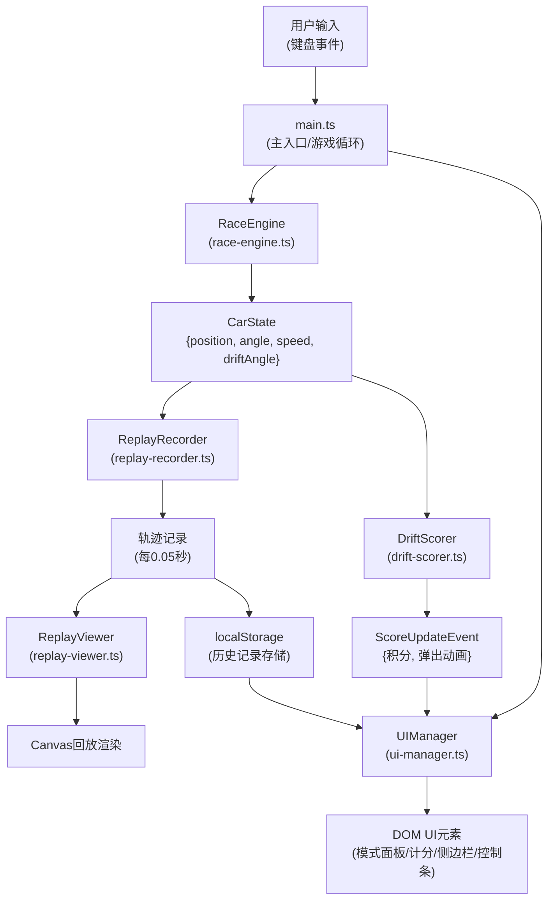

## 1. 架构设计



## 2. 技术描述

- **前端框架**：TypeScript + Vite（纯前端，无框架依赖，使用原生Canvas 2D和DOM API）
- **构建工具**：Vite 5.x
- **类型系统**：TypeScript 5.x（严格模式，ES2020）
- **渲染引擎**：HTML5 Canvas 2D API
- **数据存储**：浏览器localStorage
- **依赖包**：typescript, vite, @types/node

## 3. 文件结构

```
project-root/
├── package.json          # 依赖配置（typescript, vite, @types/node）
├── vite.config.js        # Vite构建配置（base: /）
├── tsconfig.json         # TypeScript配置（严格模式，ES2020）
├── index.html            # 入口页面（标题：漂移追踪器）
└── src/
    ├── main.ts           # 主入口，游戏循环初始化，事件绑定，模块调度
    ├── race/
    │   ├── race-engine.ts       # 赛道渲染 + 车辆物理引擎
    │   └── drift-scorer.ts      # 漂移计分模块
    ├── replay/
    │   ├── replay-recorder.ts   # 轨迹记录模块
    │   └── replay-viewer.ts     # 回放可视化模块
    └── ui/
        └── ui-manager.ts        # UI管理模块
```

## 4. 核心数据模型

### 4.1 赛车状态
```typescript
interface CarState {
  position: { x: number; y: number };   // 赛车位置坐标
  angle: number;                        // 车头朝向角度（弧度）
  speed: number;                        // 当前速度（单位/秒）
  driftAngle: number;                   // 漂移角度（弧度，0表示无漂移）
  isDrifting: boolean;                  // 是否处于漂移状态
}
```

### 4.2 操控模式
```typescript
enum ControlMode {
  NOVICE = 'novice',       // 新手模式：自动辅助转向，maxSpeed 60
  ADVANCED = 'advanced',   // 进阶模式：手动全控，maxSpeed 100
  EXPERT = 'expert'        // 高手模式：手动全控 + 轮胎磨损模拟
}

interface ModeConfig {
  name: string;
  maxSpeed: number;
  autoAssist: boolean;
  tireWear: boolean;
  color: string;
}
```

### 4.3 轨迹记录
```typescript
interface TrackPoint {
  timestamp: number;              // 时间戳（秒）
  position: { x: number; y: number };
  angle: number;
  speed: number;
  driftAngle: number;
  score: number;
}

interface LapRecord {
  id: string;
  lapTime: number;                // 圈速（秒）
  avgDriftAngle: number;          // 平均漂移角度
  totalScore: number;             // 总积分
  mode: ControlMode;              // 使用模式
  track: TrackPoint[];            // 完整轨迹
  createdAt: number;
}
```

### 4.4 漂移计分
```typescript
interface DriftScore {
  currentAngle: number;           // 当前漂移角度
  duration: number;               // 持续时间（秒）
  totalScore: number;             // 累积积分
  speedCoefficient: number;       // 速度系数
}
// 积分公式：角度 × 持续时间 × 速度系数
```

## 5. 核心接口定义

### 5.1 RaceEngine
```typescript
class RaceEngine {
  constructor(canvas: HTMLCanvasElement);
  update(deltaTime: number, keys: Set<string>): CarState;
  render(ctx: CanvasRenderingContext2D): void;
  setControlMode(mode: ControlMode): void;
  getTrackPath(): Path2D;
  checkLapComplete(): boolean;
}
```

### 5.2 DriftScorer
```typescript
class DriftScorer {
  update(state: CarState, deltaTime: number): DriftScore;
  reset(): void;
  onScorePopup(callback: (score: number, x: number, y: number) => void): void;
}
```

### 5.3 ReplayRecorder
```typescript
class ReplayRecorder {
  record(state: CarState, score: number): void;
  startNewLap(): void;
  finishLap(): LapRecord | null;
  getCurrentLapTime(): number;
}

class ReplayViewer {
  constructor(canvas: HTMLCanvasElement);
  loadRecord(record: LapRecord): void;
  play(speed?: number): void;
  pause(): void;
  seek(time: number): TrackPoint | null;
  getProgress(): number;
  renderMiniTrack(ctx: CanvasRenderingContext2D, width: number, height: number): void;
}
```

### 5.4 UIManager
```typescript
class UIManager {
  constructor(container: HTMLElement);
  showModePanel(currentMode: ControlMode): void;
  hideModePanel(): void;
  onModeChange(callback: (mode: ControlMode) => void): void;
  updateScoreDisplay(score: DriftScore): void;
  showScorePopup(score: number, x: number, y: number): void;
  showReplayControls(record: LapRecord): void;
  hideReplayControls(): void;
  showHistoryPanel(records: LapRecord[]): void;
  hideHistoryPanel(): void;
  onRecordSelect(callback: (record: LapRecord) => void): void;
  updateCarColor(color: string): void;
}
```

## 6. 性能指标

- **帧率**：稳定60FPS
- **单帧计算时间**：≤2ms（漂移计算 + 轨迹记录）
- **存储操作**