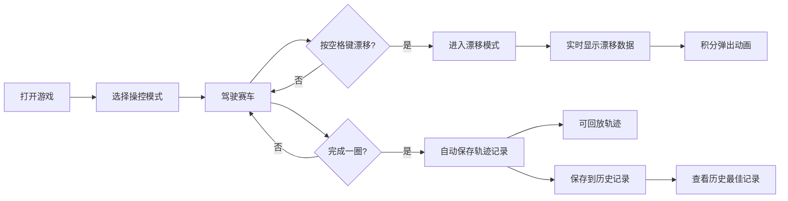

## 1. 产品概述

漂移追踪器是一款在线实时赛车漂移计分与轨迹回放浏览器游戏，专为赛车游戏爱好者设计，解决玩家在练习漂移技巧时缺乏量化反馈和事后复盘工具的痛点。

- 目标用户：赛车游戏玩家、漂移爱好者
- 核心价值：提供实时漂移数据量化反馈、完整轨迹回放和历史记录管理，帮助玩家系统提升漂移技术

## 2. 核心功能

### 2.1 功能模块

1. **游戏主界面**：赛道渲染、赛车操控、漂移尾迹、实时数据显示
2. **操控模式系统**：新手/进阶/高手三种模式，含辅助转向、速度限制、轮胎磨损模拟
3. **漂移计分系统**：实时计算漂移角度、持续时间、累积积分，积分弹出动画
4. **轨迹回放系统**：每圈自动记录轨迹，支持1.5倍速回放、进度条拖拽、暂停查看数据
5. **历史记录系统**：保存最多5条最佳圈速，支持查看详情和轨迹预览

### 2.2 页面详情

| 页面名称 | 模块名称 | 功能描述 |
|-----------|-------------|---------------------|
| 游戏主界面 | 赛道渲染模块 | 绘制贝塞尔曲线赛道，含深灰路面、白色虚线中线、红色路肩 |
| 游戏主界面 | 赛车物理引擎 | 键盘方向键控制，空格键漂移，三种操控模式 |
| 游戏主界面 | 实时数据显示 | 漂移角度、持续时间、累积积分，积分弹出动画 |
| 模式切换面板 | 模式选择模块 | 半透明毛玻璃面板，横向三选项，活动指示条平滑动画 |
| 回放控制条 | 轨迹回放模块 | 底部进度条，1.5倍速绘制，滑块拖拽暂停 |
| 历史记录面板 | 记录管理模块 | 右侧滑入面板，列表展示，点击展开详情和迷你轨迹预览 |

## 3. 核心流程

玩家打开游戏 → 选择操控模式 → 使用方向键驾驶赛车在赛道行驶 → 按空格键进入漂移模式 → 实时查看漂移数据和积分 → 完成一圈后自动保存轨迹 → 可回放轨迹或查看历史最佳记录 → 循环练习提升技术

## 4. 用户界面设计

### 4.1 设计风格
- 主背景：#1a1a2e，辅背景：#16213e，强调色：#e94560
- 深色科技感主题，营造专业赛车游戏氛围
- 按钮圆角8px，高度40px，点击缩放0.95再弹回
- 毛玻璃效果：背景模糊12px，用于模式切换面板和历史记录面板
- 等宽字体：Courier New用于数据读数

### 4.2 页面设计概览

| 页面名称 | 模块名称 | UI元素 |
|-----------|-------------|-------------|
| 游戏主界面 | 赛道区域 | Canvas 2D绘制，贝塞尔曲线赛道，深灰路面，白色虚线中线，红色路肩 |
| 游戏主界面 | 赛车元素 | 俯视几何图形，宽0.8长1.2单位，半透明穹顶驾驶舱 |
| 游戏主界面 | 漂移尾迹 | 亮红到半透橙色渐变，宽度0.3到0渐细 |
| 游戏主界面 | 实时数据面板 | 屏幕顶部，漂移角度、持续时间、积分，积分放大闪烁动画 |
| 模式切换面板 | 模式选择 | 半透明毛玻璃，圆角12px，横向三选项，活动指示条平滑滑动0.3秒 |
| 回放控制条 | 回放控件 | 底部高度48px，深灰半透明，圆角6px滑块，圆形滑块 |
| 历史记录面板 | 记录列表 | 右侧滑入宽度280px，毛玻璃背景，点击展开动画0.3秒，迷你赛道图 |

### 4.3 响应式设计
- 桌面优先设计，适配横向屏幕（宽度≥1024px）
- 在此分辨率下赛道和UI按比例缩放
- Canvas自适应容器尺寸，保持游戏区域比例

### 4.4 动画与交互
- 模式切换：活动指示条0.3秒平滑滑动
- 积分弹出：+xx从车尾向上飘散，0.8秒淡出
- 积分变化：放大至1.2倍再恢复，0.15秒
- 历史记录展开：从底部垂直展开0.3秒
- 按钮点击：缩放至0.95再弹回
