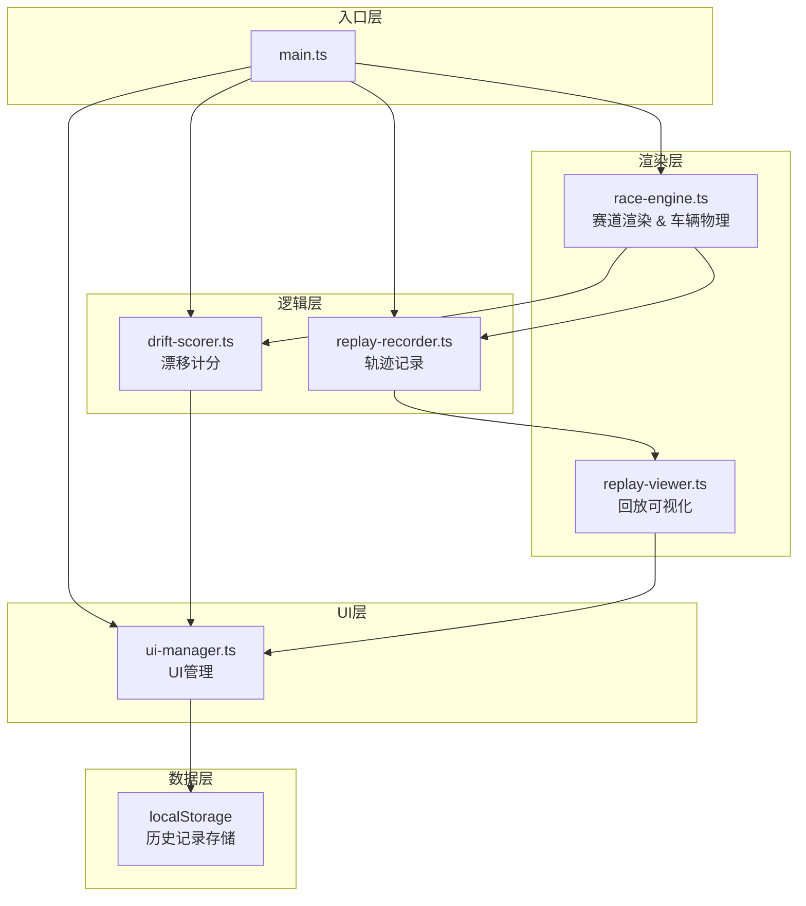

## 1. 架构设计

漂移追踪器采用纯前端模块化架构，基于TypeScript + Vite构建，所有数据存储在客户端localStorage，无需后端支持。架构分为渲染层、引擎层、逻辑层和UI层，各模块职责清晰，通过事件总线通信。



## 2. 技术描述

- **前端框架**：TypeScript 5.x + Vite 5.x（纯Canvas 2D，无UI框架）
- **构建工具**：Vite，配置base为/
- **渲染技术**：HTML5 Canvas 2D API
- **数据存储**：浏览器localStorage
- **CSS技术**：原生CSS3 + CSS变量，毛玻璃效果使用backdrop-filter

## 3. 项目文件结构

```
auto85/
├── package.json              # 项目依赖和脚本
├── vite.config.js            # Vite构建配置
├── tsconfig.json             # TypeScript配置（严格模式，ES2020）
├── index.html                # 入口页面
└── src/
    ├── main.ts               # 主入口，游戏循环、事件绑定、模块调度
    ├── types/                # 类型定义
    │   └── index.ts          # 通用类型接口
    ├── race/
    │   ├── race-engine.ts    # 赛道渲染和车辆物理引擎
    │   └── drift-scorer.ts   # 漂移计分模块
    ├── replay/
    │   ├── replay-recorder.ts # 轨迹记录与回放模块
    │   └── replay-viewer.ts  # 回放可视化模块
    └── ui/
        └── ui-manager.ts     # UI管理模块
```

## 4. 核心数据模型

### 4.1 类型定义

```typescript
// 操控模式
type ControlMode = 'novice' | 'advanced' | 'expert';

// 赛车状态
interface CarState {
  position: { x: number; y: number };
  angle: number;           // 朝向角度（弧度）
  speed: number;           // 速度
  driftAngle: number;      // 漂移角度
  isDrifting: boolean;     // 是否在漂移
}

// 轨迹记录点
interface TrackPoint {
  timestamp: number;
  position: { x: number; y: number };
  angle: number;
  speed: number;
  driftAngle: number;
  score: number;
}

// 单圈记录
interface LapRecord {
  id: string;
  lapTime: number;         // 圈速（毫秒）
  avgDriftAngle: number;   // 平均漂移角度
  totalScore: number;      // 总积分
  mode: ControlMode;       // 使用模式
  trackData: TrackPoint[]; // 轨迹数据
  createdAt: number;
}

// 漂移状态
interface DriftState {
  isActive: boolean;
  startTime: number;
  duration: number;        // 持续时间（秒）
  currentScore: number;    // 当前漂移得分
  totalScore: number;      // 总积分
}

// 积分弹出动画
interface ScorePopup {
  id: string;
  value: number;
  position: { x: number; y: number };
  createdAt: number;
}
```

### 4.2 localStorage存储键

- `drift_tracker_records`：历史最佳圈速记录数组（最多5条）

## 5. 核心模块接口

### 5.1 RaceEngine

```typescript
class RaceEngine {
  constructor(canvas: HTMLCanvasElement);
  setControlMode(mode: ControlMode): void;
  update(deltaTime: number): CarState;
  render(): void;
  getCarState(): CarState;
  checkLapCompletion(): boolean;
  resetCar(): void;
}
```

### 5.2 DriftScorer

```typescript
class DriftScorer {
  constructor();
  update(carState: CarState, deltaTime: number): DriftState;
  onScorePopup(callback: (popup: ScorePopup) => void): void;
  getTotalScore(): number;
  reset(): void;
}
```

### 5.3 ReplayRecorder

```typescript
class ReplayRecorder {
  constructor();
  record(carState: CarState, score: number): void;
  startNewLap(): void;
  finishLap(): TrackPoint[] | null;
  getTrackData(): TrackPoint[];
  clear(): void;
}
```

### 5.4 ReplayViewer

```typescript
class ReplayViewer {
  constructor(canvas: HTMLCanvasElement);
  loadTrackData(trackData: TrackPoint[]): void;
  play(speed?: number): void;
  pause(): void;
  seek(time: number): void;
  getCurrentTime(): number;
  getDuration(): number;
  isPlaying(): boolean;
  render(): void;
}
```

### 5.5 UIManager

```typescript
class UIManager {
  constructor();
  updateDriftDisplay(state: DriftState): void;
  showModePanel(currentMode: ControlMode): void;
  hideModePanel(): void;
  onModeChange(callback: (mode: ControlMode) => void): void;
  showReplayControls(enabled: boolean): void;
  showHistoryPanel(): void;
  hideHistoryPanel(): void;
  updateHistoryRecords(records: LapRecord[]): void;
  onRecordSelect(callback: (record: LapRecord) => void): void;
  addScorePopup(popup: ScorePopup): void;
}
```

## 6. 性能优化策略

### 6.1 渲染性能
- 使用Canvas 2D分层渲染，静态赛道预渲染到离屏Canvas
- 漂移尾迹使用对象池复用渐变对象
- 轨迹回放使用增量绘制，避免全量重绘

### 6.2 计算性能
- 物理计算限制在单帧≤2ms，使用简单的2D刚体模型
- 轨迹记录每0.05秒采样一次，而非每帧
- 使用requestAnimationFrame驱动游戏循环，deltaTime插值

### 6.3 存储性能
- localStorage读写操作≤50ms，异步化处理
- 历史记录最多5条，限制数据体积
- 轨迹数据压缩存储（相对坐标+差值编码）

## 7. 游戏循环

```
requestAnimationFrame → 计算deltaTime → 更新物理引擎 → 
更新漂移计分 → 记录轨迹 → 渲染赛道和赛车 → 
更新UI → 处理积分动画 → 下一帧
```
