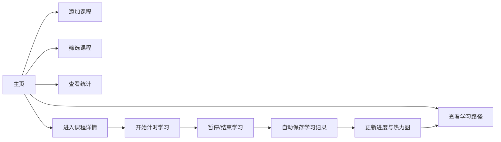

## 1. 产品概述
在线课程学习进度追踪与学习路径个性化推荐应用，帮助用户记录学习时间、管理课程进度，并基于历史行为获得智能学习建议。
- 目标用户：自学者、在线课程学习者、需要系统化管理学习进度的个人用户
- 核心价值：可视化学习进度、个性化学习路径推荐、学习数据沉淀与分析

## 2. 核心功能

### 2.1 功能模块
1. **主页（课程列表）**：课程卡片展示、全局筛选器、统计面板、添加课程入口
2. **课程详情页**：学习计时器、学习日历热力图、课程进度详情
3. **学习路径页面**：个性化推荐路径展示、节点导航跳转

### 2.2 页面详情
| 页面名称 | 模块名称 | 功能描述 |
|---------|---------|---------|
| 主页 | 全局筛选器 | 按类别、难度、状态过滤课程卡片 |
| 主页 | 课程卡片网格 | 展示课程列表，带进度条和类别色标 |
| 主页 | 统计面板 | 总学习时长、完成课程数、平均完成率 |
| 主页 | 添加课程模态框 | 课程名称、类别、预估学时、难度星级输入 |
| 课程详情页 | 学习计时器 | 开始/暂停/重置，自动累加学习时长 |
| 课程详情页 | 学习日历热力图 | 每周×每日学习分钟数可视化 |
| 课程详情页 | 课程进度信息 | 已学时长、完成百分比、难度标签 |
| 学习路径页面 | 推荐路径节点 | 步骤节点展示、虚线箭头连接、流动光点动画 |

## 3. 核心流程
用户打开应用 → 查看课程列表 → 筛选/添加课程 → 点击课程进入详情 → 开始计时学习 → 结束时自动记录 → 系统积累数据 → 生成个性化学习路径推荐

## 4. 用户界面设计

### 4.1 设计风格
- 主背景色：#f5f7fa
- 卡片背景：白色
- 主色调：#4a90d9
- 强调色：#e74c3c（用于进度条低值）
- 卡片阴影：0 2px 8px rgba(0,0,0,0.08)，悬停上浮3px并加深阴影
- 过渡动画：0.3秒统一缓动
- 圆角：卡片和面板统一圆角，统计面板12px

### 4.2 页面设计概述
| 页面名称 | 模块名称 | UI元素 |
|---------|---------|-------|
| 主页 | 课程卡片 | 类别色标圆点、课程名称、难度标签、进度条（渐变）、已学时长、完成百分比 |
| 主页 | 统计面板 | 毛玻璃背景、圆角12px、三项核心指标 |
| 主页 | 添加模态框 | 半透明遮罩、顶部滑入回弹动画、星级难度、学时滑块、类别下拉 |
| 课程详情页 | 计时器 | 大号时间显示、按压态缩放按钮 |
| 课程详情页 | 热力图 | 浅蓝到深红渐变、悬停tooltip、每周日期网格 |
| 学习路径页面 | 路径节点 | 圆角矩形、虚线箭头、流动光点动画、点击跳转 |

### 4.3 响应式
- 大于1024px：三列网格
- 768-1024px：两列网格
- 小于768px：单列网格
