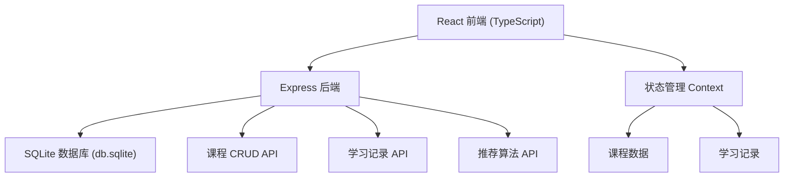
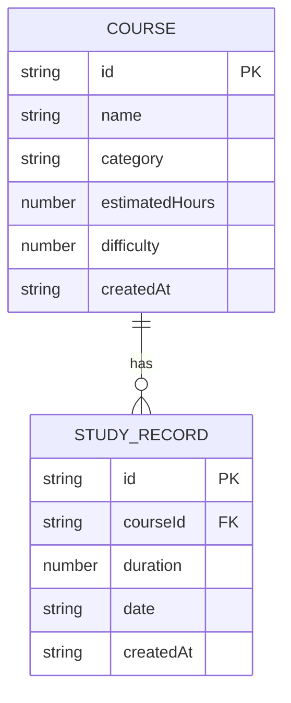

## 1. 架构设计



## 2. 技术说明
- 前端：React 18 + TypeScript + Vite
- 路由：react-router-dom
- HTTP 请求：axios
- 动画：framer-motion
- 图表：recharts
- 后端：Express 4
- 数据库：better-sqlite3
- 跨域：cors
- ID 生成：uuid
- 并发启动：concurrently

## 3. 路由定义
| 路由 | 用途 |
|-----|-----|
| / | 主页 - 课程列表与统计 |
| /course/:id | 课程详情页 - 计时器与热力图 |
| /path | 学习路径推荐页 |

## 4. API 定义

### 4.1 课程 API
```typescript
interface Course {
  id: string;
  name: string;
  category: string;
  estimatedHours: number;
  difficulty: number; // 1-5
  createdAt: string;
}

// GET    /api/courses          获取所有课程
// POST   /api/courses          创建新课程
// GET    /api/courses/:id      获取单门课程
// PUT    /api/courses/:id      更新课程信息
// DELETE /api/courses/:id      删除课程
```

### 4.2 学习记录 API
```typescript
interface StudyRecord {
  id: string;
  courseId: string;
  duration: number; // 分钟数
  date: string; // YYYY-MM-DD
  createdAt: string;
}

// GET    /api/records                  获取所有学习记录
// GET    /api/records/course/:courseId 获取某课程的学习记录
// POST   /api/records                  添加学习记录
// PUT    /api/records/:id              更新学习记录
// DELETE /api/records/:id              删除学习记录
// GET    /api/records/stats            获取统计数据
```

### 4.3 推荐路径 API
```typescript
interface RecommendStep {
  courseId: string;
  reason: string;
  priority: number;
}

// GET /api/recommendations  获取个性化学习路径
```

## 5. 服务器架构图


## 6. 数据模型

### 6.1 ER 图



### 6.2 DDL

```sql
CREATE TABLE IF NOT EXISTS courses (
  id TEXT PRIMARY KEY,
  name TEXT NOT NULL,
  category TEXT NOT NULL,
  estimatedHours INTEGER NOT NULL,
  difficulty INTEGER NOT NULL CHECK(difficulty >= 1 AND difficulty <= 5),
  createdAt TEXT NOT NULL DEFAULT (datetime('now'))
);

CREATE TABLE IF NOT EXISTS study_records (
  id TEXT PRIMARY KEY,
  courseId TEXT NOT NULL,
  duration INTEGER NOT NULL,
  date TEXT NOT NULL,
  createdAt TEXT NOT NULL DEFAULT (datetime('now')),
  FOREIGN KEY (courseId) REFERENCES courses(id) ON DELETE CASCADE
);

CREATE INDEX IF NOT EXISTS idx_study_records_courseId ON study_records(courseId);
CREATE INDEX IF NOT EXISTS idx_study_records_date ON study_records(date);
```
