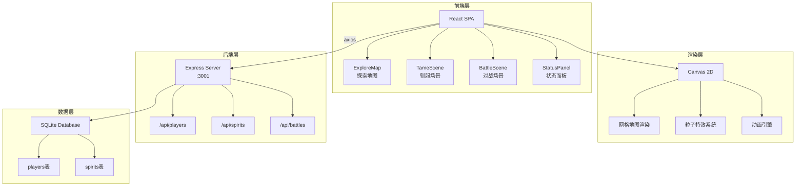
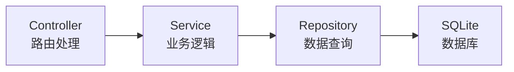
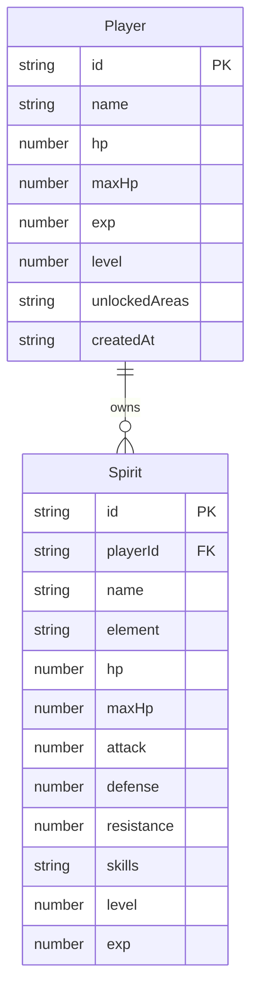

## 1. 架构设计



## 2. 技术说明

- **前端**：React@18 + TypeScript + Vite + TailwindCSS@3
- **动画**：Framer Motion（页面切换、UI动画）+ Canvas 2D（地图渲染、战斗特效、粒子系统）
- **状态管理**：Zustand（全局游戏状态：玩家数据、灵兽队伍、当前场景）
- **路由**：React Router DOM（/explore、/tame、/battle）
- **后端**：Express@4 + CORS + better-sqlite3 + uuid
- **数据库**：SQLite（玩家表 + 灵兽表）
- **构建工具**：Vite（代理/api到后端端口3001）

## 3. 路由定义

| 路由 | 用途 |
|------|------|
| `/` | 游戏入口，重定向到/explore |
| `/explore` | 探索地图主页面 |
| `/tame` | 驯服QTE场景（遭遇灵兽时进入） |
| `/battle` | 回合制对战场景 |

## 4. API定义

### 4.1 玩家API

```typescript
// GET /api/players/:id
interface Player {
  id: string;
  name: string;
  hp: number;
  maxHp: number;
  exp: number;
  level: number;
  unlockedAreas: string[];
  createdAt: string;
}
interface PlayerResponse { player: Player }

// PUT /api/players/:id
interface UpdatePlayerRequest {
  hp?: number;
  exp?: number;
  unlockedAreas?: string[];
}
interface UpdatePlayerResponse { player: Player }
```

### 4.2 灵兽API

```typescript
// GET /api/spirits?playerId=:id
interface Spirit {
  id: string;
  playerId: string;
  name: string;
  element: 'fire' | 'water' | 'wood' | 'light' | 'dark';
  hp: number;
  maxHp: number;
  attack: number;
  defense: number;
  resistance: number;
  skills: Skill[];
  level: number;
  exp: number;
}
interface Skill {
  name: string;
  element: 'fire' | 'water' | 'wood' | 'light' | 'dark';
  power: number;
}
interface SpiritsResponse { spirits: Spirit[] }

// POST /api/spirits
interface CreateSpiritRequest {
  playerId: string;
  name: string;
  element: string;
  skills: Skill[];
}
interface CreateSpiritResponse { spirit: Spirit }

// PUT /api/spirits/:id
interface UpdateSpiritRequest {
  hp?: number;
  exp?: number;
  level?: number;
}
interface UpdateSpiritResponse { spirit: Spirit }
```

### 4.3 战斗API

```typescript
// POST /api/battles
interface BattleRequest {
  playerId: string;
  playerSpirits: string[];
  aiSpirits: Spirit[];
}
interface BattleResponse {
  id: string;
  result: 'win' | 'lose';
  expGained: number;
  unlockedArea?: string;
}
```

## 5. 服务器架构图



## 6. 数据模型

### 6.1 数据模型定义



### 6.2 数据定义语言

```sql
CREATE TABLE IF NOT EXISTS players (
  id TEXT PRIMARY KEY,
  name TEXT NOT NULL DEFAULT '驯养师',
  hp INTEGER NOT NULL DEFAULT 100,
  maxHp INTEGER NOT NULL DEFAULT 100,
  exp INTEGER NOT NULL DEFAULT 0,
  level INTEGER NOT NULL DEFAULT 1,
  unlockedAreas TEXT NOT NULL DEFAULT '["forest"]',
  createdAt TEXT NOT NULL DEFAULT (datetime('now'))
);

CREATE TABLE IF NOT EXISTS spirits (
  id TEXT PRIMARY KEY,
  playerId TEXT NOT NULL,
  name TEXT NOT NULL,
  element TEXT NOT NULL CHECK(element IN ('fire','water','wood','light','dark')),
  hp INTEGER NOT NULL DEFAULT 50,
  maxHp INTEGER NOT NULL DEFAULT 50,
  attack INTEGER NOT NULL DEFAULT 10,
  defense INTEGER NOT NULL DEFAULT 5,
  resistance INTEGER NOT NULL DEFAULT 100,
  skills TEXT NOT NULL DEFAULT '[]',
  level INTEGER NOT NULL DEFAULT 1,
  exp INTEGER NOT NULL DEFAULT 0,
  FOREIGN KEY (playerId) REFERENCES players(id) ON DELETE CASCADE
);

CREATE INDEX IF NOT EXISTS idx_spirits_playerId ON spirits(playerId);
```
