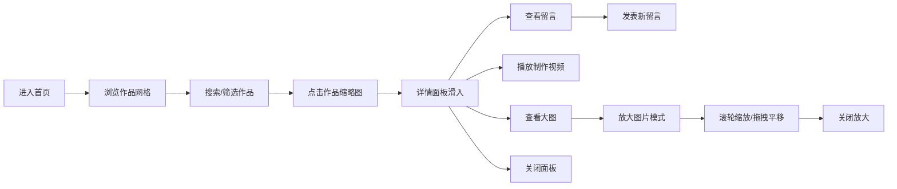

## 1. 产品概述

陶艺作品线上展厅是一个面向小型手工作坊的产品展示应用，让顾客可以在线浏览不同系列的陶艺作品，查看作品细节和制作过程视频，并留下买家留言。应用采用深色暖色调陶瓷风格，营造温暖、质朴的手作氛围。

- **目标用户**：陶艺爱好者、手工制品消费者、手工作坊顾客
- **核心价值**：提供沉浸式的陶艺作品浏览体验，支持详细的作品展示和买家互动

## 2. 核心功能

### 2.1 用户角色
| 角色 | 注册方式 | 核心权限 |
|------|----------|----------|
| 访客用户 | 无需注册 | 浏览作品、查看详情、播放视频、发表留言 |

### 2.2 功能模块
1. **作品画廊**：网格布局展示作品缩略图，按系列分组，支持渐进式图片加载
2. **详情面板**：滑入式面板展示作品大图、描述、制作视频和留言列表
3. **图片放大查看**：全屏放大模式，支持滚轮缩放和拖拽平移
4. **留言功能**：用户可发表留言，实时展示在留言列表顶部
5. **搜索与筛选**：关键词搜索和系列标签筛选

### 2.3 页面详情
| 页面名称 | 模块名称 | 功能描述 |
|----------|----------|----------|
| 首页 | 导航栏 | 应用名称、搜索框、系列筛选标签 |
| 首页 | 作品画廊 | 网格布局展示作品，按系列分组，悬停动画效果 |
| 首页 | 详情面板 | 右侧滑入，展示大图、描述、视频、留言 |
| 首页 | 图片放大 | 全屏遮罩模式，支持缩放和拖拽 |

## 3. 核心流程

用户进入首页 → 浏览作品网格（可搜索/筛选）→ 点击作品缩略图 → 详情面板滑入 → 查看大图/描述/视频/留言 → 可放大图片查看 → 可发表留言 → 关闭详情面板

## 4. 用户界面设计

### 4.1 设计风格
- **主色调**：深米色背景（#F5EDE1），深棕色导航栏（#5D4037），主题色琥珀棕（#8B4513）
- **按钮风格**：圆角胶囊按钮，悬停时背景加深，0.2秒过渡
- **字体**：采用优雅的衬线字体配合现代无衬线字体，营造手作质感
- **布局风格**：卡片式网格布局，圆角设计，柔和阴影
- **动效**：全部交互使用Framer Motion动画，easeInOut缓动，0.2-0.4秒

### 4.2 页面设计概览
| 页面名称 | 模块名称 | UI元素 |
|----------|----------|--------|
| 首页 | 导航栏 | 深棕色背景，白色标题，圆角搜索框，胶囊筛选标签 |
| 首页 | 作品卡片 | 正方形缩略图，圆角12px，悬停放大+琥珀色遮罩，浮现作品名 |
| 首页 | 详情面板 | 白色背景，右侧滑入，大图、描述段落、视频iframe、留言列表 |
| 首页 | 放大模式 | 半透明黑色遮罩，居中大图，关闭按钮，支持缩放拖拽 |

### 4.3 响应式设计
- **桌面端（>=1024px）**：网格4列，详情面板400px宽固定在右侧
- **平板端（>=768px且<1024px）**：网格3列，详情面板350px宽在右侧
- **手机端（<768px）**：网格2列，详情面板从底部全屏滑入

### 4.4 性能要求
- 缩略图渐进式加载（blur-up效果）
- 图片总大小控制在2MB以内
- 滚动画廊帧率不低于55fps
