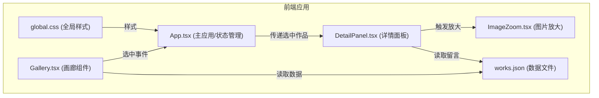

## 1. 架构设计



**数据流向**：
- works.json → Gallery.tsx（读取作品列表）
- Gallery.tsx → App.tsx（选中作品事件）
- App.tsx → DetailPanel.tsx（传递选中作品数据）
- DetailPanel.tsx → ImageZoom.tsx（放大模式）
- DetailPanel.tsx → 本地状态（新增留言）

## 2. 技术栈说明

- **前端框架**：React 18 + TypeScript
- **构建工具**：Vite
- **样式方案**：CSS Modules + 全局CSS变量
- **动画库**：framer-motion
- **HTTP请求**：axios（预留，当前使用本地JSON）
- **状态管理**：React useState（组件级），props传递

## 3. 目录结构

```
src/
├── App.tsx              # 主应用组件，管理路由和全局状态
├── components/
│   ├── Gallery.tsx      # 作品画廊组件
│   ├── DetailPanel.tsx  # 详情面板组件
│   └── ImageZoom.tsx    # 图片放大查看组件
├── data/
│   └── works.json       # 陶艺作品数据
└── styles/
    └── global.css       # 全局样式和主题变量
```

## 4. 数据模型

### 4.1 作品数据定义

```typescript
interface Comment {
  id: string;
  avatar: string;
  nickname: string;
  time: string;
  content: string;
}

interface Work {
  id: string;
  name: string;
  category: '茶器' | '花器' | '食器' | '装饰品';
  thumbnail: string;
  image: string;
  description: string;
  videoUrl: string;
  comments: Comment[];
}
```

### 4.2 works.json 数据结构

包含8-12件陶艺作品，覆盖四个系列，每件作品包含完整信息和3-5条示例留言。

## 5. 关键技术实现

### 5.1 图片渐进式加载
- 使用小型模糊缩略图作为占位
- 高清图加载完成后淡入过渡
- transition: opacity 0.5s ease

### 5.2 图片放大与拖拽
- 滚轮缩放：scale范围1-3倍
- 拖拽平移：跟随鼠标移动
- 边界回弹：超出边界时平滑回弹
- 使用framer-motion的drag和pinch手势

### 5.3 响应式布局
- CSS变量定义断点
- Grid布局自适应列数
- 详情面板位置根据屏幕宽度切换

### 5.4 留言功能
- 本地状态管理留言列表
- 提交后unshift到列表顶部
- 淡入动画效果
