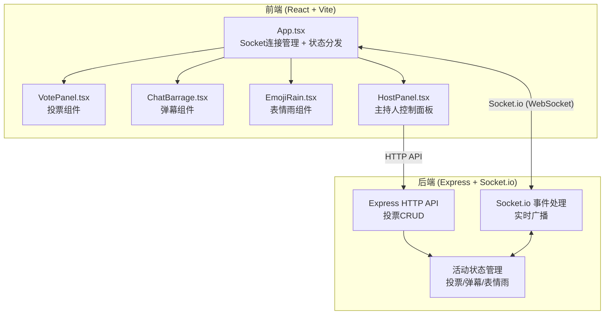
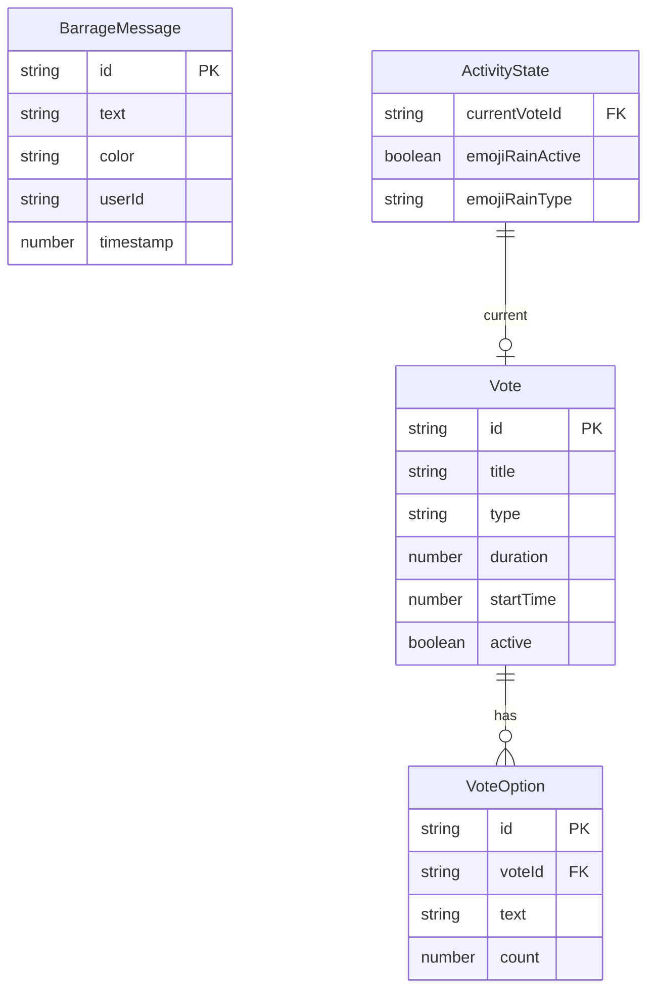

## 1. 架构设计



## 2. 技术说明

- 前端：React@18 + TypeScript + Vite + TailwindCSS@3
- 初始化工具：vite-init (react-express-ts 模板)
- 后端：Express@4 + Socket.io + cors + uuid
- 实时通信：Socket.io (WebSocket，延迟 < 200ms)
- 状态管理：Zustand（前端）+ 内存状态（后端）
- 音效：Web Audio API（无需额外音频文件）
- 数据库：无（内存状态，适合轻量级活动场景）

## 3. 路由定义

| 路由 | 用途 |
|------|------|
| / | 互动面板主页面（所有功能集成） |

## 4. API 定义

### HTTP API

```typescript
interface CreateVoteRequest {
  title: string;
  options: string[];
  type: "single" | "multiple";
  duration: number;
}

interface Vote {
  id: string;
  title: string;
  options: VoteOption[];
  type: "single" | "multiple";
  duration: number;
  startTime: number;
  active: boolean;
}

interface VoteOption {
  id: string;
  text: string;
  count: number;
}

// POST /api/votes - 创建投票
// GET /api/votes/current - 获取当前投票
// GET /api/votes/:id - 获取投票详情
```

### Socket.io 事件

```typescript
// 客户端 → 服务端
interface ClientToServerEvents {
  vote: (voteId: string, optionId: string) => void;
  send_barrage: (text: string, color: string) => void;
  trigger_emoji_rain: (emoji: "❤️" | "🎉" | "🔥") => void;
}

// 服务端 → 客户端
interface ServerToClientEvents {
  vote_start: (vote: Vote) => void;
  vote_update: (voteId: string, options: VoteOption[]) => void;
  vote_end: (voteId: string, winnerId: string) => void;
  barrage: (text: string, color: string, userId: string) => void;
  emoji_rain: (emoji: "❤️" | "🎉" | "🔥") => void;
  state_sync: (state: ActivityState) => void;
}

interface ActivityState {
  currentVote: Vote | null;
  emojiRainActive: boolean;
  emojiRainType: string | null;
}
```

## 5. 服务端架构图

```mermaid
flowchart LR
    "Express Router<br/>/api/votes" --> "VoteService<br/>投票业务逻辑"
    "Socket Handler<br/>vote/barrage/emoji" --> "StateService<br/>活动状态管理"
    "VoteService" --> "StateService"
    "StateService" --> "内存状态存储"
    "Socket Handler" --> "Socket.io<br/>广播至所有客户端"
```

## 6. 数据模型

### 6.1 数据模型定义



### 6.2 数据定义

全部使用内存存储（Map/对象），无需DDL。初始状态：
- currentVote: null
- emojiRainActive: false
- barrageHistory: []（最近100条弹幕记录）
