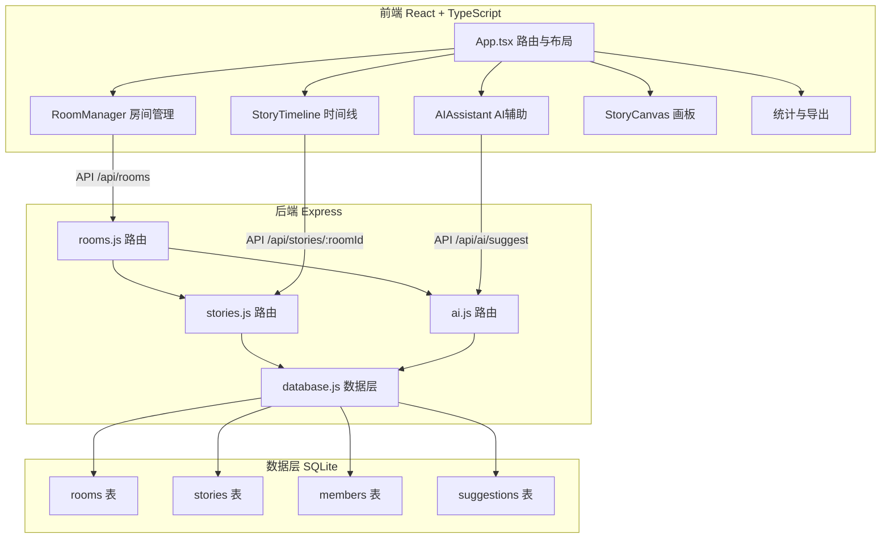
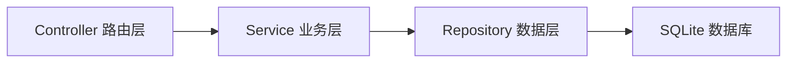

## 1. 架构设计



## 2. 技术说明
- 前端：React@18 + TypeScript + Tailwind CSS + Framer Motion + Vite
- 初始化工具：vite-init（react-express-ts模板）
- 后端：Express@4 + better-sqlite3 + uuid + cors
- 数据库：SQLite（本地文件存储）
- 状态管理：Zustand
- 路由：react-router-dom
- HTTP客户端：axios

## 3. 路由定义
| 路由 | 用途 |
|------|------|
| / | 房间大厅页面，展示房间列表，创建/加入房间 |
| /room/:roomId | 故事接龙页面，集成时间线、编辑器、AI辅助、画板、统计 |

## 4. API定义

### 4.1 房间相关
```
GET    /api/rooms              - 获取所有房间列表
POST   /api/rooms              - 创建新房间 { theme, creatorName }
POST   /api/rooms/:roomId/join - 加入房间 { userName }
```

### 4.2 故事段落相关
```
GET    /api/stories/:roomId    - 获取房间的所有段落
POST   /api/stories/:roomId    - 提交新段落 { content, author }
```

### 4.3 AI辅助相关
```
POST   /api/ai/suggest         - 获取续写建议 { content, roomId }
```

### 4.4 TypeScript类型定义
```typescript
interface Room {
  id: string;
  roomCode: string;
  theme: string;
  creatorName: string;
  createdAt: string;
  memberCount: number;
  paragraphCount: number;
}

interface StoryParagraph {
  id: string;
  roomId: string;
  content: string;
  author: string;
  order: number;
  createdAt: string;
}

interface AISuggestion {
  suggestions: string[];
}

interface Member {
  id: string;
  roomId: string;
  userName: string;
  joinedAt: string;
}

interface RoomStats {
  totalParagraphs: number;
  totalWords: number;
  memberCount: number;
  contributions: { author: string; count: number }[];
}
```

## 5. 服务端架构图



## 6. 数据模型

### 6.1 数据模型定义

```mermaid
erDiagram
    "rooms" {
        string id PK
        string roomCode UK
        string theme
        string creatorName
        datetime createdAt
    }
    "stories" {
        string id PK
        string roomId FK
        string content
        string author
        integer "order"
        datetime createdAt
    }
    "members" {
        string id PK
        string roomId FK
        string userName
        datetime joinedAt
    }
    "suggestions" {
        string id PK
        string roomId FK
        string keyword
        string suggestion
    }
    "rooms" ||--o{ "stories" : "has"
    "rooms" ||--o{ "members" : "has"
    "rooms" ||--o{ "suggestions" : "has"
```

### 6.2 数据定义语言

```sql
CREATE TABLE rooms (
  id TEXT PRIMARY KEY,
  roomCode TEXT UNIQUE NOT NULL,
  theme TEXT NOT NULL,
  creatorName TEXT NOT NULL,
  createdAt TEXT DEFAULT (datetime('now'))
);

CREATE TABLE stories (
  id TEXT PRIMARY KEY,
  roomId TEXT NOT NULL,
  content TEXT NOT NULL,
  author TEXT NOT NULL,
  "order" INTEGER NOT NULL,
  createdAt TEXT DEFAULT (datetime('now')),
  FOREIGN KEY (roomId) REFERENCES rooms(id)
);

CREATE TABLE members (
  id TEXT PRIMARY KEY,
  roomId TEXT NOT NULL,
  userName TEXT NOT NULL,
  joinedAt TEXT DEFAULT (datetime('now')),
  FOREIGN KEY (roomId) REFERENCES rooms(id)
);

CREATE TABLE suggestions (
  id TEXT PRIMARY KEY,
  roomId TEXT NOT NULL,
  keyword TEXT NOT NULL,
  suggestion TEXT NOT NULL,
  FOREIGN KEY (roomId) REFERENCES rooms(id)
);

CREATE INDEX idx_stories_roomId ON stories(roomId);
CREATE INDEX idx_members_roomId ON members(roomId);
CREATE INDEX idx_rooms_roomCode ON rooms(roomCode);
```
