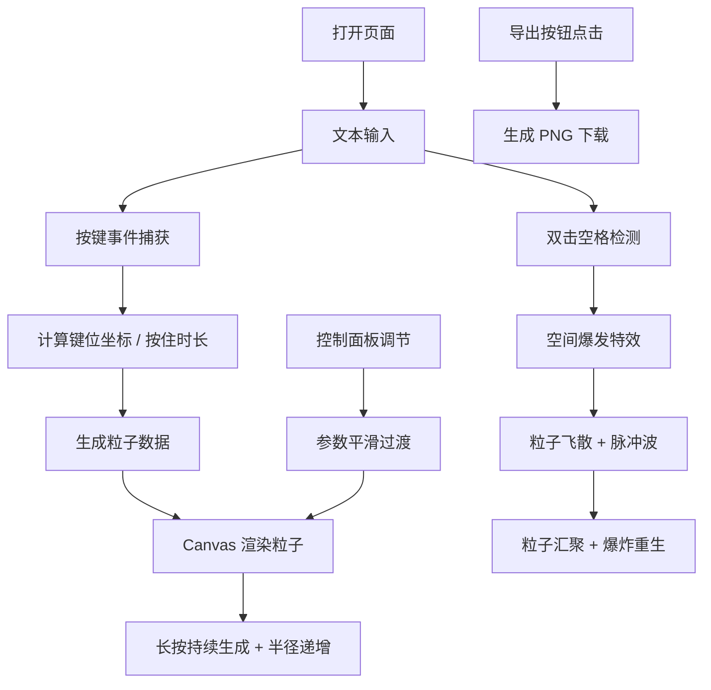

## 1. 产品概述

TypeCanvas 是一款基于打字节奏生成抽象图案的在线创意艺术工具。用户在输入文本时，每次击键都会根据按键的位置、时间和力度触发画布上的图形变化，最终形成一幅由打字行为驱动的独一无二的艺术作品。

- 核心价值：将日常打字行为转化为视觉艺术创作，让用户在输入过程中体验即时的视觉反馈和创作乐趣
- 目标用户：创意爱好者、设计师、程序员以及任何喜欢探索交互艺术的用户
- 市场定位：轻量级、浏览器端即可运行的创意工具，无需安装，打开即用

## 2. 核心功能

### 2.1 用户角色

| 角色 | 注册方式 | 核心权限 |
|------|----------|----------|
| 普通用户 | 无需注册，直接使用 | 创建打字艺术作品、调节参数、导出图片 |

### 2.2 功能模块

1. **主输入区**：代码编辑器风格的文本输入框，居中放置，深色主题
2. **Canvas 画布**：500x500 像素的粒子系统画布，响应打字输入生成视觉效果
3. **控制面板**：粒子参数调节（大小范围、运动速度、色相偏移）
4. **导出功能**：将当前画布内容导出为 PNG 图片
5. **特效系统**：空间爆发特效（双击空格触发）

### 2.3 页面详情

| 页面名称 | 模块名称 | 功能描述 |
|----------|----------|----------|
| 主页面 | 文本输入区 | 720x360px 深色代码编辑器风格输入框，粉色等宽字体，白色光标 |
| 主页面 | Canvas 画布 | 500x500px 径向渐变背景，粒子系统渲染，FPS 计数器 |
| 主页面 | 控制面板 | 三个滑块控件（大小、速度、色相），毛玻璃效果背景，悬停高亮 |
| 主页面 | 导出按钮 | 全圆角胶囊按钮，渐变背景，点击导出 PNG |
| 主页面 | 空间爆发特效 | 双击空格触发粒子飞散、脉冲波、汇聚爆炸动画 |

## 3. 核心流程

用户打开页面 → 在文本框中输入文字 → 每次按键在画布对应位置生成粒子 → 长按按键粒子持续生成并增大变红 → 双击空格触爆发特效 → 通过控制面板调节参数实时预览效果 → 点击导出按钮保存作品

## 4. 用户界面设计

### 4.1 设计风格

- **主色调**：深色主题（#121212 背景），霓虹色粒子（#ff007f, #00ffcc, #ffcc00, #7f00ff, #ff3300）
- **字体**：等宽字体用于输入区（粉色 #f92672），无衬线字体用于界面
- **按钮风格**：全圆角胶囊按钮，渐变色（#ff007f 到 #ff3300），点击内凹效果
- **布局风格**：Flex 居中布局，左侧输入区 + 右侧画布 + 侧边控制面板
- **视觉风格**：赛博朋克 / 霓虹科技感，深色背景配合发光粒子

### 4.2 页面设计概览

| 页面名称 | 模块名称 | UI 元素 |
|----------|----------|---------|
| 主页面 | 文本输入区 | 720x360px 深色卡片、#1e1e1e 背景、粉色等宽字体、白色细竖线光标、内边距 |
| 主页面 | Canvas 画布 | 500x500px 容器、径向渐变背景（#0a0a1a 到 #1a1a3a）、右上角 FPS 计数 |
| 主页面 | 控制面板 | 半透明毛玻璃背景（rgba(255,255,255,0.1) + 模糊 10px）、滑块控件、悬停高亮边框（#00ffcc） |
| 主页面 | 导出按钮 | 140x42px 胶囊按钮、渐变色、白色文字、点击内凹动画 |

### 4.3 响应式

- 桌面端优先设计
- 最小宽度支持：1280px
- 主内容区水平居中排列

### 4.4 动画与交互细节

- 粒子生成：0.3 秒从中心向外扩散的缩放动画
- 粒子涟漪：从中心向外扩散的半透明圆环，持续 0.6 秒
- 空间爆发：粒子飞散 0.8 秒 + 汇聚 1.2 秒（ease-out）+ 爆炸重生
- 控制面板参数变化：0.5 秒平滑过渡
- 控件悬停：0.2 秒边框高亮变为 #00ffcc
- 按钮点击：0.2 秒内凹效果

## 5. 性能要求

- 渲染帧率稳定在 55FPS 以上
- 使用 requestAnimationFrame 驱动动画循环
- 粒子数量过多时可考虑性能优化策略
- 导出 PNG 支持透明背景
