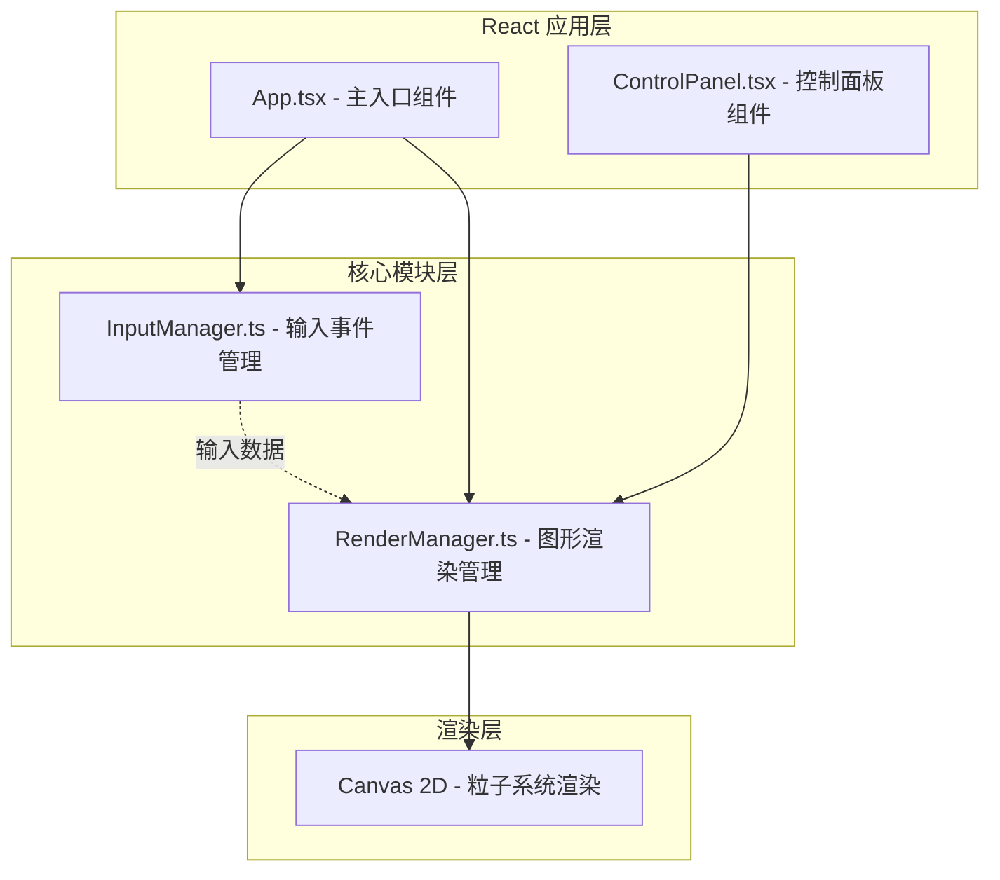

## 1. 架构设计



## 2. 技术选型

- **前端框架**：React@18 + TypeScript
- **构建工具**：Vite@5 + @vitejs/plugin-react
- **渲染技术**：Canvas 2D API（原生，无第三方图形库）
- **状态管理**：React useState/useRef（轻量级，无需 zustand）
- **样式方案**：原生 CSS（style.css），无需 Tailwind

## 3. 目录结构

```
.
├── package.json
├── vite.config.js
├── tsconfig.json
├── index.html
└── src/
    ├── App.tsx           # 主应用组件，组装各模块
    ├── InputManager.ts   # 输入事件管理模块
    ├── RenderManager.ts  # 图形渲染模块
    ├── ControlPanel.tsx  # 控制面板组件
    └── style.css         # 全局样式
```

## 4. 模块详细设计

### 4.1 InputManager（输入事件管理模块）

**职责**：监听键盘事件，计算击键持续时长和按键坐标映射，将原始键盘事件转换为结构化数据。

**核心接口**：
```typescript
interface KeyInputData {
  key: string;        // 按键字符
  x: number;          // 映射到画布的 x 坐标 (0-1)
  y: number;          // 映射到画布的 y 坐标 (0-1)
  duration: number;   // 按住时长（毫秒）
  type: 'keydown' | 'keypress' | 'keyup';
}

type InputCallback = (data: KeyInputData) => void;

class InputManager {
  constructor(targetElement: HTMLElement, callback: InputCallback);
  start(): void;
  stop(): void;
  getCharCount(): number;  // 当前输入字符总数
  destroy(): void;
}
```

**键位映射规则**：
- 基于标准 QWERTY 键盘布局
- 横向：A 键左侧 → L 键右侧
- 纵向：Q 行上方 → Z 行下方
- 坐标归一化为 0-1 范围，供渲染层映射到画布

### 4.2 RenderManager（图形渲染模块）

**职责**：管理 Canvas 元素和粒子系统，接收输入数据，控制粒子的创建、更新和销毁动画，处理控制面板参数变化。

**核心粒子数据结构**：
```typescript
interface Particle {
  id: number;
  x: number;
  y: number;
  vx: number;
  vy: number;
  radius: number;
  targetRadius: number;
  color: string;
  hue: number;
  alpha: number;
  scale: number;        // 出生缩放动画
  bornAt: number;       // 出生时间
  ripplePhase: number;  // 涟漪动画进度
  state: 'normal' | 'exploding' | 'converging' | 'reborn';
}

interface RenderParams {
  minRadius: number;    // 最小半径 4-48px
  maxRadius: number;    // 最大半径 4-48px
  speedMultiplier: number;  // 速度倍率 0.5-2.0
  hueShift: number;     // 色相偏移 0-360度
}

class RenderManager {
  constructor(canvas: HTMLCanvasElement);
  start(): void;
  stop(): void;
  addParticle(data: KeyInputData): void;
  setParams(params: Partial<RenderParams>): void;
  triggerSpaceBurst(charCount: number): void;
  exportPNG(): string;  // 返回 dataURL
  getFPS(): number;
  destroy(): void;
}
```

### 4.3 ControlPanel（控制面板组件）

**Props 接口**：
```typescript
interface ControlPanelProps {
  params: RenderParams;
  onParamsChange: (params: Partial<RenderParams>) => void;
}
```

**包含控件**：
1. 粒子大小范围滑块（minRadius: 4-48px, maxRadius: 4-48px）
2. 运动速度滑块（speedMultiplier: 0.5-2.0）
3. 色相偏移滑块（hueShift: 0-360）

### 4.4 App.tsx（主应用组件）

**职责**：
- 初始化 Canvas 元素
- 创建 InputManager 和 RenderManager 实例
- 组装 ControlPanel 组件
- 管理模块间数据传递
- 处理空间爆发特效的双击空格检测

## 5. 动画系统设计

### 5.1 粒子生命周期动画
- **出生**：scale 从 0 到 1，0.3 秒，缓动函数 ease-out
- **涟漪**：从粒子中心向外扩散的圆环，半径从 0 增长到 1.5x 粒子半径，alpha 从 0.6 降到 0，持续 0.6 秒
- **长按增长**：半径每秒增加 2px，最大 32px，颜色逐渐向红色偏移
- **消亡**：正常粒子永久存在，除非被特效重置

### 5.2 空间爆发特效
1. **飞散阶段**（0.8 秒）：所有粒子获得随机速度和方向，向外飞散
2. **汇聚阶段**（1.2 秒）：粒子减速并向中心移动，ease-out 缓动
3. **爆炸阶段**：中心圆点爆炸，生成 2x 字符数量的新粒子，随机分布在画布四周

### 5.3 参数平滑过渡
- 使用 requestAnimationFrame 驱动
- 当前值向目标值线性插值
- 过渡时长 0.5 秒

## 6. 性能优化策略

- 使用 requestAnimationFrame 统一调度渲染
- 粒子对象复用（对象池），减少 GC
- 画布使用固定尺寸，避免重排重绘
- FPS 计数器使用独立的轻量级计算
- 粒子数量设置合理上限（如 500 个）

## 7. 颜色系统

- 预设霓虹色盘：#ff007f, #00ffcc, #ffcc00, #7f00ff, #ff3300
- 色相偏移通过 HSL 色彩空间计算
- 长按向红色偏移：增加红色通道，减少蓝绿通道
