## 1. 产品概述

像素风格逐帧动画编辑器，为独立游戏开发者和像素画爱好者提供轻量、高效的在线工具，解决角色动画制作中缺乏专业在线编辑工具的痛点。

- 核心价值：在线即用、图层支持、洋葱皮功能、一键导出 Spritesheet/GIF
- 目标用户：独立游戏开发者、像素画爱好者、美术设计师

## 2. 核心功能

### 2.1 功能模块

1. **项目创建页**：画布尺寸预设选择、自定义尺寸设置
2. **编辑器主界面**：工具栏、颜色面板、画布区域、图层面板、帧面板
3. **导出功能**：Spritesheet PNG 导出、GIF 动画导出、尺寸倍数选择

### 2.2 页面详情

| 页面名称 | 模块名称 | 功能描述 |
|-----------|-------------|---------------------|
| 项目创建页 | 画布尺寸选择 | 预设 16x16/32x32/64x64，自定义最大 128x128 |
| 项目创建页 | 新建项目按钮 | 确认设置后进入编辑器 |
| 编辑器 | 工具栏 | 铅笔/橡皮/填充/取色/矩形/圆形工具切换 |
| 编辑器 | 颜色面板 | 16 色预设 Palette、自定义添加颜色、高亮选中状态 |
| 编辑器 | 画布区域 | 网格线显示、滚轮缩放(4x-32x)、鼠标交互编辑 |
| 编辑器 | 图层面板 | 最多 8 图层、重命名、透明度滑块、拖拽排序、半透明显示 |
| 编辑器 | 帧面板 | 帧增删复制、拖拽排序、洋葱皮(1-5帧/10%-50%透明度) |
| 编辑器 | 播放控制 | 播放/暂停/停止、FPS 调节(4-24fps)、绿色高亮 |
| 编辑器 | 导出模态框 | 尺寸倍数(1x/2x/4x)、背景色设置、Spritesheet/GIF 选择 |

## 3. 核心流程

```mermaid
flowchart LR
    A["用户访问应用"] --> B["项目创建页"]
    B --> C["选择画布尺寸"]
    C --> D["点击创建项目"]
    D --> E["进入编辑器"]
    E --> F["选择工具/颜色"]
    F --> G["在画布上绘制"]
    G --> H["管理图层(增删/排序/透明度)"]
    H --> I["添加/复制帧"]
    I --> J["启用洋葱皮参考"]
    J --> K["预览动画效果"]
    K --> L["调整帧速率"]
    L --> M["点击导出按钮"]
    M --> N["设置导出参数"]
    N --> O["下载 Spritesheet/GIF"]
```

## 4. 用户界面设计

### 4.1 设计风格

- **主色**：深色主题，工具栏 #2d2d2d，帧面板 #1e1e1e，画布留白 #333333
- **高亮色**：浅蓝色提示 #569cd6，当前帧白色边框，播放中帧绿色边框
- **按钮风格**：按下偏移 2px + 颜色变暗 15%
- **画布边框**：1px 实线 #555555
- **布局**：顶部工具栏、左侧颜色面板、中央画布、右侧图层面板、底部帧面板
- **图标**：使用 lucide-react 图标库

### 4.2 页面设计概览

| 页面名称 | 模块名称 | UI 元素 |
|-----------|-------------|-------------|
| 项目创建页 | 尺寸选择卡片 | 卡片网格布局、悬停高亮、选中边框 |
| 编辑器 | 工具栏按钮 | 6 个工具按钮、横向排列、选中高亮、悬停提示 |
| 编辑器 | 颜色面板 | 4x4 网格布局、白色边框高亮选中、添加颜色按钮 |
| 编辑器 | 画布区域 | 网格线(#c0c0c0/#808080)、缩放过渡 0.2s |
| 编辑器 | 图层条目 | 卡片式、拖拽跟随、弹性动画 0.15s |
| 编辑器 | 帧缩略图 | 圆角 4px、2px 间隙、选中 2px 白色边框 |
| 编辑器 | 导出模态框 | 遮罩层、参数滑块、确认/取消按钮 |

### 4.3 响应式布局

- 桌面端(≥900px)：全面板展开布局
- 移动端(<900px)：颜色面板和工具栏折叠为汉堡菜单侧边栏
- 画布和帧面板始终可见
- 面板间拖拽分隔条可调整宽度
