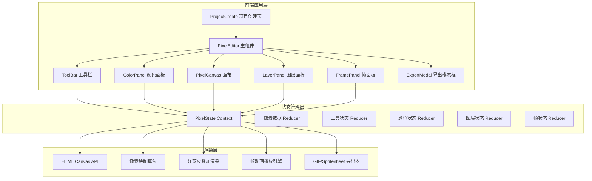

## 1. 架构设计



## 2. 技术描述

- **前端框架**：React 18 + TypeScript
- **构建工具**：Vite
- **状态管理**：React Context + useReducer
- **渲染引擎**：HTML Canvas API（原生，无第三方库）
- **样式方案**：原生 CSS + CSS Variables
- **图标库**：lucide-react
- **GIF 导出**：canvas2gif 库
- **目标版本**：ES2020

## 3. 路由定义

| 路由 | 用途 |
|-------|---------|
| / | 项目创建页，选择画布尺寸后进入编辑器 |
| /editor | 编辑器主界面，包含所有编辑功能 |

## 4. 数据模型

### 4.1 核心类型定义

```typescript
type ToolType = 'pencil' | 'eraser' | 'fill' | 'picker' | 'rectangle' | 'circle';

type RGB = { r: number; g: number; b: number; a?: number };

interface Layer {
  id: string;
  name: string;
  opacity: number;
  visible: boolean;
  pixels: (RGB | null)[][];
}

interface Frame {
  id: string;
  layers: Layer[];
}

interface Project {
  width: number;
  height: number;
  frames: Frame[];
  currentFrameIndex: number;
  currentLayerId: string;
}

interface ToolState {
  currentTool: ToolType;
  brushSize: number;
}

interface ColorState {
  palette: RGB[];
  currentColor: RGB;
}

interface OnionSkinState {
  enabled: boolean;
  frameCount: number;
  opacity: number;
}

interface PlaybackState {
  isPlaying: boolean;
  fps: number;
}
```

### 4.2 Context 状态

```typescript
interface PixelEditorState {
  project: Project;
  tool: ToolState;
  color: ColorState;
  onionSkin: OnionSkinState;
  playback: PlaybackState;
  zoom: number;
}
```

## 5. 文件结构

```
src/
├── PixelEditor.tsx      # 主编辑器组件，布局管理
├── PixelCanvas.tsx      # 画布组件，渲染与交互
├── PixelState.ts        # Context 状态管理，所有修改方法
├── ToolBar.tsx          # 工具栏组件
├── FramePanel.tsx       # 帧面板组件
├── components/
│   ├── ColorPanel.tsx   # 颜色面板
│   ├── LayerPanel.tsx   # 图层面板
│   ├── ExportModal.tsx  # 导出模态框
│   └── ProjectCreate.tsx # 项目创建页
├── utils/
│   ├── canvasUtils.ts   # 画布绘制工具函数
│   ├── exportUtils.ts   # 导出相关工具
│   └── colorUtils.ts    # 颜色处理工具
├── types/
│   └── index.ts         # 全局类型定义
├── App.tsx
├── main.tsx
└── index.css
```

## 6. 性能优化策略

1. **Canvas 分层渲染**：各图层独立缓存，仅重绘修改图层
2. **脏矩形算法**：只重绘像素变化区域
3. **rAF 播放引擎**：使用 requestAnimationFrame 确保流畅动画
4. **节流缩放**：滚轮缩放事件节流处理
5. **离屏 Canvas**：帧缩略图使用离屏 Canvas 预渲染缓存
6. **像素数据优化**：使用 TypedArray 存储像素数据减少内存
