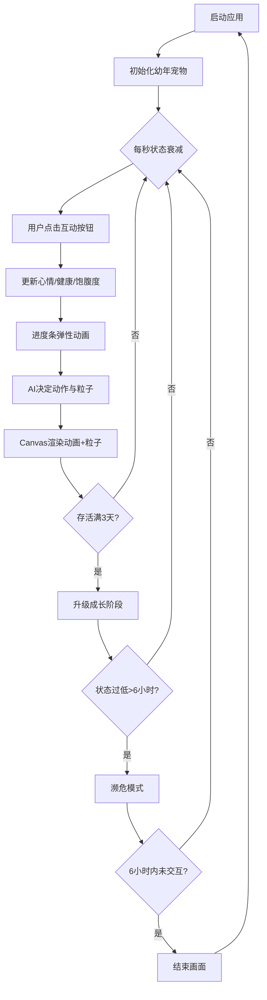

## 1. 产品概述

像素风虚拟宠物养成游戏，用户通过日常互动（喂食、清洁、玩耍、交流）影响宠物状态，宠物根据情绪做出表情、动作和粒子特效反馈。

- 核心玩法：养成类休闲小游戏，面向喜欢轻松治愈风格的用户群体
- 产品价值：提供放松治愈的互动体验，通过像素美术和流畅动画带来愉悦感

## 2. 核心功能

### 2.1 功能模块

1. **主界面**：Canvas宠物画布 + 右侧控制面板
2. **宠物状态系统**：心情、健康、饱腹度、成长阶段
3. **宠物渲染与动画**：6种动画状态、像素风绘制、表情图标
4. **粒子特效系统**：5种行为对应不同粒子效果
5. **交互反馈UI**：进度条、按钮、时间显示
6. **成长与时间系统**：4个成长阶段、游戏内计时、濒危/结束机制

### 2.2 页面详情

| 页面名称 | 模块名称 | 功能描述 |
|---------|---------|---------|
| 主界面 | Canvas画布 | 70%宽度，米黄到淡粉径向渐变背景，中央放置像素宠物，点缀草地、花朵、云朵 |
| 主界面 | 控制面板 | 30%宽度，显示名称、阶段、三个进度条、四个互动按钮 |
| 主界面 | 游戏时间 | 右上角显示游戏内时间（第X天 HH:MM） |
| 结束画面 | 结束覆盖层 | 全屏黑色，浮现"小乖永远睡着了"文字，3秒后自动重启 |

## 3. 核心流程

用户打开应用 → 初始化宠物（幼年状态）→ 自然衰减每秒更新 → 用户点击互动按钮 → 状态更新触发弹性动画 → AI决定宠物动作/粒子 → Canvas渲染 → 持续3天后成长升级 → 状态持续过低进入濒危 → 6小时未交互触发结束

## 4. 用户界面设计

### 4.1 设计风格

- 主色调：温暖柔和米黄系（#fff8e7、#fff0e0、#ffe4e1），辅以橙色（#ffa500）、粉色（#ff69b4）、青绿色（#20b2aa）
- 按钮：圆角8px，2x2网格布局，悬停上移2px、点击缩放0.95倍
- 进度条：高16px圆角8px，数值减少时红色闪烁0.3秒，变化时弹性动画0.3秒
- 像素风美术：32x32/24x24/16x16像素角色，草地点阵、固定花朵、飘动云朵
- Emoji表情：宠物头顶显示😊、😢、🍔、💤、🌟等状态图标

### 4.2 页面设计概览

| 页面名称 | 模块名称 | UI元素 |
|---------|---------|--------|
| 主界面 | Canvas背景 | 径向渐变（中心#fff0e0→边缘#ffe4e1），草地绿色点阵每16px，花朵红黄蓝交替，云朵水平飘动0.5px/帧 |
| 主界面 | 宠物渲染 | 中央定位，按成长阶段16/24/32像素，6种动画带0.2秒缓动切换，头顶表情图标 |
| 主界面 | 控制面板 | 背景#fff8e7，圆角12px，内边距16px，垂直居中，80%宽进度条 |
| 主界面 | 互动按钮 | 4个按钮2x2网格，宽100高40px，默认#ffebcc，悬停#ffd699上移2px，点击#ffb84d缩放0.95 |
| 主界面 | 时间显示 | 右上角白色字体+黑色1px阴影，格式"第X天 HH:MM" |
| 濒危 | 濒危效果 | 背景灰白闪烁0.5秒周期，宠物缓慢躺倒+0.3秒闪烁 |
| 结束 | 结束覆盖 | 全屏黑色，白色文字淡入，3秒后重启 |

### 4.3 响应性

桌面优先设计，全屏自适应布局，Canvas按窗口尺寸自动调整，控制面板保持固定30%宽度比例。
