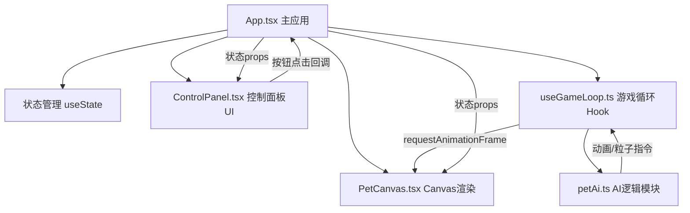

## 1. 架构设计

纯前端单页应用，基于React组件化分层架构，游戏逻辑通过自定义Hook驱动，Canvas负责渲染。



## 2. 技术描述

- 前端框架：React 18 + TypeScript
- 构建工具：Vite
- 状态管理：React useState + useRef（跨帧共享性能优化）
- 渲染方式：HTML5 Canvas 2D API
- 动画驱动：requestAnimationFrame 60fps主循环
- 初始化：Vite react-ts模板

## 3. 路由定义

| 路由 | 用途 |
|------|------|
| / | 主游戏页面（单页应用无路由跳转） |

## 4. 数据模型

### 4.1 核心数据类型

```typescript
// 成长阶段枚举
type GrowthStage = 'baby' | 'child' | 'teen' | 'adult';

// 动画状态枚举
type AnimationType = 'idle' | 'happy' | 'sad' | 'eating' | 'sleeping' | 'played';

// 宠物状态
interface PetState {
  mood: number;       // 心情 0-100
  health: number;     // 健康 0-100
  hunger: number;     // 饱腹度 0-100
  stage: GrowthStage; // 成长阶段
  animation: AnimationType;
  isWeak: boolean;    // 虚弱状态
  isEndangered: boolean; // 濒危状态
}

// 粒子数据
interface Particle {
  x: number; y: number;
  vx: number; vy: number;
  radius: number;
  color: string;
  life: number; maxLife: number;
  type: 'star' | 'drop' | 'circle' | 'heart' | 'cross';
}

// AI返回指令
interface AiCommand {
  animation: AnimationType;
  emoji: string;
  particles?: Omit<Particle, 'life'>[];
}

// 游戏时间
interface GameTime {
  day: number;
  hour: number;
  minute: number;
}
```

## 5. 模块职责说明

### 5.1 核心模块
- **src/components/App.tsx**：根组件，管理PetState、游戏时间、弹性进度条状态，分发按钮事件给useGameLoop
- **src/components/PetCanvas.tsx**：Canvas组件，通过ref暴露draw()接口给Hook调用，负责像素宠物/背景/粒子绘制
- **src/components/ControlPanel.tsx**：控制面板，展示三个弹性进度条+四个按钮，按钮回调触发父组件状态更新
- **src/hooks/useGameLoop.ts**：主循环Hook，requestAnimationFrame驱动，每秒更新状态衰减、成长升级、濒危检测，调用petAi获取动画指令，触发Canvas重绘
- **src/utils/petAi.ts**：纯函数模块，根据当前状态+触发事件，返回动画类型、emoji图标和粒子配置

### 5.2 文件结构
```
src/
├── components/
│   ├── App.tsx          # 主应用
│   ├── PetCanvas.tsx    # Canvas渲染
│   └── ControlPanel.tsx # UI控制面板
├── hooks/
│   └── useGameLoop.ts   # 游戏主循环
├── utils/
│   └── petAi.ts         # AI逻辑
└── main.tsx             # React入口
```

## 6. 性能优化

- 状态更新节流：游戏内数值每秒更新1次，避免UI频繁重渲染
- Canvas绘制分离：非变化背景（草地、花朵）缓存为离屏Canvas，每帧仅重绘动态元素
- 粒子池：峰值≤50个，生命周期结束自动回收
- useRef共享：跨帧数据（粒子列表、动画计时器）通过ref访问，不触发React重渲染
- 弹性动画：CSS transition实现进度条动画，JS计算tween值
