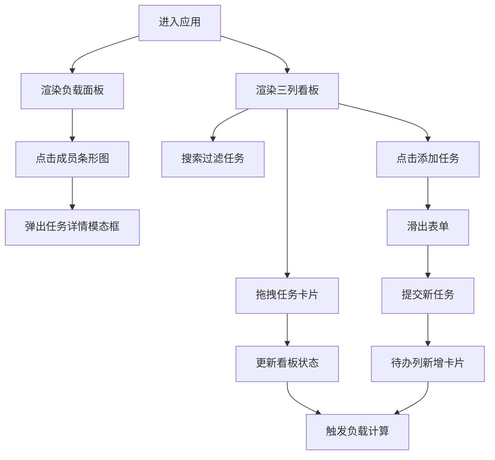

## 1. 产品概述

团队任务看板与工作负载可视化应用，帮助项目经理直观跟踪任务状态和团队成员工作负载，避免任务堆积和资源冲突。

- 面向项目经理和团队负责人的任务协调工具
- 通过看板和可视化图表实现高效的团队资源管理

## 2. 核心功能

### 2.1 用户角色
无需登录，单用户本地使用。

### 2.2 功能模块
1. **看板模块**：三列看板（待办、进行中、已完成）、任务卡片管理、拖拽排序、搜索过滤、添加任务
2. **负载分析模块**：成员工作负载条形图、超载预警、成员任务详情弹窗、统计总览

### 2.3 页面详情
| 页面名称 | 模块名称 | 功能描述 |
|-----------|-------------|---------------------|
| 主页面 | 看板模块 | 三列看板展示、拖拽交互、任务卡片渲染、搜索过滤、添加任务表单 |
| 主页面 | 负载分析模块 | 横向条形图展示成员负载、超载红色闪烁、统计面板、任务详情弹窗 |

## 3. 核心流程

### 主操作流程
用户进入页面 → 查看三列看板和负载面板 → 拖拽卡片更新状态/排序 → 负载数据实时更新 → 点击成员条形图查看详情 → 添加新任务触发负载更新

## 4. 用户界面设计

### 4.1 设计风格
- **主色调**：浅灰背景 #f0f2f5，白色卡片 #ffffff，蓝绿色按钮 #00b894
- **优先级颜色**：紧急 #ff4d4d，高 #ffa64d，中 #4d79ff，低 #4dff4d
- **按钮样式**：圆角胶囊型（20px），悬停变深色
- **字体**：无衬线系统字体（system-ui, -apple-system, sans-serif）
- **布局风格**：左右分栏卡片式布局，左侧70%看板，右侧30%负载面板
- **动画**：使用framer-motion实现拖拽弹性动画、模态框放大动画、表单滑入动画、超载闪烁动画

### 4.2 页面设计概述
| 页面名称 | 模块名称 | UI元素 |
|-----------|-------------|-------------|
| 主页面 | 看板顶栏 | 搜索框（圆角18px）、抽屉切换按钮（响应式） |
| 主页面 | 三列看板 | 列标题+蓝色计数、任务卡片（白色圆角8px、彩色优先级竖条）、拖拽动画 |
| 主页面 | 任务卡片 | 任务名（≤15字）、负责人、工时、悬停上浮效果 |
| 主页面 | 负载面板 | 总任务数、超载人数统计、横向条形图（20px高、渐变颜色）、红色闪烁超载条 |
| 主页面 | 模态框 | 400px宽、圆角12px、中心放大进入、成员任务列表、红色关闭按钮 |
| 主页面 | 添加任务 | 底部固定按钮、300px高滑入表单、任务名输入、负责人下拉、优先级单选 |

### 4.3 响应式
- **桌面端优先**：最小宽度1200px，左右分栏布局
- **窄屏适配**：<1200px时负载面板折叠为抽屉，通过看板右上角图标按钮切换

## 5. 性能约束
- 看板同时显示任务卡片不超过100张
- 拖拽操作反馈延迟 ≤ 50ms
- 负载条形图更新延迟 ≤ 100ms
