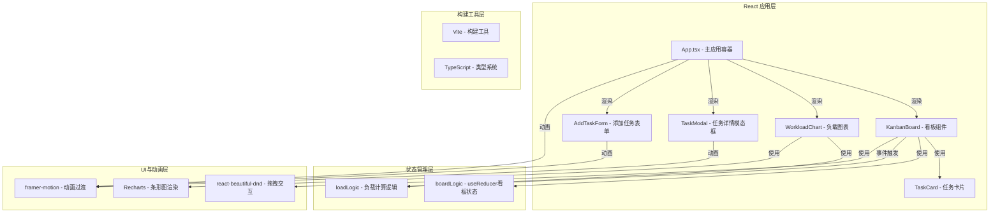

## 1. 架构设计



## 2. 技术描述

- **前端框架**: React@18 + TypeScript
- **构建工具**: Vite@5
- **拖拽库**: react-beautiful-dnd
- **图表库**: recharts
- **动画库**: framer-motion
- **状态管理**: React useReducer (看板状态) + 事件驱动 (负载更新)
- **后端**: 无（纯前端本地Mock数据）
- **数据库**: 无（内存状态管理）

## 3. 目录结构

```
src/
├── App.tsx                          # 主应用入口
├── main.tsx                         # React入口
├── index.css                        # 全局样式
├── types/
│   └── index.ts                     # 共享类型定义
├── board/
│   ├── components/
│   │   ├── KanbanBoard.tsx          # 看板主组件（三列+拖拽+搜索）
│   │   └── TaskCard.tsx             # 任务卡片组件
│   └── logic/
│       └── boardLogic.ts            # useReducer状态管理 + 初始Mock数据
└── load/
    ├── components/
    │   └── WorkloadChart.tsx        # 负载条形图组件（含超载预警动画）
    └── logic/
        └── loadLogic.ts             # 成员负载聚合计算 + 超载检测
```

## 4. 数据模型

### 4.1 核心类型定义

```typescript
type Priority = 'urgent' | 'high' | 'medium' | 'low';

interface Task {
  id: string;
  title: string;
  assignee: string;
  estimateHours: number;
  priority: Priority;
  columnId: string;
}

interface Column {
  id: string;
  title: string;
  taskIds: string[];
}

interface BoardState {
  tasks: Record<string, Task>;
  columns: Record<string, Column>;
  columnOrder: string[];
}

interface MemberWorkload {
  name: string;
  taskCount: number;
  totalHours: number;
  capacity: number;
  remainingCapacity: number;
  isOverloaded: boolean;
  tasks: Task[];
}

interface WorkloadSummary {
  totalTasks: number;
  overloadedCount: number;
  members: MemberWorkload[];
}
```

### 4.2 初始Mock数据
- 预设成员：张三、李四、王五、赵六、钱七
- 预设3列：待办、进行中、已完成
- 预设8-10个初始任务，覆盖不同优先级和负责人

## 5. 模块间通信

### 5.1 事件流
1. **KanbanBoard** → 调用 `moveTask` / `addTask` → 更新 `boardLogic` 状态
2. **boardLogic** 状态变更 → **KanbanBoard** 触发 `onTasksChange` 回调
3. **App.tsx** 监听 `onTasksChange` → 调用 `loadLogic.calculateWorkload(tasks)`
4. **loadLogic** 返回 `WorkloadSummary` → 传递给 **WorkloadChart** 渲染

### 5.2 看板Action类型
```typescript
type BoardAction =
  | { type: 'MOVE_TASK'; payload: { source: DraggableLocation; destination: DraggableLocation } }
  | { type: 'ADD_TASK'; payload: Omit<Task, 'id' | 'columnId'> }
  | { type: 'SET_SEARCH'; payload: string };
```

## 6. 样式与主题常量

| 变量名 | 值 | 用途 |
|--------|-----|------|
| COLOR_BG | #f0f2f5 | 页面背景 |
| COLOR_CARD | #ffffff | 卡片背景 |
| COLOR_PANEL | #f8f9fa | 负载面板背景 |
| COLOR_PRIMARY | #00b894 | 主按钮色 |
| COLOR_PRIMARY_HOVER | #00a381 | 主按钮悬停 |
| COLOR_BORDER | #dee2e6 | 输入框边框 |
| COLOR_BLUE | #4d79ff | 搜索聚焦/计数数字 |
| PRIORITY_URGENT | #ff4d4d | 紧急优先级 |
| PRIORITY_HIGH | #ffa64d | 高优先级 |
| PRIORITY_MEDIUM | #4d79ff | 中优先级 |
| PRIORITY_LOW | #4dff4d | 低优先级 |
| OVERLOAD_THRESHOLD | 5 | 超载任务数阈值 |
| MEMBER_CAPACITY | 8 | 成员总容量 |
