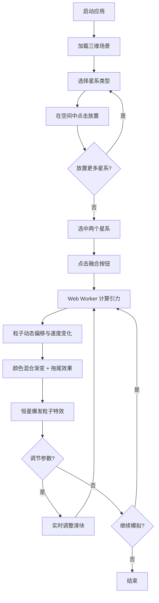

## 1. 产品概述
星系碰撞沙盒是一款面向科普教育的交互式三维天体物理模拟应用，解决复杂天体物理过程难以直观演示的问题。用户可在三维空间中放置不同类型星系，控制碰撞融合过程，并实时调节物理参数观察变化。

## 2. 核心功能

### 2.1 用户角色
| 角色 | 注册方式 | 核心权限 |
|------|----------|----------|
| 普通用户 | 无需注册 | 浏览、放置星系、控制碰撞、调节参数 |

### 2.2 功能模块
1. **主场景页面**: 三维空间场景、星系放置与碰撞模拟、参数调节面板

### 2.3 页面详情
| 页面名称 | 模块名称 | 功能描述 |
|----------|----------|----------|
| 主场景 | 三维空间渲染 | 深邃太空背景、背景星星、星系粒子渲染、星云光晕、碰撞特效 |
| 主场景 | 星系放置 | 从预设库选择星系类型，鼠标点击放置，拖拽旋转视角，滚轮缩放 |
| 主场景 | 碰撞模拟 | 选中两个星系触发融合、引力计算、粒子偏移与速度变化、颜色混合渐变、拖尾效果、恒星爆发特效 |
| 主场景 | 星系列表（左下角） | 纵向排列，显示星系缩略图、名称、粒子数，选中发光边框 |
| 主场景 | 参数面板（右下角） | 引力常数、弹性系数、模拟速度滑块，可折叠，实时调节 |
| 主场景 | 脉冲光效 | 碰撞时全屏中央圆形扩散光效 |

## 3. 核心流程

用户打开应用后，在三维空间中观察深邃太空背景。通过左下角星系列表选择星系类型（旋涡/椭圆/不规则），在三维空间中点击放置。可放置多个星系，每个星系自转速度可调。选中两个星系后点击"融合"按钮，系统开始计算引力作用，粒子群发生动态偏移，颜色混合渐变，产生拖尾效果和恒星爆发特效。用户可通过右下角参数面板实时调节引力常数、弹性系数和模拟速度。

## 4. 用户界面设计

### 4.1 设计风格
- **主色调**: 深邃太空深蓝色 (#000011 ~ #001133)
- **强调色**: 星际蓝 (#4488ff)、暖橙 (#ffcc44 ~ #ff9966)
- **视觉风格**: 玻璃态（磨砂背景、柔和阴影、动态模糊）
- **字体**: 科技感无衬线字体
- **布局**: 全屏三维场景 + 浮动面板叠加
- **动效**: 所有交互 0.3-0.5 秒 ease-out 过渡

### 4.2 页面设计概览
| 页面名称 | 模块名称 | UI 元素 |
|----------|----------|---------|
| 主场景 | 三维背景 | #000011到#001133径向渐变、200颗静态背景星、星云状光晕 |
| 主场景 | 星系列表 | 左下角纵向排列、宽160px高60px/项、圆角6px、背景#1a1a3a80、缩略图40px圆形、选中边框发光#4488ff |
| 主场景 | 参数面板 | 右下角宽220px、可折叠、背景#ffffff10、自定义滑块（轨道4px圆角2px背景#333、圆形16px#4488ff） |
| 主场景 | 脉冲光效 | 全屏中央圆形扩散、0→100px、透明度0.6→0、持续0.8秒 |
| 主场景 | 星系放置动画 | 圆形光晕扩散后稳定 |

### 4.3 响应式
- 桌面优先设计，全屏自适应
- 鼠标拖拽旋转视角、滚轮缩放
- 面板支持折叠收起

### 4.4 三维场景指引
- **环境**: 深邃太空，径向渐变从中心#000011到边缘#001133
- **灯光**: 微弱环境光，星系自发光
- **相机**: 透视相机，支持轨道控制（旋转、缩放）
- **焦点元素**: 放置的星系粒子群
- **交互**: 鼠标放置星系、选中融合、参数调节
- **后处理**: 粒子拖尾、脉冲光效、星云光晕
- **性能预算**: 30FPS以上，粒子超3000时降低拖尾透明度至0.2
