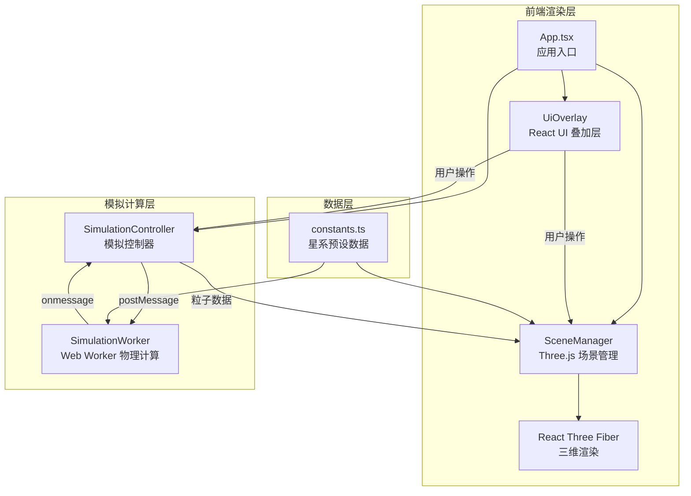

## 1. 架构设计



## 2. 技术说明
- **前端**: React 18 + TypeScript + Three.js + React Three Fiber + Drei
- **构建工具**: Vite + @vitejs/plugin-react
- **物理计算**: Web Worker（独立线程，避免阻塞主线程）
- **状态管理**: Zustand
- **样式**: CSS-in-JS / 内联样式（玻璃态视觉效果）
- **包管理器**: npm

## 3. 路由定义
| 路由 | 用途 |
|------|------|
| / | 主场景页面，包含三维模拟和所有交互 |

## 4. 文件结构与职责

| 文件路径 | 职责 |
|----------|------|
| `package.json` | 依赖管理：react, react-dom, @types/react, three, @react-three/fiber, @react-three/drei, typescript, vite |
| `vite.config.js` | Vite 构建配置，使用 @vitejs/plugin-react |
| `tsconfig.json` | TypeScript 严格模式配置 |
| `index.html` | 入口 HTML，全屏自适应 |
| `src/constants.ts` | 星系预设数据：类型、颜色、初始粒子分布算法（旋涡星系使用对数螺旋分布方程） |
| `src/modules/SimulationEngine/SimulationWorker.ts` | Web Worker 文件，接收粒子数据与参数，每帧计算粒子位置和速度并返回 |
| `src/modules/SimulationEngine/SimulationController.ts` | 与 Worker 通信，管理模拟的启动、暂停、重置和参数更新，将粒子数据传递给渲染模块 |
| `src/modules/RenderingEngine/SceneManager.tsx` | 管理 Three.js 场景、相机、灯光和网格，接收粒子数据更新 3D 粒子系统位置和颜色 |
| `src/modules/RenderingEngine/UiOverlay.tsx` | React 组件，渲染星系列表和参数面板，处理用户交互 |
| `src/App.tsx` | 应用主入口，组合 SceneManager 和 UiOverlay，初始化模拟引擎 |

## 5. 核心数据结构

### 5.1 星系数据模型
```typescript
interface Galaxy {
  id: string;
  type: 'spiral' | 'elliptical' | 'irregular';
  name: string;
  position: [number, number, number];
  rotationSpeed: number;
  particles: Particle[];
  colorRange: [string, string];
}

interface Particle {
  id: number;
  position: [number, number, number];
  velocity: [number, number, number];
  color: [number, number, number];
  originalColor: [number, number, number];
  mass: number;
}

interface SimulationParams {
  gravityConstant: number;
  elasticity: number;
  simulationSpeed: number;
}
```

### 5.2 星系粒子分布算法
- **旋涡星系**: 对数螺旋方程 r = a * e^(b*θ)，粒子沿螺旋臂分布
- **椭圆星系**: 高斯分布，粒子集中在中心并向外密度递减
- **不规则星系**: 随机分布，局部聚类

## 6. Web Worker 通信协议

### 主线程 → Worker
```typescript
type WorkerCommand =
  | { type: 'INIT'; galaxies: Galaxy[]; params: SimulationParams }
  | { type: 'UPDATE_PARAMS'; params: SimulationParams }
  | { type: 'ADD_GALAXY'; galaxy: Galaxy }
  | { type: 'START_COLLISION'; galaxyIds: [string, string] }
  | { type: 'PAUSE' }
  | { type: 'RESET' };
```

### Worker → 主线程
```typescript
type WorkerResponse =
  | { type: 'FRAME_UPDATE'; particles: Particle[]; dt: number }
  | { type: 'COLLISION_COMPLETE'; newGalaxyId: string };
```

## 7. 性能策略
- 物理计算在 Web Worker 中执行，不阻塞主线程
- 粒子总数超过 3000 时自动降低拖尾特效透明度至 0.2
- 使用 BufferGeometry 和 Points 渲染粒子系统
- 帧率目标 30FPS 以上
- 使用 requestAnimationFrame 同步渲染帧
